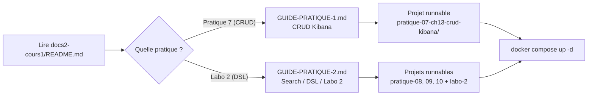

<a id="top"></a>

<!-- Copyright (c) Haythem Rehouma - InSkillFlow‌​‍​​‍​​​‌​‍​‍​​‍​‌​‍​​‍​​‍‌​‍​​​‍‍​‌​‍​​​‍‍‍‌ - Gneurone. Tous droits reserves. Code tague. Reproduction interdite sans autorisation ecrite. -->
# Elasticsearch — Cours 1 et exercices

Cours complet sur **Elasticsearch & Kibana** (théorie + pratiques + projets runnables Docker), en français, pour étudiants.

> Ce dépôt est une **version allégée** : il contient **uniquement** le cours 1 et ses exercices. Aucun projet de session, aucun dataset Spotify, aucune dépendance Neo4j.

## Table des matières

- [Pour qui ?](#pour-qui-)
- [Comment commencer ?](#comment-commencer-)
- [Structure du dépôt](#structure-du-dépôt)
- [Pratiques notées](#pratiques-notées)
- [Pré-requis techniques](#pré-requis-techniques)
- [Annexes](#annexes)

## Pour qui ?

| Profil                                | Entrée recommandée                                                       |
| ------------------------------------- | ------------------------------------------------------------------------ |
| **Étudiant qui démarre la pratique 1** | [`docs2-cours1/assets-cours2/GUIDE-PRATIQUE-1.md`](./docs2-cours1/assets-cours2/GUIDE-PRATIQUE-1.md) |
| **Étudiant qui démarre la pratique 2** | [`docs2-cours1/assets-cours2/GUIDE-PRATIQUE-2.md`](./docs2-cours1/assets-cours2/GUIDE-PRATIQUE-2.md) |
| **Étudiant qui veut lire le cours**    | [`docs2-cours1/README.md`](./docs2-cours1/README.md)                     |
| **Enseignant qui prépare la séance**   | [`docs2-cours1/assets-cours2/solutions/README.md`](./docs2-cours1/assets-cours2/solutions/README.md) |
| **Tout installer de A à Z**            | [`docs2-cours1/assets-cours2/solutions/00-setup-complet-a-z.md`](./docs2-cours1/assets-cours2/solutions/00-setup-complet-a-z.md) |

## Comment commencer ?



## Structure du dépôt

```
elasticsearch-0/
├── README.md                          (ce fichier)
├── .gitignore
└── docs2-cours1/                      Cours complet (chapitres 1 a 17 + annexe 18)
    ├── README.md                      Index du cours, table des pratiques, suivi
    ├── 01-*.md ... 17-*.md            17 chapitres + annexe
    └── assets-cours2/
        ├── README.md                  Index des supports
        ├── GUIDE-PRATIQUE-1.md        Guide etudiant - Pratique 7 (chap. 13)
        ├── GUIDE-PRATIQUE-2.md        Guide etudiant - Labo 2 (chap. 17)
        ├── Kibana - Pratique 1.docx   Enonce officiel du prof - Pratique 7
        ├── Kibana - Pratique 2.docx   Enonce officiel du prof - Labo 2
        ├── News_Category_Dataset_v2.json   Dataset (200 853 articles)
        ├── archiveCSV.zip / archiveJSON.zip   Variantes du dataset
        └── solutions/
            ├── README.md              Index complet des solutions
            ├── 00-setup-complet-a-z.md
            ├── pratique-NN-solutions-*.md / labo-N-solutions-*.md   12 fichiers
            └── pratique-NN-chXX-*/ et labo-N-chXX-*/   12 projets runnables
                ├── pratique-01-ch06-installation-neo4j/
                ├── pratique-02-ch07-premiers-pas-cypher/
                ├── pratique-03-ch08-cypher-ia/
                ├── pratique-04-ch09-nettoyage-neo4j/
                ├── pratique-05-ch10-installation-es-kibana/
                ├── labo-1-ch11-elk/
                ├── pratique-06-ch12-commandes-base/
                ├── pratique-07-ch13-crud-kibana/
                ├── pratique-08-ch14-bulk-import/
                ├── pratique-09-ch15-requetes/
                ├── pratique-10-ch16-kql-esql-dsl/
                └── labo-2-ch17-labo2/
```

## Pratiques notées

| # | Sujet                              | Durée    | Guide étudiant                                                                                         |
| - | ---------------------------------- | -------- | ------------------------------------------------------------------------------------------------------ |
| 1 | CRUD Elasticsearch via Kibana      | ~90 min  | [`GUIDE-PRATIQUE-1.md`](./docs2-cours1/assets-cours2/GUIDE-PRATIQUE-1.md)                              |
| 2 | Search API + Query DSL + Dashboard | 3 séances| [`GUIDE-PRATIQUE-2.md`](./docs2-cours1/assets-cours2/GUIDE-PRATIQUE-2.md)                              |

Chaque guide contient : objectifs, plan visuel, étapes pas-à-pas, livrable + grille de notation, FAQ.

## Pré-requis techniques

| Outil              | Version min. | Vérification                                  |
| ------------------ | :----------: | --------------------------------------------- |
| Docker Desktop     |     4.20     | `docker info` (≥ 6 GB de RAM allouée pour ES) |
| Git                |     2.40     | `git --version`                               |
| (Optionnel) Python |     3.10     | `python --version` (pour `bulk_import.py`)    |

> **Pas de Docker installé ?** Voir l'**Annexe A** du chapitre 06 ([`docs2-cours1/06-installation-neo4j.md`](./docs2-cours1/06-installation-neo4j.md#annexe-a--installation-de-docker-desktop-windows--macos--linux)) — installation détaillée Windows / macOS / Linux + composition de la stack.

## Note de version

Ce dépôt est dérivé de `elasticsearch-1` ; les éléments suivants ont été **volontairement retirés** :

| Retiré                       | Raison                                                                  |
| ---------------------------- | ----------------------------------------------------------------------- |
| `docs0-projet/`              | Doc du projet de session Spotify — hors périmètre du cours 1            |
| `cypher/`, `neo4j/`          | Stack Neo4j du projet Spotify                                            |
| `notebooks/`, `scripts/`     | Notebooks Jupyter et scripts du projet Spotify                          |
| `fichiers/`, `Spotify Dataset.zip` | Dataset Spotify (>250 Mo)                                          |
| `docker-compose.yml` racine  | Stack 4 services du projet Spotify (Neo4j+Jupyter+ES+Kibana)            |
| `requirements.txt` racine    | Dépendances Python du projet Spotify                                    |
| `Projet de session.docx`, `Formation des groupes.docx` | Énoncés du projet de session                  |
| `.env`                       | Secrets (à recréer localement si besoin)                                |

Les compose files **par chapitre** restent disponibles dans `docs2-cours1/assets-cours2/solutions/chXX-*/`. Chaque projet runnable est autonome.

<p align="right"><a href="#top">Retour en haut</a></p>


---

*Copyright © Haythem R - Tous droits reserves.*
<!-- Copyright (c) Haythem Rehouma - InSkillFlow‌​‍​​‍​​​‌​‍​‍​​‍​‌​‍​​‍​​‍‌​‍​​​‍‍​‌​‍​​​‍‍‍‌ - Gneurone. Tous droits reserves. Code tague. Reproduction interdite sans autorisation ecrite. [tag-id: HRIFG] -->
