<a id="top"></a>

# 01 — Introduction à Elasticsearch & à la stack ELK

> **Type** : Théorie · **Pré-requis** : aucun

## Table des matières

- [1. Pourquoi Elasticsearch ?](#1-pourquoi-elasticsearch-)
- [2. Lucene : le moteur sous le capot](#2-lucene--le-moteur-sous-le-capot)
- [3. Qu'est-ce que la stack ELK ?](#3-quest-ce-que-la-stack-elk-)
- [4. À quoi ça sert concrètement ?](#4-à-quoi-ça-sert-concrètement-)
- [5. Vocabulaire de base à connaître](#5-vocabulaire-de-base-à-connaître)
- [6. Récapitulatif visuel](#6-récapitulatif-visuel)
- [7. Glossaire — tous les mots-clés Elasticsearch](#7-glossaire--tous-les-mots-clés-elasticsearch)

---

## 1. Pourquoi Elasticsearch ?

Une base de données relationnelle (MySQL, PostgreSQL…) est faite pour **stocker** des données structurées et faire des **jointures**. Elle est mauvaise pour la **recherche textuelle floue** sur de gros volumes (ex. : trouver tous les articles qui parlent de "intelligence artificielle" en moins de 10 ms).

Elasticsearch est un **moteur de recherche** distribué qui répond exactement à ce besoin :

| Besoin                                              | SQL classique         | Elasticsearch         |
| --------------------------------------------------- | --------------------- | --------------------- |
| Recherche `LIKE '%mot%'` sur 10 millions de lignes  | Lent (table scan)     | Quasi instantané      |
| Tolérance aux fautes de frappe                      | Non natif             | Oui (`fuzzy`)         |
| Recherche multi-champs avec scoring                 | Non                   | Oui (`multi_match`)   |
| Agrégations / dashboards temps réel                 | Lent                  | Très rapide           |
| Filtre + facettes + pagination                      | Compliqué             | Natif                 |

<details>
<summary><b>Pourquoi SQL est lent sur la recherche textuelle ? (explication détaillée)</b></summary>

Quand vous écrivez en SQL :

```sql
SELECT * FROM articles WHERE contenu LIKE '%intelligence%';
```

La base de données **n'a aucun index utilisable** pour ce genre de motif. Pourquoi ?

- Les index B-tree de SQL sont triés **par début de chaîne**. Ils servent pour `WHERE nom LIKE 'Mar%'` (préfixe), mais **pas** pour `'%intelligence%'` (le mot peut être au milieu).
- Résultat : la base fait un **table scan**. Elle ouvre chaque ligne, lit la colonne `contenu`, vérifie si elle contient le motif.

Sur 10 millions de lignes :

| Approche                                  | Temps typique         |
| ----------------------------------------- | --------------------- |
| `LIKE '%mot%'` en SQL (table scan)        | 10 - 60 secondes      |
| Lookup dans un index inversé Elasticsearch | < 50 millisecondes    |

C'est précisément pour ça qu'on utilise Elasticsearch **à côté** d'une base SQL, pas à la place : SQL pour les transactions et les jointures, Elasticsearch pour la recherche.

</details>

<details>
<summary><b>C'est quoi un index B-tree, et pourquoi il marche pour <code>'Mar%'</code> mais pas pour <code>'%ar'</code> ?</b></summary>

### L'idée en une phrase

Un B-tree est un **arbre trié** où chaque nœud sépare les valeurs en intervalles. Pour du texte, il fonctionne **caractère par caractère, depuis le début de la chaîne** — exactement comme un **dictionnaire papier**.

### Exemple : index B-tree sur la colonne `nom`

Imaginez une table `clients(nom)` avec ces 5 valeurs :

```
Adam
Adele
Ali
Bob
Boris
```

Le B-tree les organise comme suit (vue simplifiée) :

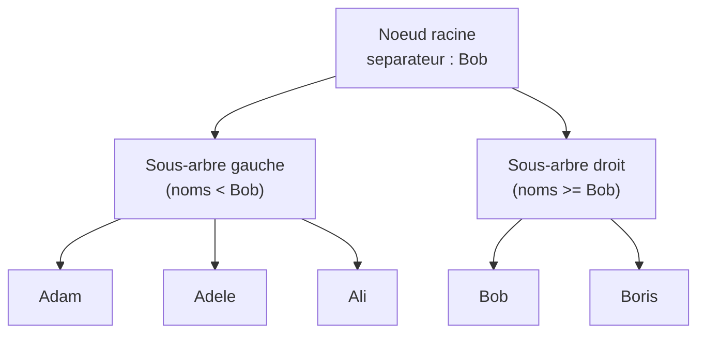

Comment l'arbre compare deux noms : **lettre par lettre, en partant du début**.

| Comparaison      | Résultat                                                                |
| ---------------- | ----------------------------------------------------------------------- |
| `Adam` vs `Adele`| 1ère lettre : `A` = `A` → continue. 2e : `d` = `d`. 3e : `a` < `e`. Donc `Adam` < `Adele`. |
| `Ali` vs `Bob`   | 1ère lettre : `A` < `B`. Réponse immédiate : `Ali` < `Bob`.             |
| `Bob` vs `Boris` | `B` = `B`, `o` = `o`, `b` < `r`. Donc `Bob` < `Boris`.                  |

### Pourquoi `LIKE 'Mar%'` est rapide

```sql
SELECT * FROM clients WHERE nom LIKE 'Mar%';
```

Le moteur SQL connaît le **préfixe** : il commence par `M`, puis `a`, puis `r`. Il **descend dans l'arbre** vers la branche `M`, puis `Ma`, puis `Mar`, et lit toutes les valeurs en partant de là **jusqu'à ce qu'il dépasse `Mas`**. Quelques sauts dans l'arbre, lecture séquentielle de la zone trouvée, **terminé**.

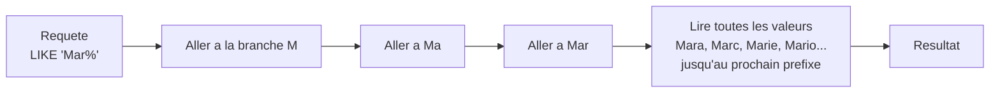

Sur 10 millions de lignes, environ **20 sauts** dans l'arbre suffisent. C'est `O(log n)`.

### Pourquoi `LIKE '%ar'` est lent

```sql
SELECT * FROM clients WHERE nom LIKE '%ar';
```

Le moteur **ne connaît pas le début** de la chaîne. Le `%` au début veut dire « n'importe quoi avant `ar` ». Or l'arbre est trié par **début de chaîne**. Donc :

- `Caesar` se termine par `ar` → branche `C`
- `Bazaar` se termine par `ar` → branche `B`
- `Mar` se termine par `ar` → branche `M`

Les correspondances sont **éparpillées partout** dans l'arbre. Aucun moyen de « descendre droit » vers la réponse. Le moteur **abandonne l'index** et fait un **table scan complet** (`O(n)`).

### Tableau récapitulatif des cas

| Requête SQL                  | L'index B-tree aide ?           | Pourquoi                                                       |
| ---------------------------- | :-----------------------------: | -------------------------------------------------------------- |
| `WHERE nom = 'Ahmed'`        | Oui                             | Égalité exacte = un seul lookup dans l'arbre                   |
| `WHERE nom > 'Benoit'`       | Oui                             | L'arbre est trié, on saute à la position et on lit la suite    |
| `WHERE nom LIKE 'Cha%'`      | Oui                             | Préfixe connu → navigation directe                             |
| `WHERE nom BETWEEN 'A' AND 'D'` | Oui                          | Plage contiguë de l'arbre                                      |
| `WHERE nom LIKE '%hat'`      | **Non**                         | Suffixe inconnu → éparpillé                                    |
| `WHERE nom LIKE '%intel%'`   | **Non**                         | Sous-chaîne au milieu → éparpillé                              |
| `WHERE LENGTH(nom) = 5`      | **Non**                         | Fonction sur le champ → l'index est invalidé                   |

### Petite nuance : la collation

L'ordre exact dépend de la **collation** de la base :

- Sensible ou non à la **casse** : `Adam` vs `adam` égaux ou pas ?
- Gestion des **accents** : `é` vs `e` proches ou distincts ?
- **Règles linguistiques** : en suédois, `å` vient après `z` ; en français, après `a`.

Ces différences sont gérées par la collation (`utf8mb4_unicode_ci`, `fr_FR.UTF-8`, etc.) mais **n'affectent pas le principe** : l'index reste trié par début de chaîne.

### En résumé

| Aspect           | B-tree (SQL)                         | Index inversé (Elasticsearch)            |
| ---------------- | ------------------------------------ | ---------------------------------------- |
| Structure        | Arbre trié par valeur                | Dictionnaire mot → liste de docs         |
| Bon pour…        | Égalité, plage, préfixe              | Recherche full-text, sous-chaîne, fuzzy  |
| Mauvais pour…    | Sous-chaîne, suffixe, full-text      | Égalité exacte sur clé primaire (overhead) |
| Complexité       | `O(log n)` si préfixe connu          | `O(1)` lookup + intersection de listes   |

</details>

---

## 2. Lucene : le moteur sous le capot

Elasticsearch n'invente pas la recherche textuelle : il s'appuie sur **Apache Lucene**, une librairie Java qui implémente l'**index inversé**.

<details>
<summary><b>C'est quoi un index inversé ? (explication détaillée)</b></summary>

### L'idée en une phrase

Un index inversé est juste une **table à l'envers**. Au lieu de noter pour chaque document quels mots il contient, on note pour chaque mot dans quels documents il apparaît.

### Le cas naïf : ce qu'il NE faut PAS faire

Imaginez qu'on stocke les choses dans le sens « naturel » :

| Document   | Contenu                              |
| ---------- | ------------------------------------ |
| document 1 | `réseau de neurones`                 |
| document 2 | `apprentissage machine`              |
| document 3 | `intelligence des foules`            |
| ...        | ...                                  |
| document 99| `intelligence artificielle générale` |

Pour répondre à la recherche `intelligence artificielle`, le moteur devrait **ouvrir chaque document, lire son texte, vérifier la présence des deux mots**. Sur 1 000 documents c'est lent. Sur 100 millions, c'est inutilisable.

### L'astuce : on inverse la table

On construit **une fois pour toutes** une table où la clé est le **mot** :

| Mot            | Documents qui contiennent ce mot |
| -------------- | -------------------------------- |
| `intelligence` | 3, 7, 42                         |
| `artificielle` | 7, 42, 99                        |
| `réseau`       | 1, 7, 12                         |

Comment lire ça :

- le mot **intelligence** apparaît dans les documents **3, 7 et 42**
- le mot **artificielle** apparaît dans les documents **7, 42 et 99**
- le mot **réseau** apparaît dans les documents **1, 7 et 12**

> Les nombres `3`, `7`, `42` ne sont **pas** des valeurs spéciales. Ce sont juste des **identifiants de documents**, comme des numéros de ligne.

### La recherche devient une intersection de listes

Quand un utilisateur tape `intelligence artificielle`, le moteur fait deux choses très simples :

1. Aller chercher la liste de **intelligence** → `3, 7, 42`
2. Aller chercher la liste de **artificielle** → `7, 42, 99`
3. Garder seulement les documents **présents dans les deux listes** :

```
intelligence  : 3, 7, 42
artificielle  :    7, 42, 99
                  ───────
intersection  :    7, 42
```

Réponse : **les documents 7 et 42** contiennent les deux mots.

### Pourquoi c'est rapide

Le moteur **ne relit jamais le texte des documents** au moment de la recherche. Il regarde uniquement les listes pré-calculées du dictionnaire. Comparer deux listes triées de quelques milliers d'IDs est une opération que l'ordinateur fait en quelques microsecondes, **même sur des centaines de millions de documents**.

### Image mentale

Pensez à un **index de fin de livre** :

```
acide ............... p. 12, 47, 188
algorithme .......... p. 5, 32, 91, 154
appel système ....... p. 7, 88
...
```

Quand vous cherchez « algorithme », vous **n'ouvrez pas le livre page par page**. Vous allez à l'index, vous lisez la liste des pages, vous y allez directement. L'index inversé d'Elasticsearch fonctionne exactement de la même manière, sauf que les « pages » sont des documents JSON.

### Un exemple encore plus simple

Trois documents très courts :

| Document | Texte         |
| -------- | ------------- |
| Doc 1    | `chat noir`   |
| Doc 2    | `chat blanc`  |
| Doc 3    | `chien noir`  |

L'index inversé construit par Lucene ressemble à :

| Mot     | Documents |
| ------- | --------- |
| `chat`  | 1, 2      |
| `noir`  | 1, 3      |
| `blanc` | 2         |
| `chien` | 3         |

Recherche `chat noir` :

```
chat : 1, 2
noir : 1, 3
       ───
inter:  1
```

Réponse : **document 1** uniquement, car c'est le seul à contenir les deux mots.

### Schéma récapitulatif

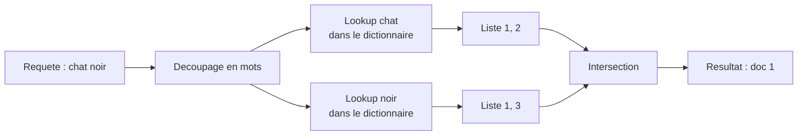

### Les trois confusions classiques

| Confusion fréquente                                          | La bonne lecture                                                                |
| ------------------------------------------------------------ | ------------------------------------------------------------------------------- |
| « 3, 7, 42 sont des scores »                                  | Non, ce sont juste des **IDs de documents**.                                    |
| « Le moteur lit chaque document à la recherche »              | Non, il lit le **dictionnaire** précalculé. Les documents ne sont pas relus.    |
| « C'est une simple recherche `LIKE '%intelligence%'` en SQL » | Non. `LIKE` fait un **scan complet** ; l'index inversé fait un **lookup direct**. |

</details>

<details>
<summary><b>Et l'analyse du texte avant indexation ? (tokenisation, lowercase, stemming)</b></summary>

Avant d'écrire dans l'index inversé, Lucene **transforme** le texte. Pour la phrase `Les Chats Noirs courent` :

| Étape                     | Résultat                          |
| ------------------------- | --------------------------------- |
| Texte original            | `Les Chats Noirs courent`         |
| 1. **Tokenisation**       | `[Les, Chats, Noirs, courent]`    |
| 2. **Lowercasing**        | `[les, chats, noirs, courent]`    |
| 3. **Stop-words** (FR)    | `[chats, noirs, courent]`         |
| 4. **Stemming / racine**  | `[chat, noir, cour]`              |

C'est la dernière liste qui entre dans l'index inversé. Conséquence : une recherche `chat noir` retrouvera bien le document, même si le texte original était `Les Chats Noirs courent`.

> On revient sur les **analyzers** au [chapitre 03](./03-concepts-cles-elasticsearch.md) et au [chapitre 17](./17-labo2-rapport-dsl-news.md).

</details>

Elasticsearch ajoute par-dessus Lucene :

- la **distribution** (cluster, shards, réplicas) ;
- une **API REST** propre en JSON (au lieu d'une API Java) ;
- la **gestion des nœuds**, du failover, du rebalancing ;
- des **agrégations** très puissantes (équivalent SQL `GROUP BY`).

<details>
<summary><b>Lucene vs Elasticsearch : qui fait quoi ? (explication détaillée)</b></summary>

C'est une confusion fréquente. Voici le partage des rôles :

| Question                            | C'est Lucene qui le fait ? | C'est Elasticsearch ? |
| ----------------------------------- | :------------------------: | :--------------------: |
| Construire l'index inversé          | Oui                        | Non                    |
| Tokeniser, lowercaser, stemmer      | Oui                        | Non                    |
| Calculer le score BM25              | Oui                        | Non                    |
| Stocker physiquement les segments   | Oui                        | Non                    |
| Répartir les données sur N machines | Non                        | Oui                    |
| Exposer une API REST en JSON        | Non                        | Oui                    |
| Gérer les pannes d'un nœud          | Non                        | Oui                    |
| Lancer des agrégations distribuées  | Non                        | Oui                    |

**Image mentale :** Lucene est comme un **moteur de voiture** très performant mais difficile à utiliser tout seul. Elasticsearch est la **voiture complète** autour : carrosserie, volant, GPS, pédales, qui rendent ce moteur utilisable par tout le monde via HTTP/JSON.

C'est pour ça qu'on parle parfois de **Solr** ou **OpenSearch** : ce sont d'autres « voitures » construites autour du même moteur Lucene.

</details>

---

## 3. Qu'est-ce que la stack ELK ?

**ELK = Elasticsearch + Logstash + Kibana** (parfois étendue à *Elastic Stack* avec Beats).

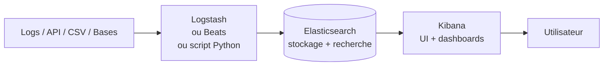

| Composant         | Rôle                                                                     |
| ----------------- | ------------------------------------------------------------------------ |
| **Beats**         | Petits agents qui collectent (Filebeat = logs, Metricbeat = métriques…). |
| **Logstash**      | Pipeline d'ingestion (parse, transforme, enrichit, envoie à ES).         |
| **Elasticsearch** | Stocke + indexe + permet la recherche.                                   |
| **Kibana**        | Interface web : explorer, visualiser, créer des dashboards.              |

---

#### Quel langage pour quel composant ? (clarification importante)

**Question fréquente : « Y a-t-il un langage différent pour Elasticsearch, Logstash et Kibana ? Et le DSL, c'est pour quoi ? »**

**Réponse courte :**

- **Elasticsearch** a son propre langage de requête : le **Query DSL** (un JSON envoyé en HTTP).
- **Logstash** a son propre langage de **configuration de pipeline** (style Ruby, avec `input { } filter { } output { }`).
- **Kibana** n'a **pas vraiment** de langage à lui : c'est une **interface graphique** qui *réutilise* les langages d'Elasticsearch. Pour la barre de recherche rapide, il propose en plus le **KQL**.

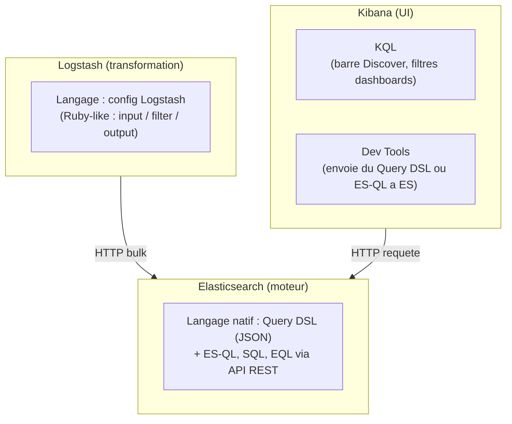

**Tableau récapitulatif :**

| Composant         | Langage(s) qu'il accepte                                  | Vous écrivez quoi, où ?                                                                                |
| ----------------- | --------------------------------------------------------- | ------------------------------------------------------------------------------------------------------ |
| **Logstash**      | Sa propre **DSL de configuration** (style Ruby)           | Dans des fichiers `.conf` du serveur Logstash. **Pas de requêtes**, juste des règles de transformation. |
| **Elasticsearch** | **Query DSL** (JSON, langage natif) + ES\|QL + SQL + EQL  | Vous envoyez du **JSON via HTTP** (curl, client Python, ou Dev Tools de Kibana).                       |
| **Kibana**        | **KQL** (barre de recherche) + UI graphique               | Dans la barre Discover ou les filtres de dashboard. Et **dans Dev Tools**, vous écrivez du **DSL d'ES**. |

**Donc : DSL = langage d'Elasticsearch, pas de Kibana.** Vous l'écrivez **dans Kibana** parce que Kibana propose un éditeur pratique (Dev Tools), mais c'est bien Elasticsearch qui le comprend et l'exécute.

---

#### Vulgarisation : quel langage, quand, pourquoi, pour qui ?

Image mentale simple : pensez à un **restaurant**.

- **Logstash**, c'est le **livreur** qui apporte les ingrédients en cuisine. Il a sa propre fiche de route (sa config). Il **ne prend jamais** la commande des clients.
- **Elasticsearch**, c'est la **cuisine + le livre de recettes**. Toutes les vraies préparations (recherches, agrégations) se font ici. La langue officielle de la cuisine, c'est le **Query DSL**.
- **Kibana**, c'est la **salle + le menu illustré**. Le client (vous) y consulte des photos (dashboards), tape une commande rapide en **KQL**, ou descend en cuisine via **Dev Tools** parler la langue officielle (DSL).

**Tableau de décision « lequel j'utilise et pourquoi ? » :**

| Langage              | C'est quoi en 1 ligne                                | Quand l'utiliser                                                            | Pourquoi (avantage)                                              | Cas d'usage typique                                                              | Qui l'utilise en pratique                            |
| -------------------- | ---------------------------------------------------- | --------------------------------------------------------------------------- | ---------------------------------------------------------------- | -------------------------------------------------------------------------------- | ---------------------------------------------------- |
| **Config Logstash**  | Un fichier `.conf` qui décrit un pipeline ETL        | Vos données arrivent **mal formées** et doivent être nettoyées avant ES.    | Très puissant : grok, geoip, mutate, conditionnels.              | Parser des logs nginx multilignes, enrichir avec geoip, router par environnement. | **DevOps / data engineer** qui installe le pipeline. |
| **KQL**              | Petit langage de la barre de recherche Kibana        | Vous **explorez** vos données dans Discover ou filtrez un dashboard.        | Ultra-simple, lisible, autocomplétion.                           | Trouver tous les logs où `status:500 AND host:"web-01"`.                          | **Analyste, support, étudiant qui débute, manager curieux**. |
| **Query DSL**        | Le JSON natif d'Elasticsearch envoyé en HTTP         | Vous voulez **toute la puissance** : tri, scoring, agrégations complexes.   | Tout est possible : `bool`, `filter`, `boost`, `aggs`, scripts.  | Construire une vraie barre de recherche dans une appli Python/Node/Java.         | **Développeur backend, data engineer**.              |
| **ES\|QL**           | Langage tabulaire style SQL piped (`FROM ... \| ...`) | Vous voulez un **rapport** ou un calcul **type SQL**.                      | Lisible comme du SQL. Pipelines d'instructions.                  | « Top 10 catégories de news par mois », rapports métier.                          | **Analyste data, BI, data engineer**.                |
| **SQL (`/_sql`)**    | Vrai SQL accepté par ES (sous-ensemble)              | Vous **connaissez SQL** et voulez interroger ES sans rien apprendre.        | Zéro courbe d'apprentissage si vous venez du SQL.                | Outil de reporting tiers branché en JDBC/ODBC.                                   | **Analyste BI, dev qui ne veut pas apprendre DSL**.  |
| **EQL**              | Event Query Language (séquences d'événements)        | Vous traquez des **séquences** dans des logs (sécurité).                    | Détecte des patterns dans le temps (`A then B within 5m`).       | SIEM : « connexion échouée puis réussie depuis la même IP en moins d'1 min ».    | **Analyste sécurité (SOC), threat hunter**.          |
| **Painless**         | Petit langage de script (Java-like) interne à ES     | Vous voulez **calculer un champ à la volée** ou un score custom.            | Sandboxé, rapide, intégré partout (runtime fields, scoring).     | Champ calculé `prix_ttc = prix * 1.20`.                                          | **Développeur avancé**.                              |

**Règle pédagogique pour ce cours :**

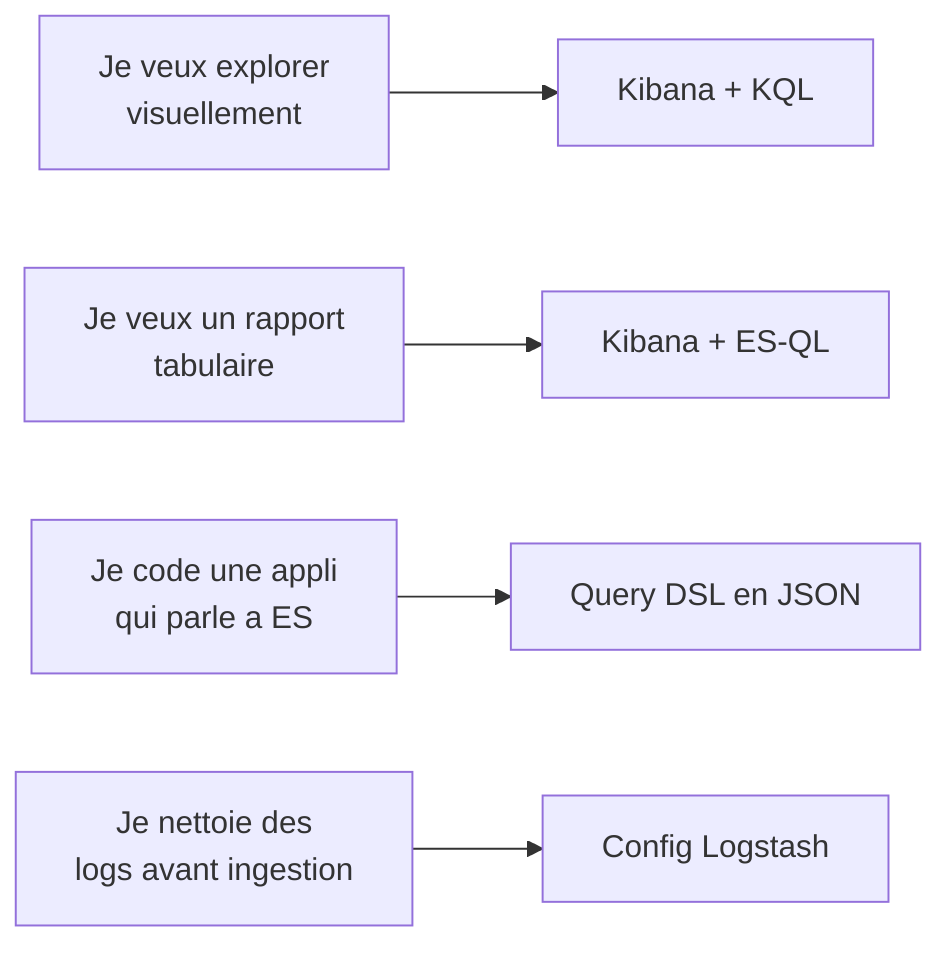

> **L'ordre dans lequel vous allez les apprendre dans ce cours :**
> 1. **KQL** (chap. 12-13, dans Kibana Discover) — le plus simple, immédiat.
> 2. **Query DSL** (chap. 14-16, dans Dev Tools) — le plus important pour la suite.
> 3. **ES\|QL** (chap. 16) — bonus pour les rapports.
> 4. **Config Logstash** : seulement mentionnée (chap. 5), pas pratiquée — on simule l'ingestion avec des scripts Python plus simples.

---

#### Obligatoire ou optionnel ? Quand DSL, quand KQL, quand EQL ?

**Réponse directe : non, vous n'avez PAS besoin de tous les apprendre.** Chaque langage a un usage précis. Voici la grille de décision **par profil** et **par situation**.

##### Tableau « Obligatoire vs optionnel » selon votre profil

| Langage              | Étudiant ce cours   | Analyste / support       | Développeur backend   | Data engineer       | Analyste sécurité (SOC) |
| -------------------- | ------------------- | ------------------------ | --------------------- | ------------------- | ------------------------ |
| **KQL**              | **Obligatoire**     | **Obligatoire**          | Optionnel             | Utile               | **Obligatoire**          |
| **Query DSL**        | **Obligatoire**     | Optionnel                | **Obligatoire**       | **Obligatoire**     | Utile                    |
| **ES\|QL**           | Recommandé          | Utile                    | Utile                 | **Obligatoire**     | Utile                    |
| **SQL** (`/_sql`)    | Optionnel           | Utile (si vient du SQL)  | Optionnel             | Utile               | Optionnel                |
| **EQL**              | Optionnel           | Optionnel                | Optionnel             | Optionnel           | **Obligatoire**          |
| **Painless**         | Optionnel           | Non                      | Recommandé            | Recommandé          | Optionnel                |
| **Config Logstash**  | Optionnel           | Non                      | Optionnel             | **Obligatoire**     | Optionnel                |

**Lecture du tableau :**
- **Obligatoire** = sans ça, vous ne pouvez pas faire votre travail.
- **Recommandé** = vous y gagnerez beaucoup, à apprendre dès que possible.
- **Utile** = bien à savoir, mais pas urgent.
- **Optionnel** = à apprendre seulement si vous tombez sur un cas qui le nécessite.

##### Arbre de décision : « j'ai cette situation, j'utilise quel langage ? »

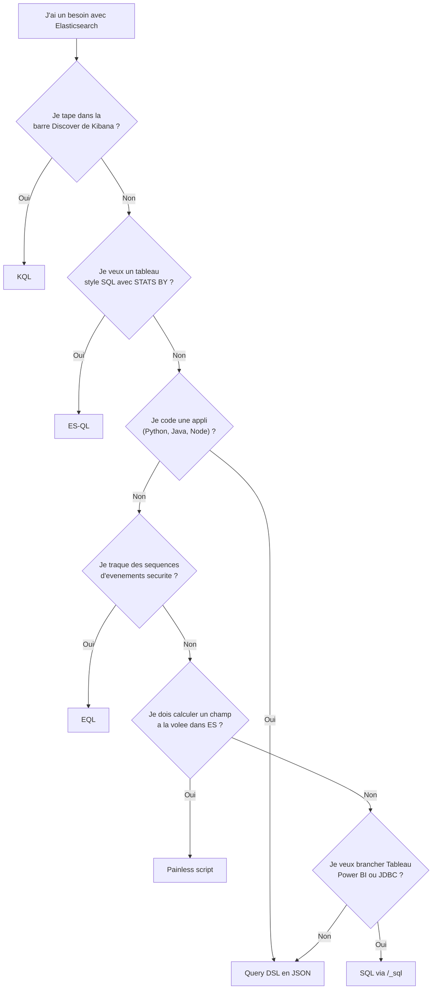

##### Quand chaque langage devient *vraiment* obligatoire (cas concrets)

<details>
<summary><b>Quand <b>KQL</b> est obligatoire</b></summary>

- Vous ouvrez **Discover** dans Kibana et tapez dans la barre de recherche → c'est forcément du KQL (ou du Lucene legacy).
- Vous configurez un filtre dans un dashboard partagé.
- Vous créez une **alerte Kibana** basée sur une condition simple (`status:500 AND service:"checkout"`).

**Sans KQL, vous ne savez pas vous servir de Kibana au-delà du clic.**

</details>

<details>
<summary><b>Quand <b>Query DSL</b> est obligatoire</b></summary>

- Vous codez une **fonction de recherche** dans une appli web (`elasticsearch-py`, `@elastic/elasticsearch`, etc.).
- Vous voulez **trier par score custom** (`function_score`, `boost` par champ).
- Vous voulez des **agrégations imbriquées** (top 10 catégories → top 3 articles dans chacune).
- Vous voulez un **highlight** des mots qui matchent (`<em>...</em>`).
- Vous voulez **paginer profondément** avec `search_after` + `pit`.
- Vous configurez une **alerte avancée** (Watcher) ou un **transform** (rollup).

**Dès qu'on quitte Kibana et qu'on code, le DSL devient incontournable.**

</details>

<details>
<summary><b>Quand <b>ES|QL</b> est obligatoire</b></summary>

- Vous produisez un **rapport tabulaire** : « combien d'articles par catégorie et par mois, triés par volume ».
- Vous faites du **debug en console** : `FROM logs-* | WHERE level=="ERROR" | STATS count=COUNT(*) BY service | SORT count DESC | LIMIT 10`.
- Vous **enchaînez des transformations** (équivalent SQL avec `WHERE`, `STATS`, `SORT`, `LIMIT`, `EVAL`, `KEEP`, `DROP`).

**Sans ES\|QL, certains rapports demanderaient un DSL avec 5 niveaux d'agrégations imbriquées et seraient illisibles.**

</details>

<details>
<summary><b>Quand <b>EQL</b> est obligatoire</b></summary>

- **Sécurité uniquement.** Vous travaillez dans un SOC, vous utilisez Elastic Security.
- Vous cherchez des **séquences temporelles** : « processus A puis fichier B créé puis connexion C, le tout en moins de 30 secondes, sur la même machine ».
- Exemple typique : `sequence by host.name [process where process.name == "powershell.exe"] [file where file.name like "*.ps1"]`.

**Si vous ne faites pas de cybersécurité, vous n'aurez probablement jamais à écrire de l'EQL.**

</details>

<details>
<summary><b>Quand <b>SQL (/_sql)</b> est obligatoire</b></summary>

- Vous branchez **Tableau, Power BI, Excel, DBeaver** sur Elasticsearch via le **driver JDBC/ODBC** d'Elastic.
- Vous avez une équipe qui **ne veut pas apprendre le DSL** mais qui maîtrise SQL.
- Vous faites du prototypage rapide en console.

**C'est rarement obligatoire ; c'est surtout un confort pour les profils SQL.**

</details>

<details>
<summary><b>Quand <b>Painless</b> est obligatoire</b></summary>

- Vous voulez un **runtime field** : un champ calculé à la lecture (ex. `prix_ttc = prix * 1.20`).
- Vous voulez **personnaliser le scoring** (`script_score`).
- Vous voulez un **ingest pipeline** custom (transformer un champ avant indexation).

**Toujours en complément du DSL, jamais seul.**

</details>

<details>
<summary><b>Quand <b>Config Logstash</b> est obligatoire</b></summary>

- Vous **ingérez des logs bruts mal formés** (multilignes, formats hétérogènes) qui doivent être parsés (`grok`).
- Vous devez **enrichir** à l'ingestion (geoip, lookup d'utilisateur).
- Vous avez **plusieurs sources** à router vers plusieurs destinations.

**Si vos données arrivent déjà en JSON propre, vous n'avez pas besoin de Logstash : un simple `_bulk` ou Filebeat suffit.**

</details>

##### Le minimum vital pour ce cours

Si vous deviez n'apprendre **que deux** langages pour réussir le cours et 95 % des cas pratiques :

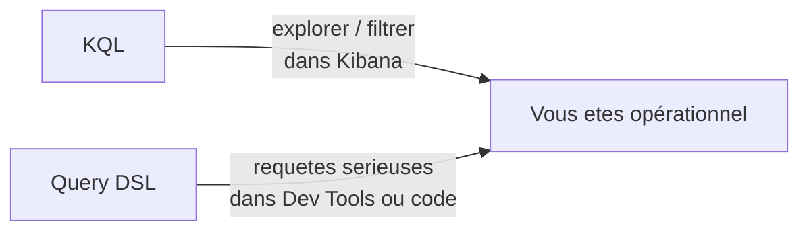

Les autres (ES\|QL, EQL, SQL, Painless, Logstash) viendront **au cas par cas**, quand un besoin précis se présentera.

<details>
<summary><b>Exemples côte à côte (le même besoin, dans chaque composant)</b></summary>

**Besoin pédagogique :** je veux **trouver tous les logs nginx avec un statut 500**.

**1) Côté Logstash** — config qui ingère les logs et garde **seulement** les 500 :

```ruby
input  { beats { port => 5044 } }
filter {
  grok { match => { "message" => "%{COMBINEDAPACHELOG}" } }
  if [response] != "500" { drop {} }
}
output { elasticsearch { hosts => ["es:9200"] index => "errors-%{+YYYY.MM.dd}" } }
```

→ C'est de la **configuration**, pas une requête. Logstash ne sait pas « chercher » dans Elasticsearch.

**2) Côté Elasticsearch (Query DSL en JSON)** — chercher les 500 dans l'index `nginx-*` :

```json
GET /nginx-*/_search
{
  "query": {
    "term": { "response.keyword": "500" }
  }
}
```

→ C'est ce JSON que tous les clients envoient à ES (Python, curl, Java, Dev Tools de Kibana…).

**3) Côté Kibana — KQL (barre Discover)** — la même chose, en une ligne lisible :

```kql
response : "500"
```

→ Kibana **traduit** ce KQL en Query DSL et l'envoie à Elasticsearch. Vous obtenez le même résultat, plus rapidement à taper.

**4) Côté Kibana — ES\|QL (onglet Discover ES\|QL)** — pour un rapport tabulaire :

```esql
FROM nginx-*
| WHERE response == "500"
| STATS count = COUNT(*) BY host.name
| SORT count DESC
```

→ C'est aussi exécuté **par Elasticsearch**, mais le langage `ES|QL` (style SQL piped) est plus naturel pour des rapports.

</details>

<details>
<summary><b>Et si je n'utilise QUE Kibana ? Que dois-je apprendre comme langage ?</b></summary>

C'est le cas le plus courant pour un débutant. Voici ce que vous écrirez réellement :

| Ce que vous faites dans Kibana                                   | Langage utilisé                | Compétence requise                                |
| ---------------------------------------------------------------- | ------------------------------ | ------------------------------------------------- |
| Taper dans la barre Discover                                     | **KQL**                        | Très simple : `champ : valeur AND ...`            |
| Filtrer un dashboard via les boutons                             | Aucun (UI clic)                | Aucune                                            |
| Créer une visualisation (Lens)                                   | Aucun (UI drag-and-drop)       | Aucune                                            |
| Écrire une requête puissante dans **Dev Tools → Console**        | **Query DSL** (JSON)           | Moyenne (c'est ce qu'on apprend chap. 12 → 16)    |
| Faire un rapport tabulaire dans Discover ES\|QL                  | **ES\|QL**                     | Faible si vous connaissez SQL                     |
| Configurer une **alerte** (Alerting)                             | KQL ou DSL selon le type       | Moyenne                                           |
| Créer un **runtime field**                                       | **Painless** (script Java-like)| Plus avancée                                      |

**En pratique pour ce cours :** vous apprendrez d'abord **KQL** (rapide, visuel) puis **Query DSL** (puissant, indispensable côté code).

</details>

---

#### Beats vs Logstash : qui transforme, qui se contente de collecter ?

Le schéma ci-dessus regroupe **Beats**, **Logstash** et **scripts Python** dans une même case d'« ingestion ». En réalité, ces trois outils n'ont **pas du tout** le même rôle : certains se contentent de **collecter** la donnée brute, d'autres la **transforment** avant de l'envoyer à Elasticsearch.

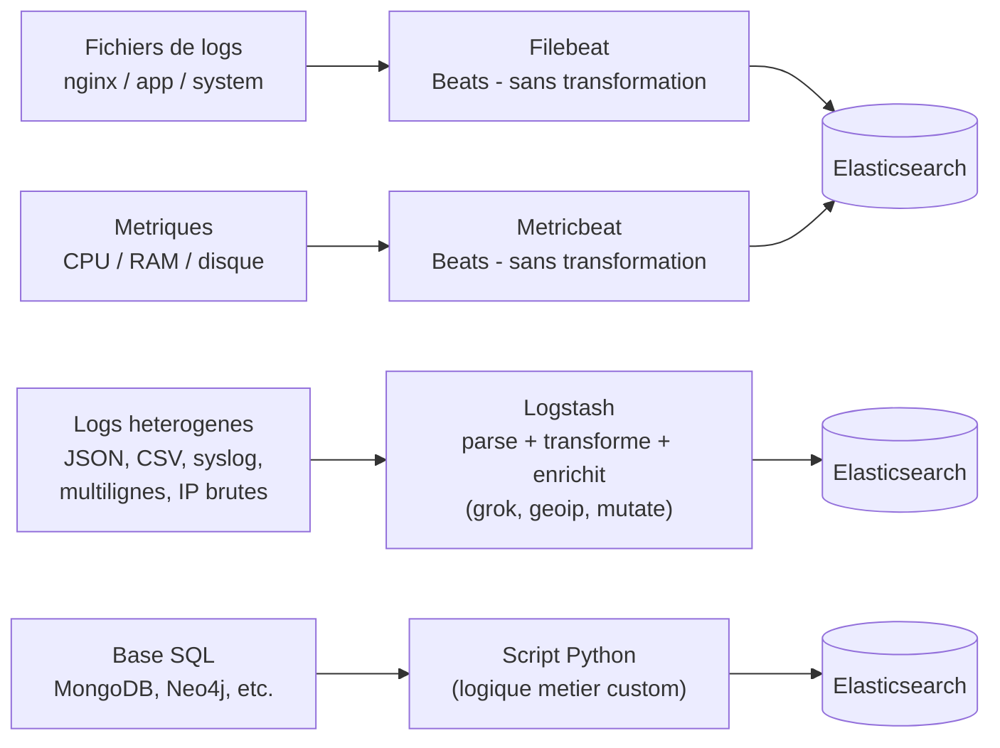

| Outil               | Transforme la donnee ? | Quand le choisir ?                                                                            |
| ------------------- | ---------------------- | --------------------------------------------------------------------------------------------- |
| **Beats** (Filebeat, Metricbeat, Packetbeat…) | **Non** (ou tres peu)  | Vous avez juste besoin de **lire un fichier ou une metrique** et de l'envoyer telle quelle. Tres leger (en Go), tourne sur la machine source. |
| **Logstash**        | **Oui**, fortement     | La donnee brute est **mal formee** : il faut la decouper (`grok`), enrichir (`geoip`), nettoyer (`mutate`), router (`if`). Pipeline puissant mais plus lourd (JVM). |
| **Script Python / ETL custom** | **Oui**, sur mesure | La logique est **specifique au metier** : agreger plusieurs sources, appeler une API tierce, calculer un score, joindre Neo4j et ES. Maximum de flexibilite. |

<details>
<summary><b>Exemple concret : un meme log nginx, trois chemins differents</b></summary>

Prenons une ligne de log nginx :

```
192.168.1.42 - - [21/Apr/2026:10:15:33 +0000] "GET /api/users/42 HTTP/1.1" 200 1234
```

**Chemin 1 — Beats seul (Filebeat) :**

Filebeat lit le fichier et envoie le document **tel quel** dans Elasticsearch. Le champ `message` contient toute la ligne brute. Pratique pour archiver, pas pratique pour analyser (vous ne pouvez pas filtrer sur le code HTTP, l'IP, etc., car ce ne sont pas des champs distincts).

```json
{ "message": "192.168.1.42 - - [21/Apr/2026:10:15:33 +0000] \"GET /api/users/42 HTTP/1.1\" 200 1234" }
```

**Chemin 2 — Logstash :**

Logstash applique un filtre `grok` qui **decoupe** la ligne en champs structures, puis `geoip` qui **enrichit** avec le pays de l'IP :

```json
{
  "client_ip": "192.168.1.42",
  "geoip": { "country": "Canada", "city": "Montreal" },
  "method": "GET",
  "path": "/api/users/42",
  "status": 200,
  "bytes": 1234,
  "@timestamp": "2026-04-21T10:15:33Z"
}
```

Maintenant on peut faire des dashboards : « top 10 des pays », « taux d'erreur 5xx par heure », etc.

**Chemin 3 — Script Python :**

Le script fait la meme chose que Logstash, mais en plus il **appelle une autre base** (Neo4j) pour recuperer le **role** de l'utilisateur 42 et l'ajoute au document :

```json
{
  "client_ip": "192.168.1.42",
  "user_id": 42,
  "user_role": "admin",
  "user_team": "data",
  "method": "GET",
  ...
}
```

C'est ce qu'on fait dans le projet Spotify pour **synchroniser Neo4j vers Elasticsearch**.

</details>

<details>
<summary><b>Regle simple pour choisir</b></summary>

| Question                                                          | Reponse → Outil       |
| ----------------------------------------------------------------- | --------------------- |
| « Je veux juste envoyer un fichier de log a ES, sans le toucher » | **Filebeat (Beats)**  |
| « Le log est mal forme, il faut le parser et l'enrichir »         | **Logstash**          |
| « Je dois croiser plusieurs sources ou appliquer une regle metier » | **Script Python / ETL custom** |
| « C'est de la metrique systeme (CPU, RAM, reseau) »               | **Metricbeat (Beats)** |
| « Je veux ingerer un CSV une fois pour toutes »                   | **Bulk API + script** |

Et bien sur on **combine** : Filebeat collecte → envoie a Logstash qui transforme → Logstash ecrit dans Elasticsearch.

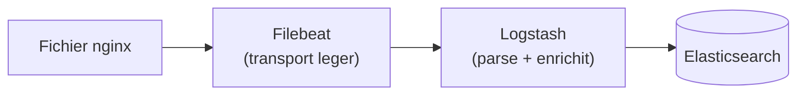

C'est l'architecture **classique de production** : chaque outil fait ce qu'il sait faire de mieux.

</details>

<details>
<summary><b>Faut-il TOUS les composants ELK ? (explication détaillée)</b></summary>

**Non.** ELK est une *boîte à outils*, pas un bloc monolithique. Vous prenez ce dont vous avez besoin.

| Votre besoin                                      | Stack minimum                          |
| ------------------------------------------------- | -------------------------------------- |
| Juste tester des requêtes Elasticsearch           | **Elasticsearch** seul (`curl` suffit) |
| Visualiser et explorer des données dans un UI     | **Elasticsearch + Kibana**             |
| Centraliser les logs de plusieurs serveurs        | **Filebeat → Elasticsearch + Kibana**  |
| Pipeline complexe (parsing, enrichissement)       | **Beats → Logstash → Elasticsearch + Kibana** |
| Application web qui interroge ES par programmation | **Elasticsearch** seul (votre app fait l'UI) |

Dans ce cours, on utilise principalement **Elasticsearch + Kibana** (les deux services lancés par les `docker-compose.yml` des chapitres 11 à 17). Pas besoin de Beats ni de Logstash pour apprendre les requêtes DSL.

</details>

---

## 4. À quoi ça sert concrètement ?

| Cas d'usage           | Exemple                                                                 |
| --------------------- | ----------------------------------------------------------------------- |
| **Logs applicatifs**  | Centraliser les logs de 50 serveurs et les chercher en 1 clic.          |
| **Recherche site web**| Barre de recherche e-commerce avec autocomplétion + tolérance aux fautes. |
| **SIEM / sécurité**   | Détection d'anomalies dans des millions d'événements réseau.            |
| **Observabilité**     | Métriques applicatives (APM) + traces + logs en un seul endroit.        |
| **Analytique**        | Dashboards temps réel (ventes, trafic, KPIs).                           |

---

## 5. Vocabulaire de base à connaître

| Terme              | Définition courte                                                              |
| ------------------ | ------------------------------------------------------------------------------ |
| **Cluster**        | Ensemble de nœuds Elasticsearch qui travaillent ensemble.                      |
| **Nœud**           | Une instance Elasticsearch (un process Java).                                  |
| **Index**          | Équivalent d'une "table" : regroupe des documents similaires.                  |
| **Document**       | Une ligne JSON (équivalent d'une "row").                                       |
| **Mapping**        | Schéma : type de chaque champ (text, keyword, date, integer…).                 |
| **Shard**          | Morceau d'un index, distribué sur le cluster.                                  |
| **Réplica**        | Copie d'un shard, pour la haute dispo.                                         |

<details>
<summary><b>Cluster, nœud, shard, réplica : analogie concrète</b></summary>

Imaginez une **bibliothèque municipale** très fréquentée :

| Vocabulaire Elasticsearch | Équivalent dans la bibliothèque                                                       |
| ------------------------- | ------------------------------------------------------------------------------------- |
| **Cluster**               | La bibliothèque dans son ensemble (l'institution).                                    |
| **Nœud**                  | Un bâtiment de la bibliothèque (la centrale, l'annexe nord, l'annexe sud).            |
| **Index**                 | Une collection thématique : « romans », « BD », « presse ».                           |
| **Document**              | Un livre individuel.                                                                  |
| **Mapping**               | La fiche descriptive d'une collection (titres, auteurs, dates, langue…).              |
| **Shard**                 | Une étagère qui contient une partie d'une collection (toute la collection ne tient pas dans un seul bâtiment). |
| **Réplica**               | Une copie de l'étagère, gardée dans un autre bâtiment, au cas où celui-ci brûle.      |

Ce qui se passe quand un utilisateur cherche un livre :

1. Il s'adresse à n'importe quel **bâtiment (nœud)**.
2. Le bâtiment sait quels **bâtiments contiennent quelles étagères (shards)**.
3. Il envoie la requête en parallèle à tous les bâtiments concernés.
4. Chaque bâtiment cherche dans ses étagères, renvoie ses résultats.
5. Le bâtiment d'origine **fusionne** les résultats et répond à l'utilisateur.

Pourquoi des **réplicas** ? Si un bâtiment brûle (panne disque, redémarrage…), les autres bâtiments contiennent une copie de ses étagères. **Aucune donnée perdue, service continu.**

Pourquoi plusieurs **shards** ? Pour pouvoir distribuer les recherches sur plusieurs machines en parallèle. Chercher dans 5 shards de 1 million de documents est **5 fois plus rapide** que chercher dans 1 shard de 5 millions.

</details>

<details>
<summary><b>C'est quoi un shard, en pratique ? (exemples concrets)</b></summary>

### L'idée en une phrase

Un **shard** est un **morceau d'un index**. Quand un index est trop gros pour tenir sur une seule machine — ou trop lent à interroger — on le **découpe** en plusieurs morceaux qu'on répartit sur les nœuds du cluster.

> Important : un shard est **lui-même un index Lucene complet**, autonome, avec son propre index inversé. Ce n'est pas un « fragment » à recoller, c'est un mini-index.

### Exemple 1 — Un index `news` de 200 853 documents

C'est exactement le dataset utilisé aux chapitres 14 à 17 de ce cours. Voyons comment Elasticsearch le découpe selon le réglage `number_of_shards`.

#### Cas A : `number_of_shards: 1` (par défaut)

Tous les 200 853 documents sont **dans un seul shard**, sur un seul nœud.

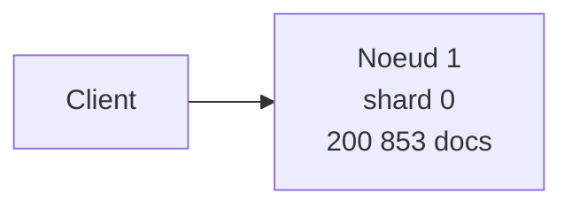

- Recherche : un seul nœud travaille → temps `T`.
- Si on veut accélérer : impossible, on est limité à 1 CPU.
- Suffisant pour ce cours (un seul Docker, dataset modeste).

#### Cas B : `number_of_shards: 3` sur un cluster de 3 nœuds

Elasticsearch répartit automatiquement :

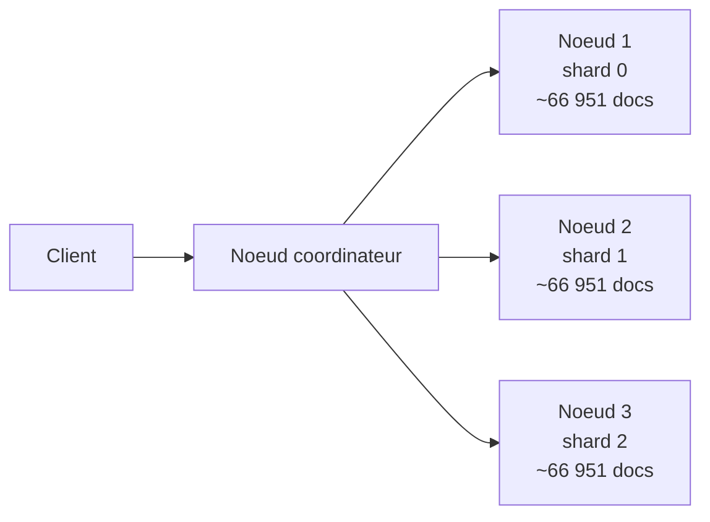

- Recherche : les 3 nœuds cherchent **en parallèle** → temps `T/3`.
- Le coordinateur **fusionne** les 3 résultats partiels et trie le top global.
- C'est ainsi qu'Elasticsearch encaisse des index de **téraoctets**.

### Exemple 2 — Comment un document est-il assigné à un shard ?

C'est purement mathématique. Pour chaque nouveau document, Elasticsearch fait :

```
shard_id = hash(_id) modulo number_of_shards
```

Avec `number_of_shards = 3` :

| `_id` du doc        | `hash(_id)` | `% 3` | Shard cible |
| ------------------- | ----------- | :---: | :---------: |
| `article-00001`     | 7 482 109   | 1     | shard 1     |
| `article-00002`     | 9 318 047   | 0     | shard 0     |
| `article-00003`     | 4 102 558   | 2     | shard 2     |
| `article-00004`     | 6 791 230   | 1     | shard 1     |
| `article-00005`     | 1 555 902   | 0     | shard 0     |

> **Conséquence importante :** une fois qu'un index est créé, on **ne peut pas changer `number_of_shards`** sans tout réindexer. La formule changerait, et tous les documents seraient dans le mauvais shard.

### Exemple 3 — Recherche distribuée pas à pas

Requête : `GET news/_search { "query": { "match": { "headline": "trump" } } }`

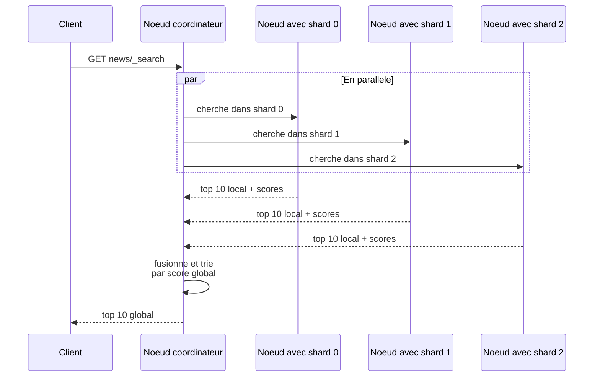

Chaque shard renvoie son **top 10 local**. Le coordinateur fait le **tri final** sur les 30 candidats reçus pour produire le top 10 global. C'est ce qu'on appelle la phase **query then fetch**.

### Exemple 4 — Combien de shards faut-il ?

Règle pratique d'Elastic pour la production :

| Taille de l'index visée | `number_of_shards` recommandé        |
| ----------------------- | ------------------------------------ |
| < 1 Go                  | **1**                                |
| 1 à 30 Go               | 1 (un shard ≤ 30 Go est l'idéal)     |
| 30 Go à 100 Go          | 2 ou 3                               |
| 1 To                    | 30 à 50                              |

> **Pour ce cours** : on reste sur **1 shard** dans tous les `docker-compose.yml` (réglage par défaut). Les 200 853 documents font ~250 Mo une fois indexés, largement sous les 30 Go.

### Exemple 5 — Shard primaire vs shard réplica

Chaque shard existe en **deux versions** (au minimum) :

| Type            | Rôle                                              | Combien                              |
| --------------- | ------------------------------------------------- | ------------------------------------ |
| **Primaire**    | Reçoit les écritures, source de vérité            | 1 par shard, jamais déplacé          |
| **Réplica**     | Copie en lecture seule, prend le relais en cas de panne | 0 ou plus (réglage `number_of_replicas`) |

Avec `number_of_shards: 3` et `number_of_replicas: 1`, on a au total **6 shards** (3 primaires + 3 réplicas) répartis sur les nœuds **avec la règle « jamais le primaire et son réplica sur le même nœud »** :

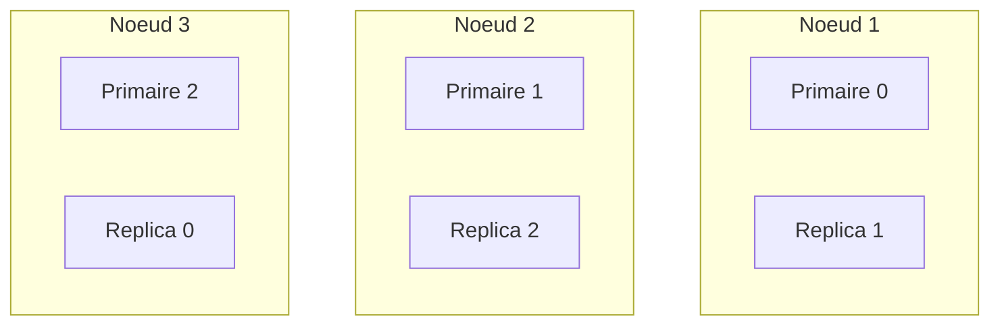

Si le **Nœud 1 plante**, le **Réplica 0** sur le Nœud 3 est **promu primaire** automatiquement, et le service continue **sans perte de données**.

### Tableau récapitulatif

| Question                                              | Réponse                                                     |
| ----------------------------------------------------- | ----------------------------------------------------------- |
| Un shard, c'est quoi techniquement ?                  | Un index Lucene complet et autonome.                        |
| Comment un doc est-il placé dans un shard ?           | `hash(_id) % number_of_shards`                              |
| Peut-on changer `number_of_shards` après création ?   | Non, seulement en réindexant.                                |
| Pour ce cours, combien de shards ?                    | 1 (par défaut). Largement suffisant.                         |
| Et `number_of_replicas` ?                             | 0 pendant l'import, 1 ensuite. Voir chapitre 14.            |
| Pourquoi plus de shards = plus rapide ?               | Recherche parallèle sur N nœuds simultanés.                 |
| Pourquoi pas 1000 shards alors ?                      | Trop d'overhead (chaque shard coûte de la RAM et un thread). |

> On approfondit la planification des shards au [chapitre 03](./03-concepts-cles-elasticsearch.md).

</details>

> On reverra tout ça en détail au [chapitre 03](./03-concepts-cles-elasticsearch.md).

---

## 6. Récapitulatif visuel

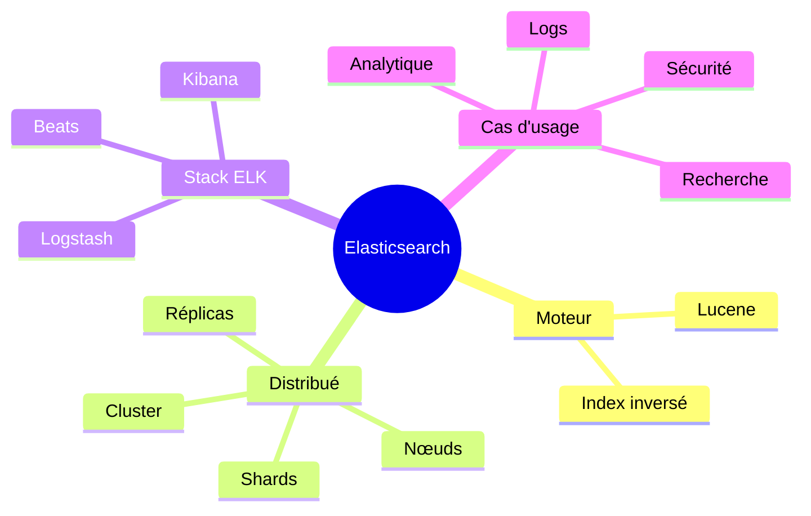

---

## 7. Glossaire — tous les mots-clés Elasticsearch

> Référence rapide de **tous les mots-clés** que vous croiserez dans le cours et dans la documentation officielle. Triés par catégorie. Ouvrez les sections `<details>` pour les explications longues.

### 7.1 Endpoints et préfixes spéciaux (les `_` underscore)

Tout ce qui commence par `_` dans une URL Elasticsearch est un **endpoint réservé** (et **non** un nom d'index).

| Mot-clé             | Type        | À quoi ça sert                                                                                                                |
| ------------------- | ----------- | ----------------------------------------------------------------------------------------------------------------------------- |
| `_doc`              | Type doc    | **Type implicite** d'un document. `POST /produits/_doc` = « ajoute un document dans l'index `produits` ». Avant ES 7, on avait des « types » personnalisés (deprecated). Aujourd'hui : toujours `_doc`. |
| `_id`               | Métadonnée  | Identifiant unique du document dans l'index (ex. `"_id": "abc123"`). Si vous ne le donnez pas, ES en génère un.                |
| `_index`            | Métadonnée  | Nom de l'index dans lequel le document est stocké.                                                                            |
| `_source`           | Métadonnée  | Le **JSON original** du document tel que vous l'avez envoyé. C'est ce qui est renvoyé par défaut dans les résultats.          |
| `_score`            | Métadonnée  | Score de pertinence calculé par BM25 lors d'une recherche. Plus c'est haut, plus c'est pertinent.                              |
| `_search`           | Endpoint    | `GET /produits/_search { ... }` → exécuter une requête Query DSL.                                                              |
| `_count`            | Endpoint    | `GET /produits/_count` → juste compter les documents (sans les renvoyer).                                                      |
| `_create`           | Endpoint    | `PUT /produits/_create/42 { ... }` → créer un document **uniquement s'il n'existe pas** (sinon erreur 409).                    |
| `_update`           | Endpoint    | `POST /produits/_update/42 { "doc": { ... } }` → **mise à jour partielle** (merge JSON).                                       |
| `_update_by_query`  | Endpoint    | Mettre à jour **plusieurs documents** d'un coup via une requête.                                                              |
| `_delete_by_query`  | Endpoint    | Supprimer **plusieurs documents** d'un coup via une requête.                                                                  |
| `_bulk`             | Endpoint    | `POST /_bulk` → envoyer **des milliers d'opérations** (index/create/update/delete) en une seule requête HTTP. Indispensable pour l'import massif. |
| `_mget`             | Endpoint    | « multi-get » : récupérer plusieurs documents par leurs IDs en une seule requête.                                              |
| `_msearch`          | Endpoint    | « multi-search » : exécuter plusieurs requêtes en une seule fois.                                                             |
| `_mapping`          | Endpoint    | `GET /produits/_mapping` → voir le schéma (types des champs) de l'index.                                                      |
| `_settings`         | Endpoint    | `GET /produits/_settings` → voir/modifier les réglages d'un index (shards, réplicas, analyzers).                              |
| `_aliases`          | Endpoint    | Donner un **alias** à un index (ex. `logs-current` pointe vers `logs-2026.04`). Permet de pivoter sans changer le code client. |
| `_refresh`          | Endpoint    | Forcer ES à rendre **immédiatement visibles** les documents qui viennent d'être indexés (sinon attente ~1 s).                  |
| `_flush`            | Endpoint    | Forcer Lucene à écrire les segments sur disque (rare en pratique).                                                            |
| `_forcemerge`       | Endpoint    | Fusionner les petits segments Lucene en gros (optimisation à froid).                                                          |
| `_reindex`          | Endpoint    | Copier tous les documents d'un index vers un autre (ex. après changement de mapping).                                          |
| `_cat`              | Endpoint    | `GET /_cat/indices?v` → vues **lisibles** (texte tabulaire) du cluster, des indices, des nœuds, des shards…                   |
| `_cluster`          | Endpoint    | `GET /_cluster/health` → état général du cluster (vert / jaune / rouge).                                                       |
| `_nodes`            | Endpoint    | `GET /_nodes` → infos sur tous les nœuds du cluster.                                                                          |
| `_tasks`            | Endpoint    | Voir et annuler les **tâches longues** en cours (reindex, update_by_query, etc.).                                              |
| `_snapshot`         | Endpoint    | Sauvegardes / restaurations.                                                                                                 |
| `_template`         | Endpoint    | **Templates d'index** : appliquer automatiquement des mappings/settings à tout index dont le nom matche un pattern.            |
| `_ingest`           | Endpoint    | Gérer les **ingest pipelines** (transformations à l'indexation : `set`, `rename`, `geoip`, `inference`, …).                    |
| `_security`         | Endpoint    | Utilisateurs, rôles, API keys (X-Pack).                                                                                       |
| `_ilm`              | Endpoint    | **Index Lifecycle Management** : politique de rotation chaud → tiède → froid → suppression.                                    |
| `_cache/clear`      | Endpoint    | Vider les caches (utile en debug).                                                                                            |
| `_explain`          | Endpoint    | `GET /produits/_explain/42` → expliquer **pourquoi** un document obtient tel score pour telle requête.                         |
| `_validate/query`   | Endpoint    | Vérifier qu'une requête DSL est syntaxiquement correcte sans l'exécuter.                                                      |
| `_analyze`          | Endpoint    | Tester un **analyzer** : « voici un texte, donne-moi les tokens produits ».                                                   |

<details>
<summary><b>Pourquoi <code>_doc</code> existe encore alors qu'il n'y a plus de "types" ?</b></summary>

Avant Elasticsearch 7, un index pouvait contenir **plusieurs types** de documents (ex. `produits`, `clients` dans le même index `boutique`). Cette idée a été abandonnée car elle créait des conflits de mapping et de la confusion.

Depuis ES 7+, **un index = un seul type**, et ce type s'appelle conventionnellement `_doc`. C'est pour ça que toutes les URLs ressemblent à :

```
POST /mon_index/_doc          → créer un doc (ID auto)
PUT  /mon_index/_doc/42       → créer/remplacer le doc 42
GET  /mon_index/_doc/42       → lire le doc 42
DELETE /mon_index/_doc/42     → supprimer le doc 42
```

`_doc` n'est **pas** un nom magique : c'est juste le **placeholder du type unique**. Vous ne pouvez pas le changer.

</details>

### 7.2 Concepts d'architecture

| Mot-clé             | Définition                                                                                                       |
| ------------------- | ---------------------------------------------------------------------------------------------------------------- |
| **Cluster**         | Ensemble de nœuds Elasticsearch qui partagent le même `cluster.name` et travaillent ensemble.                   |
| **Node** (nœud)     | Un process Elasticsearch (1 JVM) sur une machine. Plusieurs rôles possibles : master, data, ingest, coordinating. |
| **Index**           | « Table » logique d'Elasticsearch. Contient des documents JSON.                                                  |
| **Shard**           | Morceau d'un index. Un index est découpé en N shards primaires distribués sur les nœuds.                         |
| **Replica**         | Copie d'un shard primaire sur **un autre nœud**. Sert à la haute dispo et accélère la lecture.                   |
| **Document**        | Unité de base : un objet JSON stocké dans un index, identifié par `_id`.                                          |
| **Field** (champ)   | Une clé d'un document JSON. Chaque champ a un **type** (text, keyword, long, date, geo_point, dense_vector…).    |
| **Mapping**         | Schéma de l'index : la liste des champs et leur type. Peut être explicite ou inféré (« dynamic mapping »).      |
| **Segment**         | Fichier Lucene immuable contenant une portion d'un shard. Les recherches scannent tous les segments.              |
| **Lucene**          | Bibliothèque Java de recherche full-text utilisée par Elasticsearch sous le capot.                                |
| **Inverted index**  | Structure « mot → liste des documents qui le contiennent ». Cœur de la rapidité d'Elasticsearch.                  |

### 7.3 Types de champs (mapping)

| Type                   | Quand l'utiliser                                                                                       |
| ---------------------- | ------------------------------------------------------------------------------------------------------ |
| `text`                 | Texte libre **analysé** (tokenisé). Bon pour `match`, recherche full-text. Pas trié, pas agrégé.       |
| `keyword`              | Texte **non analysé** (stocké tel quel). Pour `term`, tri, agrégations (ex. `category.keyword`).        |
| `long`, `integer`, `short`, `byte` | Entiers.                                                                                  |
| `double`, `float`, `half_float`, `scaled_float` | Décimaux.                                                                  |
| `boolean`              | `true` / `false`.                                                                                      |
| `date`                 | Date/heure (formats ISO ou epoch_millis).                                                              |
| `binary`               | Données encodées en base64.                                                                            |
| `object`               | Sous-objet JSON imbriqué (aplati par défaut).                                                          |
| `nested`               | Sous-objet imbriqué qui **conserve son indépendance** (utile pour des tableaux d'objets).              |
| `geo_point`            | Coordonnées lat/lon (cartes Kibana).                                                                   |
| `geo_shape`            | Polygones, lignes (cartes complexes).                                                                  |
| `ip`                   | Adresse IPv4/IPv6 (filtrage par CIDR).                                                                 |
| `dense_vector`         | Vecteur dense pour recherche **kNN** (embeddings, IA, similarité sémantique).                          |
| `completion`           | Auto-complétion ultra-rapide (suggester).                                                              |

### 7.4 Query DSL (recherche)

| Mot-clé             | Catégorie    | Effet                                                                                              |
| ------------------- | ------------ | -------------------------------------------------------------------------------------------------- |
| `query`             | Racine       | Conteneur d'une requête de recherche.                                                              |
| `match`             | Full-text    | Cherche un mot/phrase dans un champ `text` (analysé). Tolère les variations.                       |
| `match_phrase`      | Full-text    | Cherche une **phrase exacte** (mots dans l'ordre, contigus).                                        |
| `match_all`         | Full-text    | Renvoie tous les documents (utile pour exporter / paginer tout).                                    |
| `multi_match`       | Full-text    | `match` sur **plusieurs champs** à la fois (avec `boost` par champ possible).                       |
| `term`              | Term-level   | Match **exact** sur un champ `keyword` ou un nombre. Ne tokenise pas.                               |
| `terms`             | Term-level   | Match exact sur **une liste de valeurs** (ex. `category IN ['POLITICS', 'TECH']`).                  |
| `range`             | Term-level   | Filtre `>=`, `<=`, `gt`, `lt` sur nombre, date, IP.                                                |
| `exists`            | Term-level   | Document où un champ est présent (et non null).                                                    |
| `prefix`            | Term-level   | Préfixe (ex. `chat*`).                                                                             |
| `wildcard`          | Term-level   | Joker `*` et `?` (lent, à éviter en prod).                                                         |
| `regexp`            | Term-level   | Expression régulière.                                                                              |
| `fuzzy`             | Term-level   | Tolérance aux fautes de frappe (distance de Levenshtein).                                          |
| `bool`              | Compound     | Combine plusieurs clauses : `must`, `should`, `must_not`, `filter`.                                |
| `must`              | Bool         | **Doit matcher** (compte dans le score).                                                           |
| `should`            | Bool         | **Devrait matcher** (boost le score). `minimum_should_match` contrôle combien doivent matcher.     |
| `must_not`          | Bool         | **Ne doit pas matcher** (exclusion).                                                               |
| `filter`            | Bool         | Doit matcher mais **ne compte pas dans le score** (et est cacheable → rapide).                     |
| `function_score`    | Compound     | Modifier le score avec des fonctions (ex. décroissance temporelle, multiplicateur custom).         |
| `boost`             | Param        | Multiplie le poids d'une clause ou d'un champ.                                                     |
| `minimum_should_match` | Param     | Combien de clauses `should` doivent matcher (ex. `"75%"`).                                          |
| `operator`          | Param `match`| `or` (défaut, large) ou `and` (strict).                                                            |
| `fuzziness`         | Param `match`| `AUTO`, `1`, `2` : tolérance aux fautes.                                                           |
| `from` / `size`     | Pagination   | Décalage et nombre de résultats (limité à 10 000 → utiliser `search_after` au-delà).                |
| `search_after`      | Pagination   | Pagination profonde stable (basée sur la dernière ligne reçue).                                    |
| `scroll`            | Pagination   | Curseur pour parcourir des **millions** de documents (export). Deprecated au profit de `pit`.      |
| `pit`               | Pagination   | « Point in time » : snapshot pour `search_after`.                                                  |
| `sort`              | Tri          | Trier par un ou plusieurs champs (`asc` / `desc`).                                                 |
| `_source`           | Filtre       | Limiter quels champs sont renvoyés (économise de la bande passante).                               |
| `highlight`         | Affichage    | Surligner les mots qui ont matché (`<em>...</em>` autour des hits).                                |
| `track_total_hits`  | Param        | Forcer le calcul exact du nombre total de hits (sinon ES s'arrête à 10 000).                       |

### 7.5 Agrégations

| Mot-clé             | Type d'agg   | Effet                                                                                              |
| ------------------- | ------------ | -------------------------------------------------------------------------------------------------- |
| `aggs` / `aggregations` | Racine   | Conteneur d'agrégations (équivalent SQL `GROUP BY`).                                               |
| `terms`             | Bucket       | Regrouper par valeur d'un champ (top N).                                                           |
| `date_histogram`    | Bucket       | Regrouper par tranche de temps (`day`, `hour`, `month`).                                           |
| `histogram`         | Bucket       | Regrouper par tranche numérique (ex. tous les 100).                                                |
| `range`             | Bucket       | Regrouper par intervalles personnalisés.                                                           |
| `filters`           | Bucket       | Plusieurs buckets définis chacun par une requête.                                                  |
| `nested`            | Bucket       | Agréger sur des champs `nested`.                                                                   |
| `avg`, `sum`, `min`, `max` | Metric | Statistiques classiques.                                                                            |
| `cardinality`       | Metric       | Compte de valeurs **distinctes** (approximatif, HyperLogLog).                                       |
| `stats`             | Metric       | `avg + sum + min + max + count` en une seule passe.                                                |
| `extended_stats`    | Metric       | + écart-type, variance.                                                                            |
| `percentiles`       | Metric       | Médiane, p95, p99 (latence par exemple).                                                          |
| `top_hits`          | Sub-agg      | Récupérer les **N documents représentatifs** de chaque bucket.                                     |
| `significant_terms` | Bucket       | Termes **anormalement fréquents** dans un sous-ensemble (utile NLP).                              |
| `composite`         | Bucket       | Agrégation paginée (équivalent `GROUP BY` infini).                                                 |

### 7.6 Analyse de texte (analyzers)

| Mot-clé             | Effet                                                                                              |
| ------------------- | -------------------------------------------------------------------------------------------------- |
| `analyzer`          | Pipeline complet `char_filter → tokenizer → token_filter` appliqué à un champ `text`.              |
| `char_filter`       | Pré-traitement (HTML strip, mapping de caractères).                                                |
| `tokenizer`         | Découpage en tokens (`standard`, `whitespace`, `keyword`, `ngram`…).                                |
| `token_filter`      | Transforme les tokens (`lowercase`, `stop` mots vides, `stemmer` racines, `synonym`).               |
| `standard analyzer` | Analyzer par défaut, multilingue de base.                                                          |
| `keyword analyzer`  | Ne tokenise pas (laisse le texte tel quel, en un seul token).                                      |
| `french analyzer`   | Pré-construit pour le français (stopwords + stemming `light_french`).                              |
| `normalizer`        | Comme un analyzer mais pour les champs `keyword` (lowercase / asciifolding).                       |

### 7.7 Langages de requête disponibles dans Kibana

| Mot-clé             | Quand l'utiliser                                                                                   |
| ------------------- | -------------------------------------------------------------------------------------------------- |
| **Query DSL**       | JSON envoyé à `_search`. Le langage **natif** d'Elasticsearch. Le plus puissant.                   |
| **KQL** (Kibana Query Language) | Barre de recherche dans **Discover** / dashboards. Syntaxe simple : `status:200 AND user:alice`. |
| **Lucene query syntax** | Ancien langage de la barre Discover. Toujours dispo, mais KQL est recommandé.                    |
| **ES\|QL**          | Langage tabulaire **type SQL piped** (`FROM ... | WHERE ... | STATS ...`). Idéal pour rapports.    |
| **SQL**             | API SQL d'Elasticsearch (`POST /_sql?format=txt`). Limitée mais pratique.                          |
| **EQL**             | Event Query Language (sécurité, séquences d'événements).                                           |

### 7.8 Concurrence et versioning

| Mot-clé             | Effet                                                                                              |
| ------------------- | -------------------------------------------------------------------------------------------------- |
| `_version`          | Numéro de version interne du document (incrémenté à chaque update).                                |
| `_seq_no`           | Numéro de séquence du shard (utilisé pour le **CAS optimistique**).                                |
| `_primary_term`     | Numéro de génération du shard primaire.                                                           |
| `if_seq_no` / `if_primary_term` | Conditions sur un update : « ne mets à jour que si la version n'a pas changé ».        |
| `version_type`      | `internal` (défaut) ou `external` (vous gérez vous-même la version).                               |
| `op_type`           | `index` (remplace) ou `create` (échoue si existe).                                                 |
| `routing`           | Forcer un document vers un shard particulier (utile pour co-localiser des données liées).         |

### 7.9 Composants de la stack

| Mot-clé             | Rôle                                                                                               |
| ------------------- | -------------------------------------------------------------------------------------------------- |
| **Elasticsearch**   | Le moteur (stocke + indexe + cherche).                                                            |
| **Kibana**          | UI web : Discover, Dashboards, Dev Tools, Stack Management, ML.                                    |
| **Logstash**        | Pipeline de transformation lourd (JVM). Filtres `grok`, `geoip`, `mutate`.                         |
| **Beats**           | Famille d'agents légers (Go) : **Filebeat** (logs), **Metricbeat** (métriques), **Packetbeat** (réseau), **Auditbeat** (sécurité), **Heartbeat** (uptime), **Winlogbeat** (Windows). |
| **Fleet** + **Elastic Agent** | Successeur unifié de Beats, géré centralement.                                          |
| **APM Server**      | Application Performance Monitoring (traces, latences).                                             |
| **Eland**           | Bibliothèque Python pour pousser des modèles ML (PyTorch, sklearn) dans ES.                        |
| **X-Pack**          | Ensemble de fonctionnalités payantes/gratuites (sécurité, alerting, ML, monitoring).               |

### 7.10 Codes de retour HTTP fréquents

| Code  | Signification dans Elasticsearch                                                                          |
| ----- | --------------------------------------------------------------------------------------------------------- |
| `200` | OK (lecture / recherche).                                                                                 |
| `201` | Created (document créé).                                                                                  |
| `400` | Bad request (requête mal formée, mapping refusé).                                                         |
| `404` | Not found (index ou doc inexistant).                                                                      |
| `409` | Conflict (collision de version, ou `_create` sur ID existant).                                             |
| `429` | Too many requests (file de bulk pleine → ralentir).                                                        |
| `503` | Service unavailable (cluster pas prêt, shards non assignés).                                               |

<details>
<summary><b>Aide-mémoire ultra-condensé : les 10 commandes à retenir absolument</b></summary>

```http
GET  /_cat/indices?v                          # Voir tous les indices
GET  /_cluster/health                          # Etat du cluster
PUT  /produits                                 # Creer un index vide
PUT  /produits/_mapping { ... }                # Definir le schema
POST /produits/_doc { "name": "casque" }       # Indexer un document (ID auto)
PUT  /produits/_doc/42 { "name": "casque" }    # Indexer/remplacer le doc 42
GET  /produits/_doc/42                          # Lire le doc 42
POST /produits/_update/42 { "doc": {...} }     # Mise a jour partielle
GET  /produits/_search { "query": {...} }      # Rechercher
DELETE /produits                                # Supprimer l'index
```

Si vous maitrisez ces 10 lignes, vous tenez déjà 80 % du quotidien Elasticsearch.

</details>

<p align="right"><a href="#top">↑ Retour en haut</a></p>
