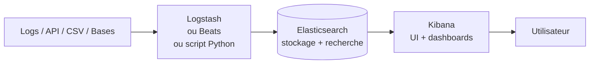
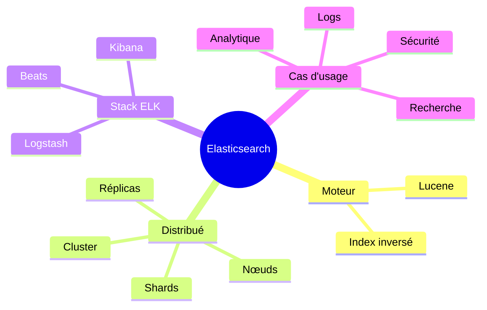

# 01 — Introduction à Elasticsearch & à la stack ELK

> **Type** : Théorie · **Pré-requis** : aucun

## Table des matières

- [1. Pourquoi Elasticsearch ?](#1-pourquoi-elasticsearch-)
- [2. Lucene : le moteur sous le capot](#2-lucene--le-moteur-sous-le-capot)
- [3. Qu'est-ce que la stack ELK ?](#3-quest-ce-que-la-stack-elk-)
- [4. À quoi ça sert concrètement ?](#4-à-quoi-ça-sert-concrètement-)
- [5. Vocabulaire de base à connaître](#5-vocabulaire-de-base-à-connaître)
- [6. Récapitulatif visuel](#6-récapitulatif-visuel)

---

## 1. Pourquoi Elasticsearch ?

Une base de données relationnelle (MySQL, PostgreSQL…) est faite pour **stocker** des données structurées et faire des **jointures**. Elle est mauvaise pour la **recherche textuelle floue** sur de gros volumes (ex. : trouver tous les articles qui parlent de "intelligence artificielle" en moins de 10 ms).

Elasticsearch est un **moteur de recherche** distribué qui répond exactement à ce besoin :

| Besoin                                              | SQL classique         | Elasticsearch         |
| --------------------------------------------------- | --------------------- | --------------------- |
| Recherche `LIKE '%mot%'` sur 10 millions de lignes  | Lent (table scan)     | Quasi instantané      |
| Tolérance aux fautes de frappe                      | Non natif             | Oui (`fuzzy`)         |
| Recherche multi-champs avec scoring                 | Non                   | Oui (`multi_match`)   |
| Agrégations / dashboards temps réel                 | Lent                  | Très rapide           |
| Filtre + facettes + pagination                      | Compliqué             | Natif                 |

---

## 2. Lucene : le moteur sous le capot

Elasticsearch n'invente pas la recherche textuelle : il s'appuie sur **Apache Lucene**, une librairie Java qui implémente l'**index inversé**.

C'est quoi un <b>index inversé</b> ?

Au lieu de stocker "document → mots", on stocke **"mot → liste des documents qui le contiennent"**.

Exemple :

| Mot           | Documents          |
| ------------- | ------------------ |
| `intelligence`| 3, 7, 42           |
| `artificielle`| 7, 42, 99          |
| `réseau`      | 1, 7, 12           |

Chercher "intelligence artificielle" = intersecter deux listes → **constant** quel que soit le volume.

Elasticsearch ajoute par-dessus Lucene :

- la **distribution** (cluster, shards, réplicas) ;
- une **API REST** propre en JSON (au lieu d'une API Java) ;
- la **gestion des nœuds**, du failover, du rebalancing ;
- des **agrégations** très puissantes (équivalent SQL `GROUP BY`).

---

## 3. Qu'est-ce que la stack ELK ?

**ELK = Elasticsearch + Logstash + Kibana** (parfois étendue à *Elastic Stack* avec Beats).

| Composant         | Rôle                                                                     |
| ----------------- | ------------------------------------------------------------------------ |
| **Beats**         | Petits agents qui collectent (Filebeat = logs, Metricbeat = métriques…). |
| **Logstash**      | Pipeline d'ingestion (parse, transforme, enrichit, envoie à ES).         |
| **Elasticsearch** | Stocke + indexe + permet la recherche.                                   |
| **Kibana**        | Interface web : explorer, visualiser, créer des dashboards.              |

---

## 4. À quoi ça sert concrètement ?

| Cas d'usage           | Exemple                                                                 |
| --------------------- | ----------------------------------------------------------------------- |
| **Logs applicatifs**  | Centraliser les logs de 50 serveurs et les chercher en 1 clic.          |
| **Recherche site web**| Barre de recherche e-commerce avec autocomplétion + tolérance aux fautes. |
| **SIEM / sécurité**   | Détection d'anomalies dans des millions d'événements réseau.            |
| **Observabilité**     | Métriques applicatives (APM) + traces + logs en un seul endroit.        |
| **Analytique**        | Dashboards temps réel (ventes, trafic, KPIs).                           |

---

## 5. Vocabulaire de base à connaître

| Terme              | Définition courte                                                              |
| ------------------ | ------------------------------------------------------------------------------ |
| **Cluster**        | Ensemble de nœuds Elasticsearch qui travaillent ensemble.                      |
| **Nœud**           | Une instance Elasticsearch (un process Java).                                  |
| **Index**          | Équivalent d'une "table" : regroupe des documents similaires.                  |
| **Document**       | Une ligne JSON (équivalent d'une "row").                                       |
| **Mapping**        | Schéma : type de chaque champ (text, keyword, date, integer…).                 |
| **Shard**          | Morceau d'un index, distribué sur le cluster.                                  |
| **Réplica**        | Copie d'un shard, pour la haute dispo.                                         |

> On reverra tout ça en détail au [chapitre 03](./03-concepts-cles-elasticsearch.md).

---

## 6. Récapitulatif visuel

<a href="#top">↑ Retour en haut</a>

