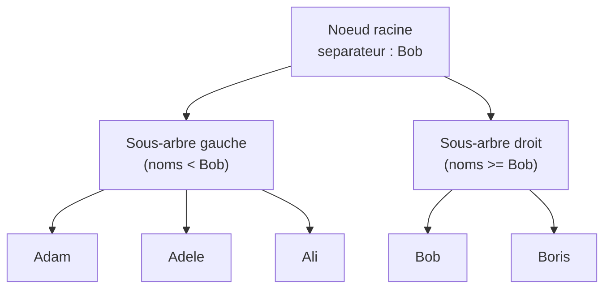
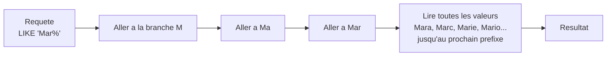
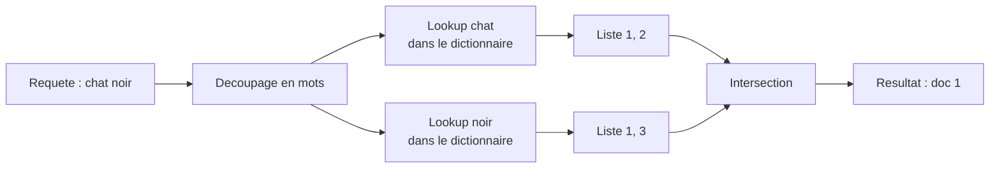
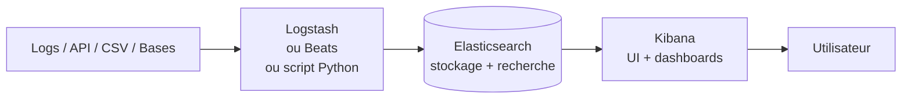
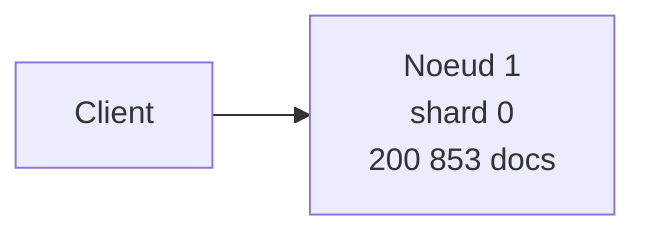
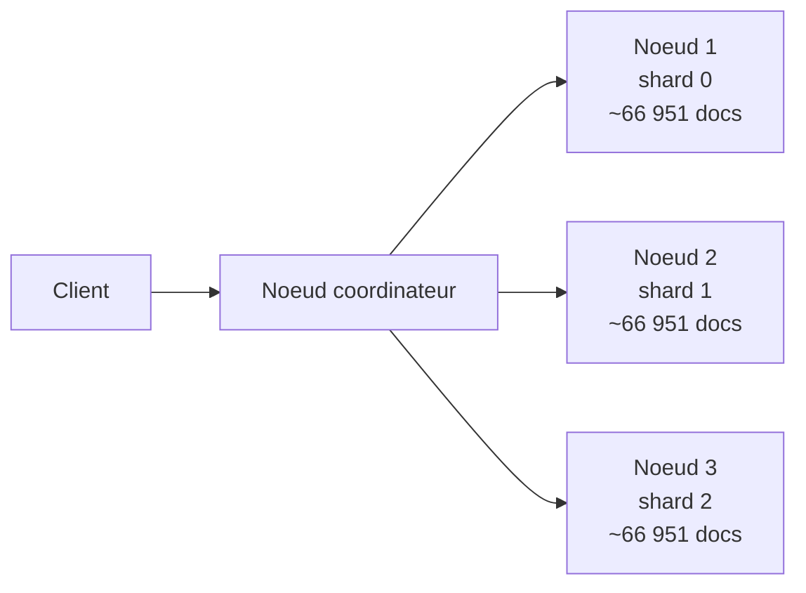
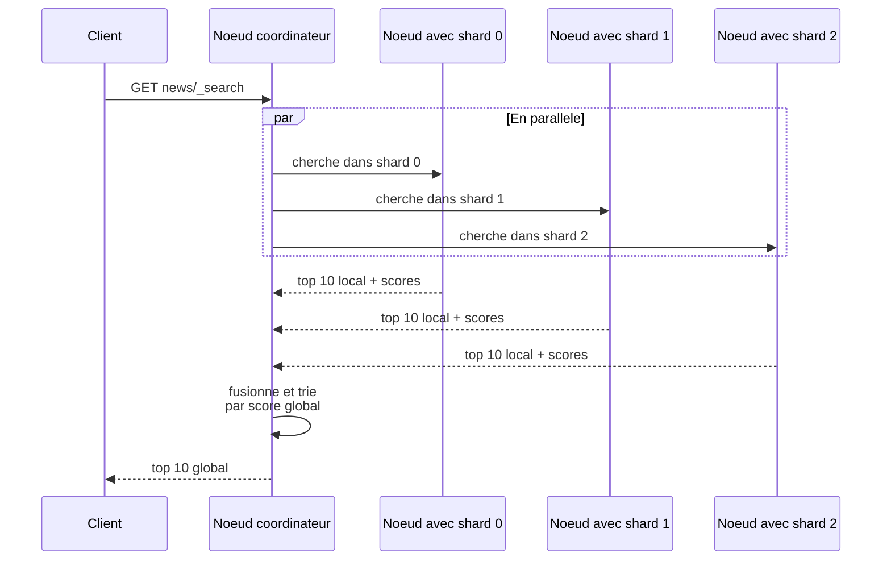
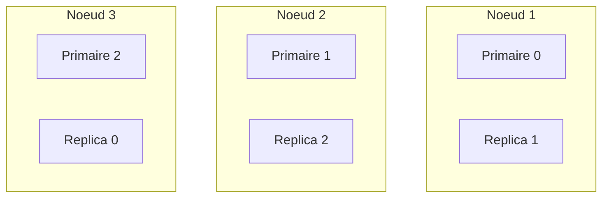
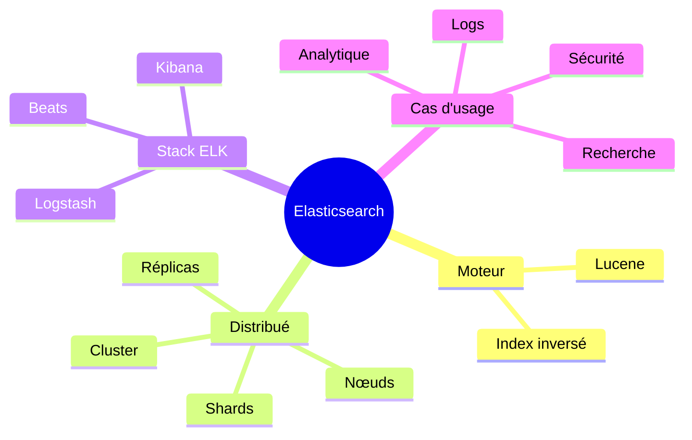

<a id="top"></a>

# 01 — Introduction à Elasticsearch & à la stack ELK

> **Type** : Théorie · **Pré-requis** : aucun

## Table des matières

- [1. Pourquoi Elasticsearch ?](#1-pourquoi-elasticsearch-)
- [2. Lucene : le moteur sous le capot](#2-lucene--le-moteur-sous-le-capot)
- [3. Qu'est-ce que la stack ELK ?](#3-quest-ce-que-la-stack-elk-)
- [4. À quoi ça sert concrètement ?](#4-à-quoi-ça-sert-concrètement-)
- [5. Vocabulaire de base à connaître](#5-vocabulaire-de-base-à-connaître)
- [6. Récapitulatif visuel](#6-récapitulatif-visuel)

---

## 1. Pourquoi Elasticsearch ?

Une base de données relationnelle (MySQL, PostgreSQL…) est faite pour **stocker** des données structurées et faire des **jointures**. Elle est mauvaise pour la **recherche textuelle floue** sur de gros volumes (ex. : trouver tous les articles qui parlent de "intelligence artificielle" en moins de 10 ms).

Elasticsearch est un **moteur de recherche** distribué qui répond exactement à ce besoin :

| Besoin                                              | SQL classique         | Elasticsearch         |
| --------------------------------------------------- | --------------------- | --------------------- |
| Recherche `LIKE '%mot%'` sur 10 millions de lignes  | Lent (table scan)     | Quasi instantané      |
| Tolérance aux fautes de frappe                      | Non natif             | Oui (`fuzzy`)         |
| Recherche multi-champs avec scoring                 | Non                   | Oui (`multi_match`)   |
| Agrégations / dashboards temps réel                 | Lent                  | Très rapide           |
| Filtre + facettes + pagination                      | Compliqué             | Natif                 |

<details>
<summary><b>Pourquoi SQL est lent sur la recherche textuelle ? (explication détaillée)</b></summary>

Quand vous écrivez en SQL :

```sql
SELECT * FROM articles WHERE contenu LIKE '%intelligence%';
```

La base de données **n'a aucun index utilisable** pour ce genre de motif. Pourquoi ?

- Les index B-tree de SQL sont triés **par début de chaîne**. Ils servent pour `WHERE nom LIKE 'Mar%'` (préfixe), mais **pas** pour `'%intelligence%'` (le mot peut être au milieu).
- Résultat : la base fait un **table scan**. Elle ouvre chaque ligne, lit la colonne `contenu`, vérifie si elle contient le motif.

Sur 10 millions de lignes :

| Approche                                  | Temps typique         |
| ----------------------------------------- | --------------------- |
| `LIKE '%mot%'` en SQL (table scan)        | 10 - 60 secondes      |
| Lookup dans un index inversé Elasticsearch | < 50 millisecondes    |

C'est précisément pour ça qu'on utilise Elasticsearch **à côté** d'une base SQL, pas à la place : SQL pour les transactions et les jointures, Elasticsearch pour la recherche.

</details>

<details>
<summary><b>C'est quoi un index B-tree, et pourquoi il marche pour <code>'Mar%'</code> mais pas pour <code>'%ar'</code> ?</b></summary>

### L'idée en une phrase

Un B-tree est un **arbre trié** où chaque nœud sépare les valeurs en intervalles. Pour du texte, il fonctionne **caractère par caractère, depuis le début de la chaîne** — exactement comme un **dictionnaire papier**.

### Exemple : index B-tree sur la colonne `nom`

Imaginez une table `clients(nom)` avec ces 5 valeurs :

```
Adam
Adele
Ali
Bob
Boris
```

Le B-tree les organise comme suit (vue simplifiée) :



Comment l'arbre compare deux noms : **lettre par lettre, en partant du début**.

| Comparaison      | Résultat                                                                |
| ---------------- | ----------------------------------------------------------------------- |
| `Adam` vs `Adele`| 1ère lettre : `A` = `A` → continue. 2e : `d` = `d`. 3e : `a` < `e`. Donc `Adam` < `Adele`. |
| `Ali` vs `Bob`   | 1ère lettre : `A` < `B`. Réponse immédiate : `Ali` < `Bob`.             |
| `Bob` vs `Boris` | `B` = `B`, `o` = `o`, `b` < `r`. Donc `Bob` < `Boris`.                  |

### Pourquoi `LIKE 'Mar%'` est rapide

```sql
SELECT * FROM clients WHERE nom LIKE 'Mar%';
```

Le moteur SQL connaît le **préfixe** : il commence par `M`, puis `a`, puis `r`. Il **descend dans l'arbre** vers la branche `M`, puis `Ma`, puis `Mar`, et lit toutes les valeurs en partant de là **jusqu'à ce qu'il dépasse `Mas`**. Quelques sauts dans l'arbre, lecture séquentielle de la zone trouvée, **terminé**.



Sur 10 millions de lignes, environ **20 sauts** dans l'arbre suffisent. C'est `O(log n)`.

### Pourquoi `LIKE '%ar'` est lent

```sql
SELECT * FROM clients WHERE nom LIKE '%ar';
```

Le moteur **ne connaît pas le début** de la chaîne. Le `%` au début veut dire « n'importe quoi avant `ar` ». Or l'arbre est trié par **début de chaîne**. Donc :

- `Caesar` se termine par `ar` → branche `C`
- `Bazaar` se termine par `ar` → branche `B`
- `Mar` se termine par `ar` → branche `M`

Les correspondances sont **éparpillées partout** dans l'arbre. Aucun moyen de « descendre droit » vers la réponse. Le moteur **abandonne l'index** et fait un **table scan complet** (`O(n)`).

### Tableau récapitulatif des cas

| Requête SQL                  | L'index B-tree aide ?           | Pourquoi                                                       |
| ---------------------------- | :-----------------------------: | -------------------------------------------------------------- |
| `WHERE nom = 'Ahmed'`        | Oui                             | Égalité exacte = un seul lookup dans l'arbre                   |
| `WHERE nom > 'Benoit'`       | Oui                             | L'arbre est trié, on saute à la position et on lit la suite    |
| `WHERE nom LIKE 'Cha%'`      | Oui                             | Préfixe connu → navigation directe                             |
| `WHERE nom BETWEEN 'A' AND 'D'` | Oui                          | Plage contiguë de l'arbre                                      |
| `WHERE nom LIKE '%hat'`      | **Non**                         | Suffixe inconnu → éparpillé                                    |
| `WHERE nom LIKE '%intel%'`   | **Non**                         | Sous-chaîne au milieu → éparpillé                              |
| `WHERE LENGTH(nom) = 5`      | **Non**                         | Fonction sur le champ → l'index est invalidé                   |

### Petite nuance : la collation

L'ordre exact dépend de la **collation** de la base :

- Sensible ou non à la **casse** : `Adam` vs `adam` égaux ou pas ?
- Gestion des **accents** : `é` vs `e` proches ou distincts ?
- **Règles linguistiques** : en suédois, `å` vient après `z` ; en français, après `a`.

Ces différences sont gérées par la collation (`utf8mb4_unicode_ci`, `fr_FR.UTF-8`, etc.) mais **n'affectent pas le principe** : l'index reste trié par début de chaîne.

### En résumé

| Aspect           | B-tree (SQL)                         | Index inversé (Elasticsearch)            |
| ---------------- | ------------------------------------ | ---------------------------------------- |
| Structure        | Arbre trié par valeur                | Dictionnaire mot → liste de docs         |
| Bon pour…        | Égalité, plage, préfixe              | Recherche full-text, sous-chaîne, fuzzy  |
| Mauvais pour…    | Sous-chaîne, suffixe, full-text      | Égalité exacte sur clé primaire (overhead) |
| Complexité       | `O(log n)` si préfixe connu          | `O(1)` lookup + intersection de listes   |

</details>

---

## 2. Lucene : le moteur sous le capot

Elasticsearch n'invente pas la recherche textuelle : il s'appuie sur **Apache Lucene**, une librairie Java qui implémente l'**index inversé**.

<details>
<summary><b>C'est quoi un index inversé ? (explication détaillée)</b></summary>

### L'idée en une phrase

Un index inversé est juste une **table à l'envers**. Au lieu de noter pour chaque document quels mots il contient, on note pour chaque mot dans quels documents il apparaît.

### Le cas naïf : ce qu'il NE faut PAS faire

Imaginez qu'on stocke les choses dans le sens « naturel » :

| Document   | Contenu                              |
| ---------- | ------------------------------------ |
| document 1 | `réseau de neurones`                 |
| document 2 | `apprentissage machine`              |
| document 3 | `intelligence des foules`            |
| ...        | ...                                  |
| document 99| `intelligence artificielle générale` |

Pour répondre à la recherche `intelligence artificielle`, le moteur devrait **ouvrir chaque document, lire son texte, vérifier la présence des deux mots**. Sur 1 000 documents c'est lent. Sur 100 millions, c'est inutilisable.

### L'astuce : on inverse la table

On construit **une fois pour toutes** une table où la clé est le **mot** :

| Mot            | Documents qui contiennent ce mot |
| -------------- | -------------------------------- |
| `intelligence` | 3, 7, 42                         |
| `artificielle` | 7, 42, 99                        |
| `réseau`       | 1, 7, 12                         |

Comment lire ça :

- le mot **intelligence** apparaît dans les documents **3, 7 et 42**
- le mot **artificielle** apparaît dans les documents **7, 42 et 99**
- le mot **réseau** apparaît dans les documents **1, 7 et 12**

> Les nombres `3`, `7`, `42` ne sont **pas** des valeurs spéciales. Ce sont juste des **identifiants de documents**, comme des numéros de ligne.

### La recherche devient une intersection de listes

Quand un utilisateur tape `intelligence artificielle`, le moteur fait deux choses très simples :

1. Aller chercher la liste de **intelligence** → `3, 7, 42`
2. Aller chercher la liste de **artificielle** → `7, 42, 99`
3. Garder seulement les documents **présents dans les deux listes** :

```
intelligence  : 3, 7, 42
artificielle  :    7, 42, 99
                  ───────
intersection  :    7, 42
```

Réponse : **les documents 7 et 42** contiennent les deux mots.

### Pourquoi c'est rapide

Le moteur **ne relit jamais le texte des documents** au moment de la recherche. Il regarde uniquement les listes pré-calculées du dictionnaire. Comparer deux listes triées de quelques milliers d'IDs est une opération que l'ordinateur fait en quelques microsecondes, **même sur des centaines de millions de documents**.

### Image mentale

Pensez à un **index de fin de livre** :

```
acide ............... p. 12, 47, 188
algorithme .......... p. 5, 32, 91, 154
appel système ....... p. 7, 88
...
```

Quand vous cherchez « algorithme », vous **n'ouvrez pas le livre page par page**. Vous allez à l'index, vous lisez la liste des pages, vous y allez directement. L'index inversé d'Elasticsearch fonctionne exactement de la même manière, sauf que les « pages » sont des documents JSON.

### Un exemple encore plus simple

Trois documents très courts :

| Document | Texte         |
| -------- | ------------- |
| Doc 1    | `chat noir`   |
| Doc 2    | `chat blanc`  |
| Doc 3    | `chien noir`  |

L'index inversé construit par Lucene ressemble à :

| Mot     | Documents |
| ------- | --------- |
| `chat`  | 1, 2      |
| `noir`  | 1, 3      |
| `blanc` | 2         |
| `chien` | 3         |

Recherche `chat noir` :

```
chat : 1, 2
noir : 1, 3
       ───
inter:  1
```

Réponse : **document 1** uniquement, car c'est le seul à contenir les deux mots.

### Schéma récapitulatif



### Les trois confusions classiques

| Confusion fréquente                                          | La bonne lecture                                                                |
| ------------------------------------------------------------ | ------------------------------------------------------------------------------- |
| « 3, 7, 42 sont des scores »                                  | Non, ce sont juste des **IDs de documents**.                                    |
| « Le moteur lit chaque document à la recherche »              | Non, il lit le **dictionnaire** précalculé. Les documents ne sont pas relus.    |
| « C'est une simple recherche `LIKE '%intelligence%'` en SQL » | Non. `LIKE` fait un **scan complet** ; l'index inversé fait un **lookup direct**. |

</details>

<details>
<summary><b>Et l'analyse du texte avant indexation ? (tokenisation, lowercase, stemming)</b></summary>

Avant d'écrire dans l'index inversé, Lucene **transforme** le texte. Pour la phrase `Les Chats Noirs courent` :

| Étape                     | Résultat                          |
| ------------------------- | --------------------------------- |
| Texte original            | `Les Chats Noirs courent`         |
| 1. **Tokenisation**       | `[Les, Chats, Noirs, courent]`    |
| 2. **Lowercasing**        | `[les, chats, noirs, courent]`    |
| 3. **Stop-words** (FR)    | `[chats, noirs, courent]`         |
| 4. **Stemming / racine**  | `[chat, noir, cour]`              |

C'est la dernière liste qui entre dans l'index inversé. Conséquence : une recherche `chat noir` retrouvera bien le document, même si le texte original était `Les Chats Noirs courent`.

> On revient sur les **analyzers** au [chapitre 03](./03-concepts-cles-elasticsearch.md) et au [chapitre 17](./17-labo2-rapport-dsl-news.md).

</details>

Elasticsearch ajoute par-dessus Lucene :

- la **distribution** (cluster, shards, réplicas) ;
- une **API REST** propre en JSON (au lieu d'une API Java) ;
- la **gestion des nœuds**, du failover, du rebalancing ;
- des **agrégations** très puissantes (équivalent SQL `GROUP BY`).

<details>
<summary><b>Lucene vs Elasticsearch : qui fait quoi ? (explication détaillée)</b></summary>

C'est une confusion fréquente. Voici le partage des rôles :

| Question                            | C'est Lucene qui le fait ? | C'est Elasticsearch ? |
| ----------------------------------- | :------------------------: | :--------------------: |
| Construire l'index inversé          | Oui                        | Non                    |
| Tokeniser, lowercaser, stemmer      | Oui                        | Non                    |
| Calculer le score BM25              | Oui                        | Non                    |
| Stocker physiquement les segments   | Oui                        | Non                    |
| Répartir les données sur N machines | Non                        | Oui                    |
| Exposer une API REST en JSON        | Non                        | Oui                    |
| Gérer les pannes d'un nœud          | Non                        | Oui                    |
| Lancer des agrégations distribuées  | Non                        | Oui                    |

**Image mentale :** Lucene est comme un **moteur de voiture** très performant mais difficile à utiliser tout seul. Elasticsearch est la **voiture complète** autour : carrosserie, volant, GPS, pédales, qui rendent ce moteur utilisable par tout le monde via HTTP/JSON.

C'est pour ça qu'on parle parfois de **Solr** ou **OpenSearch** : ce sont d'autres « voitures » construites autour du même moteur Lucene.

</details>

---

## 3. Qu'est-ce que la stack ELK ?

**ELK = Elasticsearch + Logstash + Kibana** (parfois étendue à *Elastic Stack* avec Beats).



| Composant         | Rôle                                                                     |
| ----------------- | ------------------------------------------------------------------------ |
| **Beats**         | Petits agents qui collectent (Filebeat = logs, Metricbeat = métriques…). |
| **Logstash**      | Pipeline d'ingestion (parse, transforme, enrichit, envoie à ES).         |
| **Elasticsearch** | Stocke + indexe + permet la recherche.                                   |
| **Kibana**        | Interface web : explorer, visualiser, créer des dashboards.              |

<details>
<summary><b>Faut-il TOUS les composants ELK ? (explication détaillée)</b></summary>

**Non.** ELK est une *boîte à outils*, pas un bloc monolithique. Vous prenez ce dont vous avez besoin.

| Votre besoin                                      | Stack minimum                          |
| ------------------------------------------------- | -------------------------------------- |
| Juste tester des requêtes Elasticsearch           | **Elasticsearch** seul (`curl` suffit) |
| Visualiser et explorer des données dans un UI     | **Elasticsearch + Kibana**             |
| Centraliser les logs de plusieurs serveurs        | **Filebeat → Elasticsearch + Kibana**  |
| Pipeline complexe (parsing, enrichissement)       | **Beats → Logstash → Elasticsearch + Kibana** |
| Application web qui interroge ES par programmation | **Elasticsearch** seul (votre app fait l'UI) |

Dans ce cours, on utilise principalement **Elasticsearch + Kibana** (les deux services lancés par les `docker-compose.yml` des chapitres 11 à 17). Pas besoin de Beats ni de Logstash pour apprendre les requêtes DSL.

</details>

---

## 4. À quoi ça sert concrètement ?

| Cas d'usage           | Exemple                                                                 |
| --------------------- | ----------------------------------------------------------------------- |
| **Logs applicatifs**  | Centraliser les logs de 50 serveurs et les chercher en 1 clic.          |
| **Recherche site web**| Barre de recherche e-commerce avec autocomplétion + tolérance aux fautes. |
| **SIEM / sécurité**   | Détection d'anomalies dans des millions d'événements réseau.            |
| **Observabilité**     | Métriques applicatives (APM) + traces + logs en un seul endroit.        |
| **Analytique**        | Dashboards temps réel (ventes, trafic, KPIs).                           |

---

## 5. Vocabulaire de base à connaître

| Terme              | Définition courte                                                              |
| ------------------ | ------------------------------------------------------------------------------ |
| **Cluster**        | Ensemble de nœuds Elasticsearch qui travaillent ensemble.                      |
| **Nœud**           | Une instance Elasticsearch (un process Java).                                  |
| **Index**          | Équivalent d'une "table" : regroupe des documents similaires.                  |
| **Document**       | Une ligne JSON (équivalent d'une "row").                                       |
| **Mapping**        | Schéma : type de chaque champ (text, keyword, date, integer…).                 |
| **Shard**          | Morceau d'un index, distribué sur le cluster.                                  |
| **Réplica**        | Copie d'un shard, pour la haute dispo.                                         |

<details>
<summary><b>Cluster, nœud, shard, réplica : analogie concrète</b></summary>

Imaginez une **bibliothèque municipale** très fréquentée :

| Vocabulaire Elasticsearch | Équivalent dans la bibliothèque                                                       |
| ------------------------- | ------------------------------------------------------------------------------------- |
| **Cluster**               | La bibliothèque dans son ensemble (l'institution).                                    |
| **Nœud**                  | Un bâtiment de la bibliothèque (la centrale, l'annexe nord, l'annexe sud).            |
| **Index**                 | Une collection thématique : « romans », « BD », « presse ».                           |
| **Document**              | Un livre individuel.                                                                  |
| **Mapping**               | La fiche descriptive d'une collection (titres, auteurs, dates, langue…).              |
| **Shard**                 | Une étagère qui contient une partie d'une collection (toute la collection ne tient pas dans un seul bâtiment). |
| **Réplica**               | Une copie de l'étagère, gardée dans un autre bâtiment, au cas où celui-ci brûle.      |

Ce qui se passe quand un utilisateur cherche un livre :

1. Il s'adresse à n'importe quel **bâtiment (nœud)**.
2. Le bâtiment sait quels **bâtiments contiennent quelles étagères (shards)**.
3. Il envoie la requête en parallèle à tous les bâtiments concernés.
4. Chaque bâtiment cherche dans ses étagères, renvoie ses résultats.
5. Le bâtiment d'origine **fusionne** les résultats et répond à l'utilisateur.

Pourquoi des **réplicas** ? Si un bâtiment brûle (panne disque, redémarrage…), les autres bâtiments contiennent une copie de ses étagères. **Aucune donnée perdue, service continu.**

Pourquoi plusieurs **shards** ? Pour pouvoir distribuer les recherches sur plusieurs machines en parallèle. Chercher dans 5 shards de 1 million de documents est **5 fois plus rapide** que chercher dans 1 shard de 5 millions.

</details>

<details>
<summary><b>C'est quoi un shard, en pratique ? (exemples concrets)</b></summary>

### L'idée en une phrase

Un **shard** est un **morceau d'un index**. Quand un index est trop gros pour tenir sur une seule machine — ou trop lent à interroger — on le **découpe** en plusieurs morceaux qu'on répartit sur les nœuds du cluster.

> Important : un shard est **lui-même un index Lucene complet**, autonome, avec son propre index inversé. Ce n'est pas un « fragment » à recoller, c'est un mini-index.

### Exemple 1 — Un index `news` de 200 853 documents

C'est exactement le dataset utilisé aux chapitres 14 à 17 de ce cours. Voyons comment Elasticsearch le découpe selon le réglage `number_of_shards`.

#### Cas A : `number_of_shards: 1` (par défaut)

Tous les 200 853 documents sont **dans un seul shard**, sur un seul nœud.



- Recherche : un seul nœud travaille → temps `T`.
- Si on veut accélérer : impossible, on est limité à 1 CPU.
- Suffisant pour ce cours (un seul Docker, dataset modeste).

#### Cas B : `number_of_shards: 3` sur un cluster de 3 nœuds

Elasticsearch répartit automatiquement :



- Recherche : les 3 nœuds cherchent **en parallèle** → temps `T/3`.
- Le coordinateur **fusionne** les 3 résultats partiels et trie le top global.
- C'est ainsi qu'Elasticsearch encaisse des index de **téraoctets**.

### Exemple 2 — Comment un document est-il assigné à un shard ?

C'est purement mathématique. Pour chaque nouveau document, Elasticsearch fait :

```
shard_id = hash(_id) modulo number_of_shards
```

Avec `number_of_shards = 3` :

| `_id` du doc        | `hash(_id)` | `% 3` | Shard cible |
| ------------------- | ----------- | :---: | :---------: |
| `article-00001`     | 7 482 109   | 1     | shard 1     |
| `article-00002`     | 9 318 047   | 0     | shard 0     |
| `article-00003`     | 4 102 558   | 2     | shard 2     |
| `article-00004`     | 6 791 230   | 1     | shard 1     |
| `article-00005`     | 1 555 902   | 0     | shard 0     |

> **Conséquence importante :** une fois qu'un index est créé, on **ne peut pas changer `number_of_shards`** sans tout réindexer. La formule changerait, et tous les documents seraient dans le mauvais shard.

### Exemple 3 — Recherche distribuée pas à pas

Requête : `GET news/_search { "query": { "match": { "headline": "trump" } } }`



Chaque shard renvoie son **top 10 local**. Le coordinateur fait le **tri final** sur les 30 candidats reçus pour produire le top 10 global. C'est ce qu'on appelle la phase **query then fetch**.

### Exemple 4 — Combien de shards faut-il ?

Règle pratique d'Elastic pour la production :

| Taille de l'index visée | `number_of_shards` recommandé        |
| ----------------------- | ------------------------------------ |
| < 1 Go                  | **1**                                |
| 1 à 30 Go               | 1 (un shard ≤ 30 Go est l'idéal)     |
| 30 Go à 100 Go          | 2 ou 3                               |
| 1 To                    | 30 à 50                              |

> **Pour ce cours** : on reste sur **1 shard** dans tous les `docker-compose.yml` (réglage par défaut). Les 200 853 documents font ~250 Mo une fois indexés, largement sous les 30 Go.

### Exemple 5 — Shard primaire vs shard réplica

Chaque shard existe en **deux versions** (au minimum) :

| Type            | Rôle                                              | Combien                              |
| --------------- | ------------------------------------------------- | ------------------------------------ |
| **Primaire**    | Reçoit les écritures, source de vérité            | 1 par shard, jamais déplacé          |
| **Réplica**     | Copie en lecture seule, prend le relais en cas de panne | 0 ou plus (réglage `number_of_replicas`) |

Avec `number_of_shards: 3` et `number_of_replicas: 1`, on a au total **6 shards** (3 primaires + 3 réplicas) répartis sur les nœuds **avec la règle « jamais le primaire et son réplica sur le même nœud »** :



Si le **Nœud 1 plante**, le **Réplica 0** sur le Nœud 3 est **promu primaire** automatiquement, et le service continue **sans perte de données**.

### Tableau récapitulatif

| Question                                              | Réponse                                                     |
| ----------------------------------------------------- | ----------------------------------------------------------- |
| Un shard, c'est quoi techniquement ?                  | Un index Lucene complet et autonome.                        |
| Comment un doc est-il placé dans un shard ?           | `hash(_id) % number_of_shards`                              |
| Peut-on changer `number_of_shards` après création ?   | Non, seulement en réindexant.                                |
| Pour ce cours, combien de shards ?                    | 1 (par défaut). Largement suffisant.                         |
| Et `number_of_replicas` ?                             | 0 pendant l'import, 1 ensuite. Voir chapitre 14.            |
| Pourquoi plus de shards = plus rapide ?               | Recherche parallèle sur N nœuds simultanés.                 |
| Pourquoi pas 1000 shards alors ?                      | Trop d'overhead (chaque shard coûte de la RAM et un thread). |

> On approfondit la planification des shards au [chapitre 03](./03-concepts-cles-elasticsearch.md).

</details>

> On reverra tout ça en détail au [chapitre 03](./03-concepts-cles-elasticsearch.md).

---

## 6. Récapitulatif visuel



<p align="right"><a href="#top">↑ Retour en haut</a></p>


---

*Copyright © Haythem R - Tous droits reserves.*
