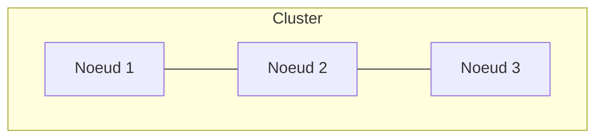
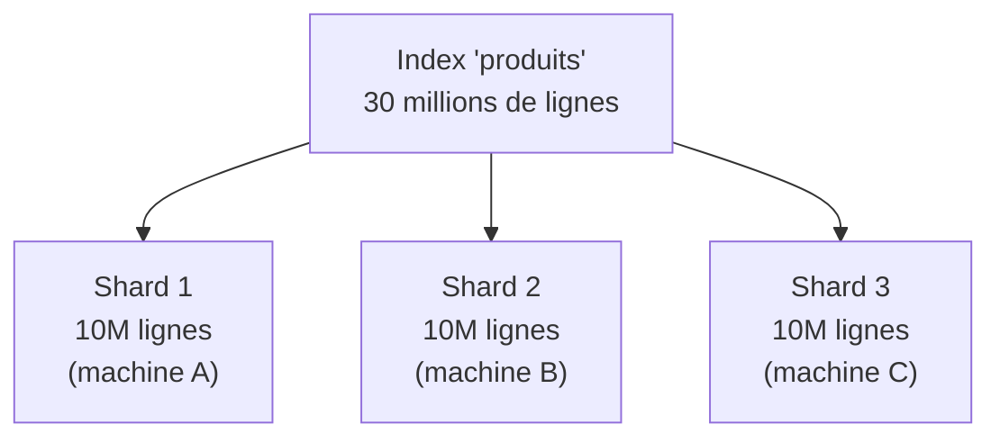
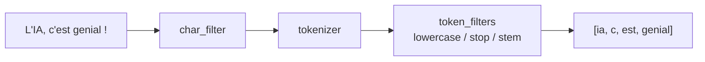
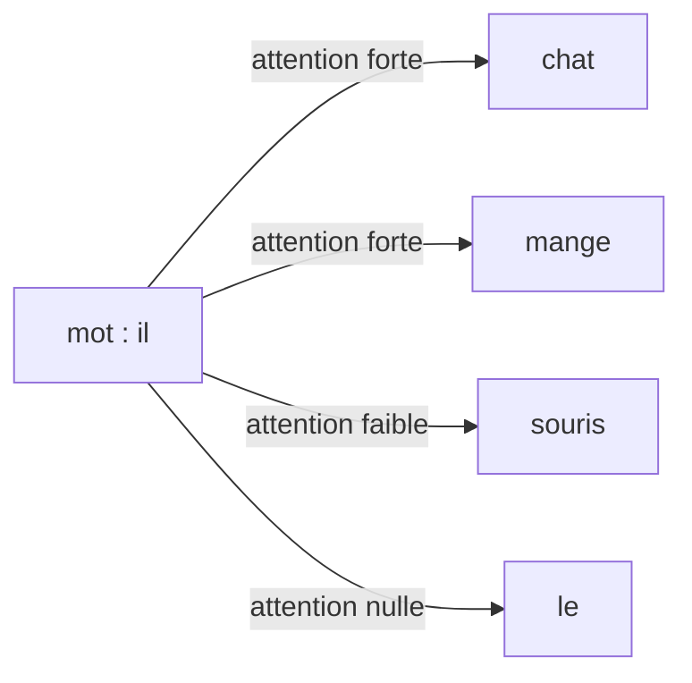
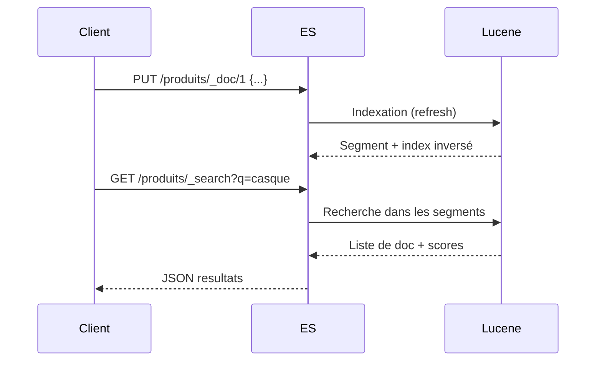

<a id="top"></a>

# 03 — Concepts clés d'Elasticsearch

> **Type** : Théorie · **Pré-requis** : [01](./01-introduction-elasticsearch-elk-stack.md), [02](./02-theorie-sql-vs-documents.md)

## Table des matières

- [1. Cluster, nœuds, shards, réplicas](#1-cluster-nœuds-shards-réplicas)
- [2. Index, document, mapping](#2-index-document-mapping)
- [3. Les types de champs principaux](#3-les-types-de-champs-principaux)
- [4. Recherche : `text` vs `keyword`](#4-recherche--text-vs-keyword)
- [5. Analyseur (analyzer)](#5-analyseur-analyzer)
- [6. Pertinence et score `_score`](#6-pertinence-et-score-_score)
- [7. Cycle de vie d'un document](#7-cycle-de-vie-dun-document)

---

## 1. Cluster, nœuds, shards, réplicas



| Concept     | Définition                                                                                  |
| ----------- | ------------------------------------------------------------------------------------------- |
| **Cluster** | Ensemble de nœuds identifiés par un même `cluster.name`.                                    |
| **Nœud**    | Un process Elasticsearch (1 JVM). Plusieurs rôles possibles : master, data, ingest…         |
| **Shard primaire** | Morceau d'un index. Un index est découpé en N shards.                                |
| **Réplica** | Copie d'un shard primaire, hébergée sur un autre nœud. Sert à la HA et accélère la lecture. |

> **Règle pratique** : 1 shard ≈ 10 à 50 Go de données. Trop de shards = surcharge ; trop peu = pas de parallélisme.

<details>
<summary><b>Analogie avec SQL : index = table, document = ligne (vulgarisation)</b></summary>

#### Le parallèle qui débloque tout

Si vous venez du monde SQL (MySQL, PostgreSQL), voici la traduction directe :

| Monde SQL              | Monde Elasticsearch                  |
| ---------------------- | ------------------------------------ |
| **Base de données**    | **Cluster** Elasticsearch            |
| **Table**              | **Index**                            |
| **Ligne / row**        | **Document** (un objet JSON)         |
| **Colonne**            | **Champ** (key d'un JSON)            |
| **Schéma de la table** | **Mapping** de l'index               |
| Index B-tree sur une colonne | **Index inversé** (sur tout le texte) |

> **C'est l'analogie clé : un index Elasticsearch, c'est l'équivalent d'une table SQL. Un document, c'est une ligne. Sauf que la ligne est un JSON, pas un ensemble de colonnes fixes.**

#### Mais alors c'est quoi un shard ?

Un shard, c'est juste un **morceau** de votre table.

Imaginez une table SQL avec **30 millions de lignes**. C'est trop gros pour tenir confortablement sur une seule machine. **Solution Elasticsearch :** on coupe la table en 3 morceaux de 10 millions de lignes chacun, et on les met sur 3 machines différentes. Chaque morceau s'appelle un **shard**.



**Quand vous cherchez quelque chose**, Elasticsearch interroge **les 3 shards en parallèle**, puis combine les résultats. C'est comme avoir 3 bibliothécaires qui cherchent en même temps — 3 fois plus rapide qu'un seul.

#### Et un réplica ?

Un **réplica**, c'est une **copie de sécurité** d'un shard, posée sur **une autre machine**. Si la machine A meurt :
- son **Shard 1** est perdu
- mais le **Réplica 1** (qui est sur la machine B ou C) prend le relais immédiatement
- l'utilisateur ne s'en aperçoit même pas

C'est l'équivalent d'avoir **2 exemplaires de chaque livre dans 2 bibliothèques différentes** : si une bibliothèque ferme, l'autre vous donne quand même le livre.

#### Le résumé en 1 phrase par concept

| Concept    | En une phrase                                                                |
| ---------- | ---------------------------------------------------------------------------- |
| **Cluster**  | Le groupe entier (toutes vos machines Elasticsearch).                       |
| **Nœud**     | Une machine du groupe.                                                      |
| **Index**    | Une « table » de documents (ex. `produits`, `articles`, `logs-2026.04`).    |
| **Document** | Une « ligne » : un objet JSON unique (ex. un produit, un article, un log).  |
| **Champ**    | Une « colonne » : une clé du JSON (ex. `name`, `price`, `category`).        |
| **Shard**    | Un morceau de l'index, posé sur un nœud. Permet la **scalabilité**.         |
| **Réplica**  | Une copie d'un shard sur un autre nœud. Permet la **haute disponibilité**.  |

#### Une seule différence importante avec SQL

En SQL, vous écrivez **une fois** la requête, le moteur décide où chercher dans la table.

En Elasticsearch, c'est pareil **du point de vue du client** : vous envoyez une seule requête à n'importe quel nœud, et **lui s'occupe d'interroger les bons shards** et de fusionner les résultats. **Vous n'avez jamais à dire « cherche dans le shard 2 »** — c'est transparent.

> **À retenir :** un index = une table, un document = une ligne, et les shards/réplicas sont **invisibles à l'usage** — ils servent juste à ce qu'Elasticsearch tienne face à des téraoctets de données.

</details>

<details>
<summary>Exemple : un index avec 3 shards et 1 réplica</summary>

```
Index "produits" → 3 shards (P0, P1, P2) + 1 réplica chacun (R0, R1, R2)

Nœud A : P0 R1
Nœud B : P1 R2
Nœud C : P2 R0
```

Si **Nœud B** tombe :
- P1 disparaît → mais R1 (sur Nœud A) prend le relais.
- R2 disparaît → R2 sera recréée ailleurs si possible.

</details>

---

## 2. Index, document, mapping

| Concept     | Équivalent SQL  | Exemple                                   |
| ----------- | --------------- | ----------------------------------------- |
| Index       | Table           | `produits`, `logs-2026-04-19`             |
| Document    | Ligne           | `{"id": 1, "nom": "Casque audio"}`        |
| Champ       | Colonne         | `nom`, `prix`, `stock`                    |
| Mapping     | Schéma DDL      | définit le type de chaque champ           |

> **Mémo « 3 mots » à retenir** (souvent vu en cours) :
>
> | Vocabulaire ES | Analogie SQL    |
> | -------------- | --------------- |
> | **Index**      | Table           |
> | **Type**       | Colonne *(obsolète depuis ES 7+)* |
> | **Document**   | Enregistrement (ligne) |
>
> Le concept de **`type`** existait jusqu'en Elasticsearch 6 (un index pouvait contenir plusieurs *types*, ex : `forum/adds/1`). Depuis **ES 7+**, un index ne contient **qu'un seul type implicite** appelé **`_doc`**. On écrit donc aujourd'hui :
>
> ```bash
> # ES 6 et avant (legacy)
> PUT /forum/adds/1
>
> # ES 7+ (actuel)
> PUT /forum/_doc/1
> ```
>
> Si tu rencontres un cours qui utilise encore `forum/adds/1`, mentalement remplace `adds` par `_doc`.

Création d'un index avec mapping explicite :

```bash
curl -X PUT "https://localhost:9200/produits" \
  -u elastic:spotify123 -k \
  -H 'Content-Type: application/json' -d '{
  "mappings": {
    "properties": {
      "nom":   { "type": "text" },
      "prix":  { "type": "float" },
      "stock": { "type": "integer" },
      "tags":  { "type": "keyword" }
    }
  }
}'
```

---

## 3. Les types de champs principaux

| Type        | Usage                                                              |
| ----------- | ------------------------------------------------------------------ |
| `text`      | Texte **analysé** (tokenisé). Pour de la recherche full-text.      |
| `keyword`   | Texte **non analysé**. Pour filtre exact, agrégation, tri.         |
| `integer`, `long`, `float`, `double` | Nombres                                       |
| `boolean`   | `true` / `false`                                                   |
| `date`      | Date ISO 8601 ou epoch                                             |
| `geo_point` | Latitude/longitude                                                 |
| `nested`    | Objet imbriqué dont chaque sous-doc est indépendant                |
| `object`    | Objet imbriqué simple (aplatis par défaut)                         |

---

## 4. Recherche : `text` vs `keyword`

> **C'est LE piège classique**.

```json
{
  "titre": {
    "type": "text",      // pour la recherche "intelligente"
    "fields": {
      "raw": {            // sous-champ pour exact / agrégation / tri
        "type": "keyword"
      }
    }
  }
}
```

| Cas                        | Champ utilisé                                |
| -------------------------- | -------------------------------------------- |
| `match` recherche full-text | `titre`                                     |
| `term` filtre exact         | `titre.raw`                                 |
| `aggs` GROUP BY             | `titre.raw`                                 |
| `sort` tri alphabétique     | `titre.raw`                                 |

---

## 5. Analyseur (analyzer)

Quand un champ est `text`, Elasticsearch passe la valeur dans un **analyseur** :



| Composant      | Rôle                                                                         |
| -------------- | ---------------------------------------------------------------------------- |
| `char_filter`  | Pré-traitement du texte (HTML strip, mappings caractères…)                   |
| `tokenizer`    | Découpe en tokens (`whitespace`, `standard`, `keyword`…)                     |
| `token_filter` | Applique `lowercase`, `stop` (mots vides), `stemming` (racines), synonymes…  |

Pour le français, on configure souvent :

```json
"analyzer": {
  "fr_std": {
    "type": "standard",
    "stopwords": "_french_"
  }
}
```

---

## 6. Pertinence et score `_score`

Chaque document retourné par une recherche reçoit un **score** (`_score`). Plus il est élevé, plus le doc est pertinent.

Le calcul utilise principalement **BM25** (successeur de TF-IDF) :

| Facteur          | Effet                                                            |
| ---------------- | ---------------------------------------------------------------- |
| **TF**           | Plus le mot apparaît dans le doc → score ↑                       |
| **IDF**          | Plus le mot est rare dans la collection → score ↑                |
| **Longueur**     | Doc court avec le mot → score ↑ (vs doc long noyé)               |

<details>
<summary><b>TF-IDF expliqué comme à un enfant (mini-exemples)</b></summary>

#### L'idée en deux phrases

> Imagine un mot dans un document.
>
> - **TF** = combien de fois ce mot apparaît **dans ce document**.
> - **IDF** = si ce mot est **partout** dans la bibliothèque, il n'a **pas de valeur** ; s'il est **rare**, il a **plus de poids**.
>
> **TF-IDF combine les deux** : ça met en avant les mots qui **définissent** vraiment un texte, et ça écarte les mots banals.

#### Mini-exemple n° 1 : 3 documents très courts

On a 3 textes dans notre « bibliothèque » :

| Doc   | Texte                              |
| ----- | ---------------------------------- |
| Doc 1 | « le chat dort »                   |
| Doc 2 | « le chien dort »                  |
| Doc 3 | « le chat mange un chat heureux »  |

**Vous cherchez le mot : `chat`.**

##### Étape 1 — TF (combien de fois "chat" apparaît dans chaque doc)

| Doc   | "chat" apparaît | TF |
| ----- | --------------- | -- |
| Doc 1 | 1 fois          | 1  |
| Doc 2 | 0 fois          | 0  |
| Doc 3 | 2 fois          | 2  |

→ Le Doc 3 « parle plus » de chat que le Doc 1.

##### Étape 2 — IDF (le mot "chat" est-il rare ou courant ?)

- "chat" apparaît dans **2 documents sur 3** → moyennement courant → IDF moyen.
- "le" apparaît dans **3 documents sur 3** → partout → IDF **très bas** (presque 0).
- "heureux" apparaît dans **1 seul doc sur 3** → rare → IDF **haut**.

##### Étape 3 — TF-IDF combiné

| Mot dans Doc 3 | TF (dans Doc 3) | IDF                | TF × IDF (importance) |
| -------------- | --------------- | ------------------ | --------------------- |
| `le`           | 1               | très bas (~0)      | **proche de 0**       |
| `chat`         | 2               | moyen              | **moyen**             |
| `heureux`      | 1               | haut               | **haut**              |

> **Conclusion :** dans le Doc 3, le mot le plus « caractéristique » n'est pas « le » (banal), ni « chat » (présent ailleurs aussi), c'est **« heureux »** — parce qu'il n'apparaît **nulle part ailleurs**.

C'est exactement ce que TF-IDF cherche : **trouver les mots qui définissent le mieux un texte**.

#### Mini-exemple n° 2 : pourquoi "le", "de", "et" ont un score quasi nul

Imaginez 1 000 articles de presse. Vous cherchez « **le président** ».

- Le mot **`le`** est dans **999 articles sur 1 000** → tout le monde l'a → **inutile pour départager**.
  → IDF ≈ 0 → contribution au score ≈ 0.
- Le mot **`président`** est dans **80 articles sur 1 000** → plus rare → **discriminant**.
  → IDF haut → contribution forte.

**Résultat :** quand vous tapez « le président », Elasticsearch fait **comme si vous aviez juste tapé « président »**. Le mot « le » est techniquement compté, mais son poids est si bas qu'il ne change rien.

> C'est pour ça qu'on parle de mots-vides (« stop words ») : pas besoin de les supprimer manuellement, IDF s'en occupe tout seul.

#### Mini-exemple n° 3 : le mot rare gagne toujours

Vous cherchez « **chat kubernetes** » dans une bibliothèque tech de 10 000 documents.

- `chat` apparaît dans **4 000 docs** (mot français courant).
- `kubernetes` apparaît dans **20 docs** (mot rare et très technique).

| Doc                                              | Contient "chat" ? | Contient "kubernetes" ? | Score TF-IDF |
| ------------------------------------------------ | ----------------- | ----------------------- | ------------ |
| Doc A : article banal qui mentionne un chat       | Oui (3 fois)      | Non                     | **bas**      |
| Doc B : tutoriel Kubernetes qui cite "chat" 1 fois | Oui (1 fois)      | Oui (5 fois)            | **TRES haut**|
| Doc C : juste un article Kubernetes               | Non               | Oui (4 fois)            | **haut**     |

**Pourquoi le Doc B gagne ?** Parce que `kubernetes` est **rare** → son IDF est énorme → même 1 occurrence vaut plus que 100 occurrences de `chat`.

> **Règle à retenir :** un mot **rare** dans votre recherche pèse **toujours plus** qu'un mot courant. C'est ce qui rend les recherches Elasticsearch si malines.

#### À retenir en 1 phrase

> **TF-IDF = "ce mot est répété ici (TF) ET il est rare ailleurs (IDF) → c'est sûrement de ça que parle ce document".**

</details>

<details>
<summary><b>Vulgarisation : c'est quoi TF, IDF, BM25 et <code>_score</code> ? (avec exemples)</b></summary>

#### Image mentale en 1 phrase

Imaginez une **bibliothèque**. Vous cherchez « intelligence artificielle ». Le bibliothécaire vous tend les livres dans l'**ordre du plus pertinent au moins pertinent**. Ce classement, c'est le `_score`. La méthode qu'il utilise pour décider, c'est **BM25**.

#### `_score` en clair

`_score` est juste un **nombre** (souvent entre 0 et ~20) attaché à chaque document trouvé.

```
Recherche : "intelligence artificielle"
Resultats :
  - Doc 7  : _score = 12.4   <- en haut, le plus pertinent
  - Doc 42 : _score =  9.8
  - Doc 99 : _score =  3.1   <- en bas, juste un peu pertinent
```

**Plus le nombre est haut, plus le document est pertinent.** Vous n'avez pas besoin de calculer ce nombre vous-même : Elasticsearch le fait pour vous à chaque recherche.

#### TF (Term Frequency) — « combien de fois le mot apparaît dans CE document »

**TF = compter** combien de fois le mot recherché apparaît dans le document.

| Document                                                          | Combien de fois "chat" ? | TF |
| ----------------------------------------------------------------- | ------------------------ | -- |
| Doc 1 : « J'ai vu un chat »                                       | 1                        | 1  |
| Doc 2 : « Le chat de mon chat aime les autres chats »             | 3                        | 3  |
| Doc 3 : « Article sur les algorithmes »                            | 0                        | 0  |

**Logique :** Doc 2 parle **vraiment** de chats → score plus élevé que Doc 1. Doc 3 ne parle pas de chats → exclu.

> ATTENTION : si on s'arrête à TF, un article répétitif qui dit 50 fois « chat » serait toujours premier. C'est trop simpliste. D'où IDF.

#### IDF (Inverse Document Frequency) — « est-ce que ce mot est rare ou courant ? »

**IDF = mesurer la rareté** d'un mot dans **toute la collection**.

- Un mot **courant** (« le », « est », « pour ») apparaît dans presque tous les documents → IDF **bas** → contribue **peu** au score.
- Un mot **rare** (« kubernetes », « bohémien », « eutectique ») apparaît dans peu de documents → IDF **haut** → contribue **beaucoup** au score.

| Mot                | Présent dans...           | IDF       | Pourquoi ?                              |
| ------------------ | ------------------------- | --------- | --------------------------------------- |
| `le`               | 9 999 / 10 000 documents  | très bas  | Trop banal, n'aide pas à départager.    |
| `chat`             | 200 / 10 000 documents    | moyen     | Mot ni rare ni courant.                 |
| `kubernetes`       | 5 / 10 000 documents      | très haut | Mot rare, hyper discriminant.           |

**Logique :** un document qui contient un mot **rare** que vous cherchez est probablement **très pertinent**, parce que ce mot ne traîne pas partout.

#### Pourquoi combiner les deux : TF × IDF

```
Score d'un document = TF (combien il contient le mot) × IDF (le mot est rare ou pas)
```

| Recherche : "kubernetes" | TF | IDF       | Score brut |
| ------------------------ | -- | --------- | ---------- |
| Doc A : 5 fois "kubernetes"  | 5  | très haut | TRES eleve |
| Doc B : 1 fois "kubernetes"  | 1  | très haut | eleve      |
| Doc C : 5 fois "le"          | 5  | tres bas  | tres bas   |

**On élimine ainsi les mots-vides** sans même devoir les exclure manuellement.

#### Le piège : la longueur du document

Imaginez deux documents qui contiennent **chacun 3 fois** « chat » :

- **Doc court** (10 mots) : « chat chat chat assis tapis maison soleil »
- **Doc long** (10 000 mots) : un livre entier où « chat » apparaît 3 fois noyé dans le reste

→ Le **doc court** est **vraiment** centré sur les chats. Le **doc long** ne l'est pas.

**BM25 corrige TF-IDF en pénalisant les documents longs.** À TF égal, le doc court remonte plus haut.

#### BM25 = TF-IDF en plus malin

**BM25** (Best Match 25) est la formule qu'utilise Elasticsearch par défaut depuis 2016. C'est une **amélioration** de TF-IDF :

| Aspect                          | TF-IDF classique                          | BM25 (utilisé par ES)                          |
| ------------------------------- | ----------------------------------------- | ----------------------------------------------- |
| TF augmente le score            | Linéairement (sans limite)                | **Saturation** : 10 fois "chat" n'ajoute presque rien après 5 fois |
| Longueur du document            | Pas pris en compte                        | **Pénalisée** : doc court favorisé              |
| Réglage                         | Aucun                                     | 2 paramètres (`k1`, `b`) ajustables             |

> Ce que ça veut dire concrètement : si vous écrivez un article truffé du mot « kubernetes » répété 200 fois pour tricher, **BM25 ne se laisse pas avoir** — il sature et arrête de récompenser après quelques répétitions.

#### Exemple complet de calcul (intuition, pas la vraie formule)

Recherche : `"intelligence artificielle"` sur 10 000 articles.

- `intelligence` est dans 500 docs → IDF moyen
- `artificielle` est dans 200 docs → IDF un peu plus haut

| Doc                                                              | TF "intelligence" | TF "artificielle" | Longueur | Score final (intuitif) |
| ---------------------------------------------------------------- | ----------------- | ----------------- | -------- | ---------------------- |
| Doc 7 : « L'intelligence artificielle a transformé... » (300 mots) | 4                 | 3                 | court    | **12.4** (en tête)     |
| Doc 42 : « ...l'IA et l'intelligence artificielle... » (800 mots) | 3                 | 2                 | moyen    | **9.8**                |
| Doc 99 : Article sur l'art où "intelligence" est citée 1 fois     | 1                 | 0                 | long     | **3.1**                |

→ Elasticsearch trie automatiquement : Doc 7, puis Doc 42, puis Doc 99.

#### Quand le `_score` est mis à zéro (et pourquoi c'est utile)

Dans une requête `bool`, **les clauses `filter` et `must_not` ne calculent PAS de score** :

```json
{
  "query": {
    "bool": {
      "must":   [{ "match": { "headline": "kubernetes" }}],   /* compte dans le score */
      "filter": [{ "term":  { "category": "TECH" }}]          /* ne compte PAS */
    }
  }
}
```

**Pourquoi ?** Parce qu'un filtre type `category = TECH` est un **oui/non** : ça n'a pas de sens de dire que « TECH » est plus pertinent que « POLITICS ». Donc on saute le calcul → **plus rapide** et même **mis en cache**.

> Règle pratique : tout ce qui est un **vrai filtre booléen** (catégorie, statut, plage de dates) → mettez-le dans `filter`. Tout ce qui est de la **recherche textuelle floue** → mettez-le dans `must`. Vous gagnez en performance ET le score reste pur.

#### À retenir en 3 lignes

1. **`_score`** = un nombre. Plus haut = plus pertinent. ES trie pour vous.
2. **BM25** (= TF-IDF amélioré) calcule ce nombre à partir de : combien de fois le mot apparaît (TF), combien le mot est rare (IDF), et la longueur du doc.
3. Si vous voulez **juste filtrer sans scorer**, utilisez `filter` (plus rapide, cacheable).

</details>

<details>
<summary><b>Le pont avec ChatGPT : TF-IDF, NLP classique et mécanismes d'attention</b></summary>

#### TF-IDF est une **brique de base du NLP**

**NLP** = Natural Language Processing = tout ce qui permet à une machine de **comprendre du texte**.

TF-IDF est une des **toutes premières techniques** de NLP, utilisée depuis les années 1970. Le principe est resté simple :

> **« Les mots qui définissent un texte sont ceux qui sont répétés ici (TF) ET rares ailleurs (IDF). »**

C'est ce qu'utilisent encore aujourd'hui :

- les moteurs de recherche (**Elasticsearch**, Google avant 2010, etc.)
- les détecteurs de spam
- les outils de classification automatique
- les systèmes de recommandation

#### Exemple concret : « le », « la » vs « Jupiter »

Prenons un article sur Jupiter (la planète) :

> *« Jupiter est la plus grande planète du système solaire. Jupiter possède une atmosphère composée principalement d'hydrogène. Le champ magnétique de Jupiter est très puissant. »*

| Mot          | TF (dans cet article) | IDF (dans la collection)        | TF × IDF (importance) |
| ------------ | --------------------- | ------------------------------- | --------------------- |
| `le`, `la`   | TRES eleve (8 fois chacun) | TRES bas (dans presque tous les articles) | **proche de 0**       |
| `est`, `de`  | eleve                 | tres bas                        | **proche de 0**       |
| `planete`    | moyen (2 fois)        | moyen                           | **moyen**             |
| `Jupiter`    | eleve (3 fois)        | TRES haut (rare ailleurs)       | **TRES eleve**        |
| `magnetique` | bas (1 fois)          | haut                            | **eleve**             |

> **Conclusion :** TF-IDF identifie automatiquement que ce texte parle de **Jupiter** et **magnétique**, **pas** de « le » ou « est », même si ces derniers apparaissent beaucoup plus souvent. **C'est exactement ce qu'on attend d'un moteur de recherche.**

#### Et ChatGPT là-dedans ?

ChatGPT (et tous les LLM modernes) **n'utilisent PAS TF-IDF directement**. Ils utilisent une technique beaucoup plus sophistiquée, appelée **Transformers**, basée sur les **mécanismes d'attention** (« attention mechanisms »).

| Aspect                       | TF-IDF                                       | Transformers (ChatGPT, BERT, GPT-4)              |
| ---------------------------- | -------------------------------------------- | ------------------------------------------------ |
| **Date d'invention**         | Années 1970                                  | 2017 (paper *Attention Is All You Need*)         |
| **Niveau de compréhension**  | Mots isolés (« sac de mots »)                | Contexte complet de la phrase et au-delà         |
| **Comprend le sens ?**       | Non, juste la fréquence                      | Oui (relations, synonymes, polysémie)            |
| **Reconnaît "chat" et "chaton" comme proches ?** | Non                          | Oui                                              |
| **Coût de calcul**           | Très léger                                   | Très lourd (GPU obligatoire pour l'entraînement) |

> Mais l'**idée fondamentale** est la même : *« distinguer ce qui est pertinent et spécifique dans un texte »*. TF-IDF le fait avec des fréquences ; les Transformers le font avec des vecteurs et de l'attention.

#### Mécanismes d'attention : la version vulgarisée

L'**attention** est ce qui permet à un modèle comme ChatGPT de **se concentrer sur les bons mots** d'une phrase selon le contexte.

Exemple :

> *« Le chat **a mangé** la souris parce qu'**il avait faim**. »*

Quand le modèle lit « **il** », il doit savoir : **« il » = qui ?** Le chat ou la souris ?

- **Sans attention** (vieux modèles) : il se trompe une fois sur deux.
- **Avec attention** (Transformers) : il **regarde tous les mots de la phrase**, et donne **plus de poids** aux mots les plus utiles. Ici, il met beaucoup d'attention sur **« chat »** et **« mangé »** → il comprend que **« il » = le chat**.



> **Image mentale :** quand vous lisez une phrase compliquée, vous **soulignez mentalement** les 2-3 mots clés. L'attention, c'est ça : le modèle apprend à souligner automatiquement les bons mots, et à le faire **différemment selon le contexte**.

#### Le lien avec Elasticsearch en 2026

Elasticsearch utilise **toujours BM25** (TF-IDF amélioré) pour le scoring textuel classique. **Mais depuis 2022**, il intègre aussi :

- les **dense vectors** (`dense_vector`) : on stocke des embeddings produits par un modèle Transformer.
- la recherche **kNN** (k Nearest Neighbors) : on trouve les documents les plus **sémantiquement proches** d'une requête, pas juste ceux qui contiennent les mêmes mots.

Concrètement, vous pouvez maintenant chercher *« voiture rapide »* et obtenir des documents qui parlent de *« berline performante »* — sans avoir le mot « voiture » ni « rapide ». **C'est l'IA qui comprend le sens.**

> **Résumé :** TF-IDF/BM25 = recherche **lexicale** (par les mots). Embeddings + Transformers = recherche **sémantique** (par le sens). Elasticsearch fait les **deux**, et on les combine souvent (« hybrid search »).

#### À retenir

1. **TF-IDF** est la base du NLP classique. Toujours utilisé partout, y compris dans Elasticsearch (sous forme de BM25).
2. **ChatGPT** n'utilise pas TF-IDF, il utilise des **Transformers** avec des **mécanismes d'attention**.
3. **L'idée commune** : distinguer ce qui est pertinent dans un texte. TF-IDF le fait avec des fréquences, les Transformers avec du contexte.
4. **Elasticsearch moderne** combine les deux : BM25 (mots) + kNN sémantique (sens).

</details>

> Si on veut **désactiver** le scoring (ex : filtre booléen), on utilise le contexte `filter` au lieu de `must` (voir chapitre 16).

---

## 7. Cycle de vie d'un document



| Étape          | Description                                                       |
| -------------- | ----------------------------------------------------------------- |
| **Index**      | Le doc est écrit dans un buffer, puis flushé en **segment** Lucene. |
| **Refresh**    | Toutes les 1 s par défaut → le doc devient visible.               |
| **Merge**      | Lucene fusionne les petits segments en arrière-plan.              |
| **Delete**     | Le doc est marqué supprimé, vraiment effacé au prochain merge.    |

<p align="right"><a href="#top">↑ Retour en haut</a></p>
