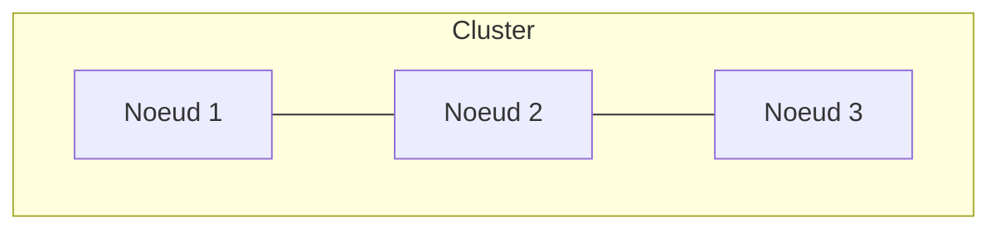
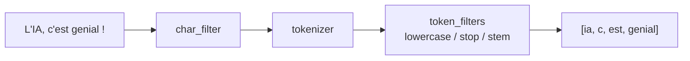
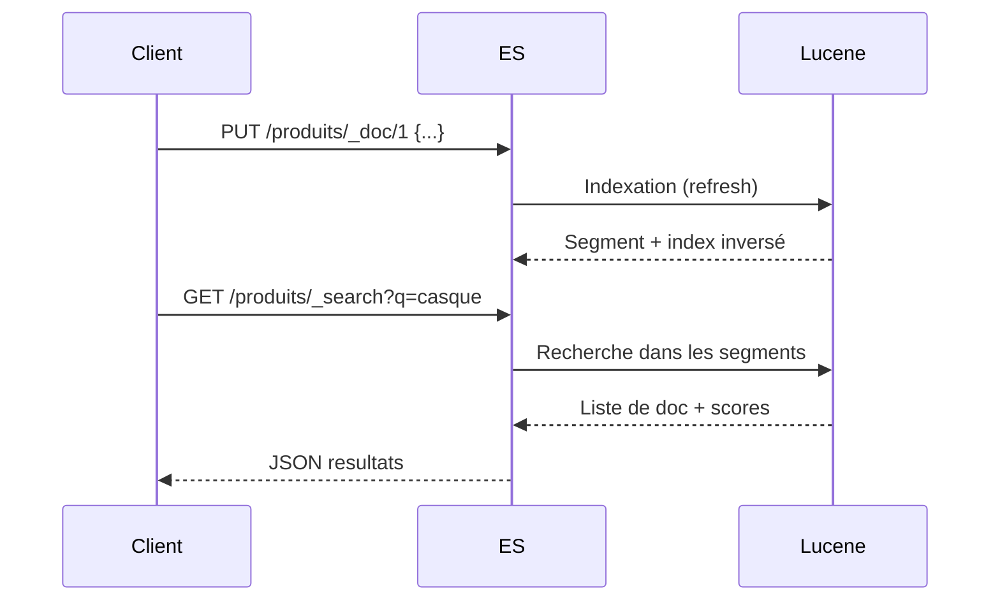

<a id="top"></a>

# 03 — Concepts clés d'Elasticsearch

> **Type** : Théorie · **Pré-requis** : [01](./01-introduction-elasticsearch-elk-stack.md), [02](./02-theorie-sql-vs-documents.md)

## Table des matières

- [1. Cluster, nœuds, shards, réplicas](#1-cluster-nœuds-shards-réplicas)
- [2. Index, document, mapping](#2-index-document-mapping)
- [3. Les types de champs principaux](#3-les-types-de-champs-principaux)
- [4. Recherche : `text` vs `keyword`](#4-recherche--text-vs-keyword)
- [5. Analyseur (analyzer)](#5-analyseur-analyzer)
- [6. Pertinence et score `_score`](#6-pertinence-et-score-_score)
- [7. Cycle de vie d'un document](#7-cycle-de-vie-dun-document)

---

## 1. Cluster, nœuds, shards, réplicas



| Concept     | Définition                                                                                  |
| ----------- | ------------------------------------------------------------------------------------------- |
| **Cluster** | Ensemble de nœuds identifiés par un même `cluster.name`.                                    |
| **Nœud**    | Un process Elasticsearch (1 JVM). Plusieurs rôles possibles : master, data, ingest…         |
| **Shard primaire** | Morceau d'un index. Un index est découpé en N shards.                                |
| **Réplica** | Copie d'un shard primaire, hébergée sur un autre nœud. Sert à la HA et accélère la lecture. |

> **Règle pratique** : 1 shard ≈ 10 à 50 Go de données. Trop de shards = surcharge ; trop peu = pas de parallélisme.

<details>
<summary>Exemple : un index avec 3 shards et 1 réplica</summary>

```
Index "produits" → 3 shards (P0, P1, P2) + 1 réplica chacun (R0, R1, R2)

Nœud A : P0 R1
Nœud B : P1 R2
Nœud C : P2 R0
```

Si **Nœud B** tombe :
- P1 disparaît → mais R1 (sur Nœud A) prend le relais.
- R2 disparaît → R2 sera recréée ailleurs si possible.

</details>

---

## 2. Index, document, mapping

| Concept     | Équivalent SQL  | Exemple                                   |
| ----------- | --------------- | ----------------------------------------- |
| Index       | Table           | `produits`, `logs-2026-04-19`             |
| Document    | Ligne           | `{"id": 1, "nom": "Casque audio"}`        |
| Champ       | Colonne         | `nom`, `prix`, `stock`                    |
| Mapping     | Schéma DDL      | définit le type de chaque champ           |

> **Mémo « 3 mots » à retenir** (souvent vu en cours) :
>
> | Vocabulaire ES | Analogie SQL    |
> | -------------- | --------------- |
> | **Index**      | Table           |
> | **Type**       | Colonne *(obsolète depuis ES 7+)* |
> | **Document**   | Enregistrement (ligne) |
>
> Le concept de **`type`** existait jusqu'en Elasticsearch 6 (un index pouvait contenir plusieurs *types*, ex : `forum/adds/1`). Depuis **ES 7+**, un index ne contient **qu'un seul type implicite** appelé **`_doc`**. On écrit donc aujourd'hui :
>
> ```bash
> # ES 6 et avant (legacy)
> PUT /forum/adds/1
>
> # ES 7+ (actuel)
> PUT /forum/_doc/1
> ```
>
> Si tu rencontres un cours qui utilise encore `forum/adds/1`, mentalement remplace `adds` par `_doc`.

Création d'un index avec mapping explicite :

```bash
curl -X PUT "https://localhost:9200/produits" \
  -u elastic:spotify123 -k \
  -H 'Content-Type: application/json' -d '{
  "mappings": {
    "properties": {
      "nom":   { "type": "text" },
      "prix":  { "type": "float" },
      "stock": { "type": "integer" },
      "tags":  { "type": "keyword" }
    }
  }
}'
```

---

## 3. Les types de champs principaux

| Type        | Usage                                                              |
| ----------- | ------------------------------------------------------------------ |
| `text`      | Texte **analysé** (tokenisé). Pour de la recherche full-text.      |
| `keyword`   | Texte **non analysé**. Pour filtre exact, agrégation, tri.         |
| `integer`, `long`, `float`, `double` | Nombres                                       |
| `boolean`   | `true` / `false`                                                   |
| `date`      | Date ISO 8601 ou epoch                                             |
| `geo_point` | Latitude/longitude                                                 |
| `nested`    | Objet imbriqué dont chaque sous-doc est indépendant                |
| `object`    | Objet imbriqué simple (aplatis par défaut)                         |

---

## 4. Recherche : `text` vs `keyword`

> **C'est LE piège classique**.

```json
{
  "titre": {
    "type": "text",      // pour la recherche "intelligente"
    "fields": {
      "raw": {            // sous-champ pour exact / agrégation / tri
        "type": "keyword"
      }
    }
  }
}
```

| Cas                        | Champ utilisé                                |
| -------------------------- | -------------------------------------------- |
| `match` recherche full-text | `titre`                                     |
| `term` filtre exact         | `titre.raw`                                 |
| `aggs` GROUP BY             | `titre.raw`                                 |
| `sort` tri alphabétique     | `titre.raw`                                 |

---

## 5. Analyseur (analyzer)

Quand un champ est `text`, Elasticsearch passe la valeur dans un **analyseur** :



| Composant      | Rôle                                                                         |
| -------------- | ---------------------------------------------------------------------------- |
| `char_filter`  | Pré-traitement du texte (HTML strip, mappings caractères…)                   |
| `tokenizer`    | Découpe en tokens (`whitespace`, `standard`, `keyword`…)                     |
| `token_filter` | Applique `lowercase`, `stop` (mots vides), `stemming` (racines), synonymes…  |

Pour le français, on configure souvent :

```json
"analyzer": {
  "fr_std": {
    "type": "standard",
    "stopwords": "_french_"
  }
}
```

---

## 6. Pertinence et score `_score`

Chaque document retourné par une recherche reçoit un **score** (`_score`). Plus il est élevé, plus le doc est pertinent.

Le calcul utilise principalement **BM25** (successeur de TF-IDF) :

| Facteur          | Effet                                                            |
| ---------------- | ---------------------------------------------------------------- |
| **TF**           | Plus le mot apparaît dans le doc → score ↑                       |
| **IDF**          | Plus le mot est rare dans la collection → score ↑                |
| **Longueur**     | Doc court avec le mot → score ↑ (vs doc long noyé)               |

> Si on veut **désactiver** le scoring (ex : filtre booléen), on utilise le contexte `filter` au lieu de `must` (voir chapitre 16).

---

## 7. Cycle de vie d'un document



| Étape          | Description                                                       |
| -------------- | ----------------------------------------------------------------- |
| **Index**      | Le doc est écrit dans un buffer, puis flushé en **segment** Lucene. |
| **Refresh**    | Toutes les 1 s par défaut → le doc devient visible.               |
| **Merge**      | Lucene fusionne les petits segments en arrière-plan.              |
| **Delete**     | Le doc est marqué supprimé, vraiment effacé au prochain merge.    |

<p align="right"><a href="#top">↑ Retour en haut</a></p>


---

*Copyright © Haythem R - Tous droits reserves.*
