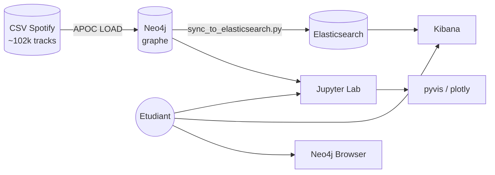
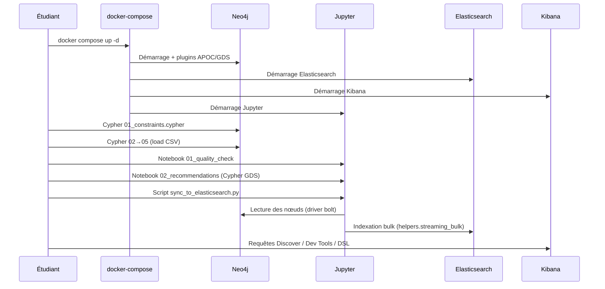

<a id="top"></a>

# 04 — Architecture pipeline ELK + Neo4j

> **Type** : Architecture · **Pré-requis** : [01](./01-introduction-elasticsearch-elk-stack.md) → [03](./03-concepts-cles-elasticsearch.md)

## Table des matières

- [1. Pourquoi combiner Neo4j et Elasticsearch ?](#1-pourquoi-combiner-neo4j-et-elasticsearch-)
- [2. Vue d'ensemble du pipeline](#2-vue-densemble-du-pipeline)
- [3. Le rôle de chaque brique](#3-le-rôle-de-chaque-brique)
- [4. Flux de données pas-à-pas](#4-flux-de-données-pas-à-pas)
- [5. Synchronisation Neo4j → Elasticsearch](#5-synchronisation-neo4j--elasticsearch)
- [6. Patterns d'usage](#6-patterns-dusage)

---

## 1. Pourquoi combiner Neo4j et Elasticsearch ?

| Outil             | Force principale                                | Faiblesse                          |
| ----------------- | ----------------------------------------------- | ---------------------------------- |
| **Neo4j**         | Naviguer dans des **relations** (graphes)       | Recherche textuelle limitée         |
| **Elasticsearch** | Recherche full-text & agrégations rapides       | Pas de notion de "chemin" / graphe  |

Les deux sont **complémentaires**. Exemple : Spotify-like.

| Question utilisateur                                                | Outil le plus adapté |
| ------------------------------------------------------------------- | -------------------- |
| « Donne-moi les morceaux dont le titre contient *love* »            | Elasticsearch        |
| « Quels sont les morceaux que mes amis aiment et que je n'ai pas ? »| Neo4j (collaborative)|
| « Trouve un morceau similaire à *Bohemian Rhapsody* »               | Neo4j (GDS, cosine)  |
| « Autocomplétion sur le nom d'artiste »                             | Elasticsearch        |

---

## 2. Vue d'ensemble du pipeline



---

## 3. Le rôle de chaque brique

| Brique               | Port       | Rôle                                                                  |
| -------------------- | ---------- | --------------------------------------------------------------------- |
| **Neo4j**            | 7474, 7687 | Stocker le **graphe** (Artist, Album, Track, Genre, User).            |
| **APOC**             | (plugin)   | Charger les CSV en batch (`apoc.periodic.iterate`).                   |
| **GDS**              | (plugin)   | Algorithmes de graphes (cosine similarity, PageRank…).                |
| **Jupyter Lab**      | 8888       | Notebooks Python pour qualité données, recommandations, visualisation.|
| **Elasticsearch**    | 9200       | Indexer les tracks/artistes pour recherche full-text.                 |
| **Kibana**           | 5601       | Interface : Dev Tools, Discover, dashboards.                          |
| **Docker Compose**   | —          | Orchestre tout le monde, healthchecks, volumes.                       |

---

## 4. Flux de données pas-à-pas



---

## 5. Synchronisation Neo4j → Elasticsearch

C'est le **cœur** de l'intégration. On ne réplique pas tout le graphe, mais juste les **entités cherchables** (track, artist, album).

```python
def stream_tracks(session):
    cypher = """
    MATCH (t:Track)<-[:CONTAINS]-(al:Album)
    MATCH (t)-[:PERFORMED_BY]->(ar:Artist)
    OPTIONAL MATCH (ar)-[:HAS_GENRE]->(g:Genre)
    RETURN t, al.name AS album, ar.name AS artist,
           collect(DISTINCT g.name) AS genres
    """
    for record in session.run(cypher):
        yield {
            "_index": "tracks",
            "_id": record["t"]["id"],
            "_source": {
                "name":   record["t"]["name"],
                "album":  record["album"],
                "artist": record["artist"],
                "genres": record["genres"],
                "danceability": record["t"]["danceability"],
                ...
            }
        }

helpers.streaming_bulk(es, stream_tracks(session), chunk_size=500)
```

| Avantage de cette approche | Inconvénient                                       |
| -------------------------- | -------------------------------------------------- |
| Découplage clair           | Resync nécessaire si Neo4j change                  |
| ES reste très simple       | Pas de "live sync" (faut un job batch ou CDC)      |
| Mapping ES contrôlé        | Code Python à maintenir                            |

> En production, on utiliserait plutôt un **CDC** (Change Data Capture) ou Kafka pour propager les changements en temps réel. Pour un projet pédagogique, le batch suffit largement.

---

## 6. Patterns d'usage

### Pattern 1 — Chercher dans ES, naviguer dans Neo4j

1. Utilisateur tape "queen" dans la barre de recherche.
2. **Elasticsearch** retourne les 10 morceaux les plus pertinents.
3. L'utilisateur clique sur un morceau.
4. **Neo4j** récupère les relations : artistes similaires, autres albums, recommandations collaboratives.

### Pattern 2 — Recommander avec Neo4j, afficher avec Kibana

1. **Jupyter** calcule des recommandations via GDS.
2. Les résultats sont **réindexés** dans un index `recommandations` dans ES.
3. **Kibana** affiche un dashboard "Top recommandations du jour".

### Pattern 3 — Hybride

| Étape | Outil | Action |
| ----- | ----- | ------ |
| 1     | ES    | Pré-filtre rapide (texte, genre, année)        |
| 2     | Neo4j | Re-classement par proximité dans le graphe     |
| 3     | UI    | Affiche le top 20 trié                         |

<p align="right"><a href="#top">↑ Retour en haut</a></p>


---

*Copyright © Haythem R - Tous droits reserves.*
