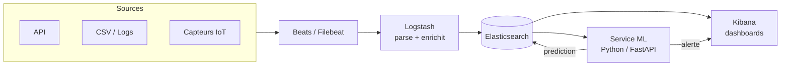
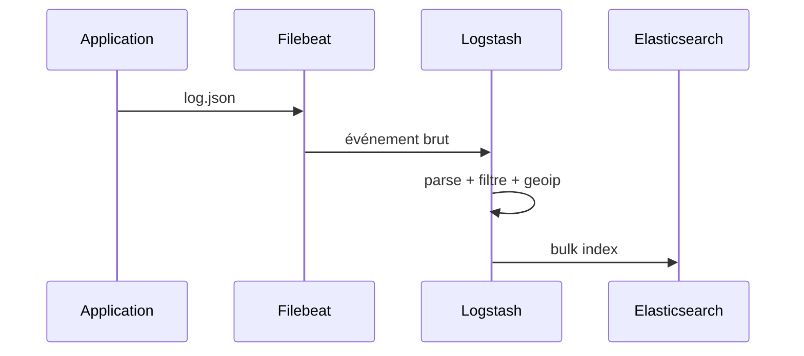
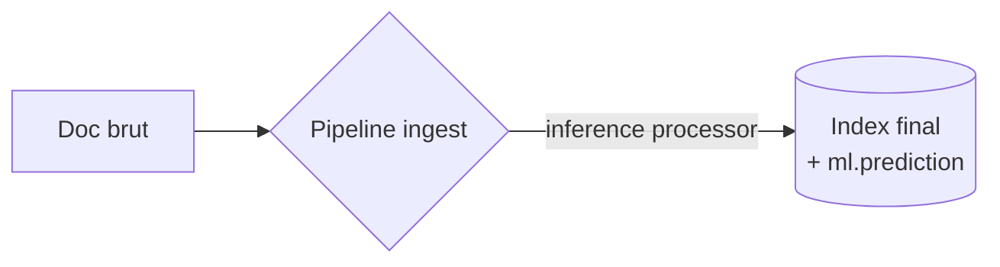
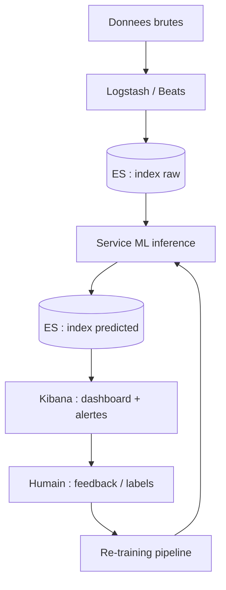

<a id="top"></a>

# 05 — Architecture pipeline ELK + Machine Learning

> **Type** : Architecture · **Pré-requis** : [04](./04-architecture-pipeline-elk-neo4j.md)

## Table des matières

- [1. Pourquoi ajouter du ML à ELK ?](#1-pourquoi-ajouter-du-ml-à-elk-)
- [2. Schéma général](#2-schéma-général)
- [3. Les rôles du pipeline](#3-les-rôles-du-pipeline)
- [4. Pipeline d'ingestion (Logstash / Beats)](#4-pipeline-dingestion-logstash--beats)
- [5. Pipeline d'inférence ML](#5-pipeline-dinférence-ml)
- [6. Boucle de feedback (MLOps simplifié)](#6-boucle-de-feedback-mlops-simplifié)

---

## 1. Pourquoi ajouter du ML à ELK ?

Elasticsearch sait :

- chercher du texte 
- agréger des chiffres 
- détecter des **anomalies simples** (Elastic ML, payant) 

Mais il **ne fait pas** :

- de la classification supervisée custom 
- de la prédiction (régression) 
- du NLP avancé (sauf via plugin payant) 

On greffe donc un **module ML** (souvent Python : scikit-learn, PyTorch, TensorFlow).

---

## 2. Schéma général



---

## 3. Les rôles du pipeline

| Composant         | Rôle dans le pipeline ML                                                       |
| ----------------- | ------------------------------------------------------------------------------ |
| **Beats**         | Collecte les événements bruts (logs, métriques, traces).                       |
| **Logstash**      | Parse, nettoie, enrichit (ex : geoip, user-agent), envoie à ES.                |
| **Elasticsearch** | Stocke + permet de réinterroger pour réentraîner.                              |
| **Service ML**    | Prend une donnée, sort une prédiction (classe, score, anomalie).               |
| **Kibana**        | Visualise les prédictions, déclenche des alertes (Watcher / Alerting).         |

---

## 4. Pipeline d'ingestion (Logstash / Beats)



Exemple de pipeline Logstash :

```ruby
input {
  beats { port => 5044 }
}
filter {
  json { source => "message" }
  mutate { remove_field => ["host", "agent"] }
  geoip { source => "client_ip" }
}
output {
  elasticsearch {
    hosts => ["https://es:9200"]
    index => "logs-%{+YYYY.MM.dd}"
  }
}
```

---

## 5. Pipeline d'inférence ML

Trois grandes manières d'intégrer du ML avec ES :

| Approche                         | Description                                                                | Quand l'utiliser                          |
| -------------------------------- | -------------------------------------------------------------------------- | ----------------------------------------- |
| **Inference Pipeline (ingest)**  | On charge un modèle PyTorch/sklearn dans ES (Eland) et on l'appelle au moment de l'indexation. | Modèle léger, prédiction au document près. |
| **Service externe** (REST)       | Un microservice Python (FastAPI) reçoit le JSON et renvoie la prédiction.  | Modèles lourds, déploiement séparé.       |
| **Batch reindex**                | Job Spark/Python qui lit ES, prédit, réécrit dans un nouvel index.         | Recalcul historique massif.               |



---

## 6. Boucle de feedback (MLOps simplifié)



| Étape           | Outil typique                                |
| --------------- | -------------------------------------------- |
| Collecte        | Beats / Logstash / Kafka                     |
| Stockage chaud  | Elasticsearch                                |
| Stockage froid  | S3 / HDFS                                    |
| Entraînement    | Jupyter / Airflow / MLflow                   |
| Déploiement     | FastAPI / TorchServe / Eland                 |
| Monitoring      | Kibana + Prometheus                          |
| Feedback humain | Kibana annotations / Label Studio            |

> Pour notre cours, on **n'implémente pas** une vraie boucle ML : on se concentre sur le côté Elasticsearch + Neo4j. Mais il faut **comprendre l'écosystème**.

<p align="right"><a href="#top">↑ Retour en haut</a></p>


---

*Copyright © Haythem R - Tous droits reserves.*
