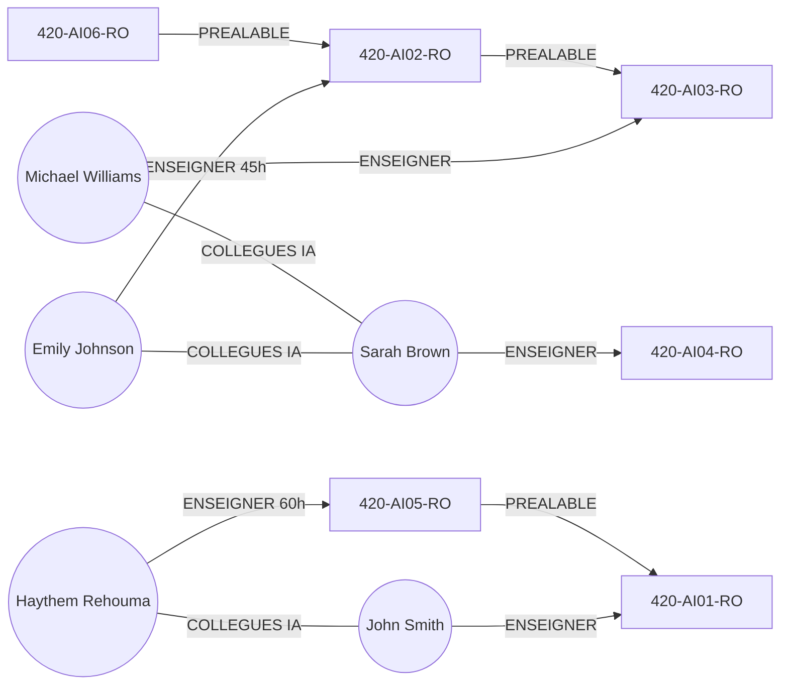

<a id="top"></a>

# 08 — Cas pratique Cypher : programme « Intelligence Artificielle »

> **Type** : Pratique · **Pré-requis** : [07 — Premiers pas Cypher](./07-premiers-pas-cypher.md)

## Table des matières

- [1. Objectif pédagogique](#1-objectif-pédagogique)
- [2. Modèle de données cible](#2-modèle-de-données-cible)
- [3. Script complet de création](#3-script-complet-de-création)
- [4. Requêtes d'exploration](#4-requêtes-dexploration)
- [5. Requêtes de mise à jour](#5-requêtes-de-mise-à-jour)
- [6. Requêtes de suppression ciblée](#6-requêtes-de-suppression-ciblée)
- [7. Exécuter le script](#7-exécuter-le-script)

---

## 1. Objectif pédagogique

Construire et interroger un mini-graphe représentant un **programme universitaire** :

- des **cours** (label `cours`)
- des **professeurs** qui les enseignent (label `professeur`)
- des **prérequis** entre cours (`PREALABLE`)
- des **collaborations** entre professeurs (`COLLEGUES`)

À la fin, vous saurez :

- créer plusieurs nœuds + relations dans une seule requête,
- ajouter des propriétés sur les **relations** (ex : nombre d'heures),
- retrouver un nœud, lister ses relations, le supprimer proprement,
- utiliser `MERGE` pour éviter les doublons.

---

## 2. Modèle de données cible



| Label        | Propriétés clés                            |
| ------------ | ------------------------------------------ |
| `cours`      | `sigle`, `diplome`                         |
| `professeur` | `matricule`, `prenom`, `nom`               |
| `ENSEIGNER`  | `nbrhrs` (optionnel)                       |
| `PREALABLE`  | (aucune)                                   |
| `COLLEGUES`  | `programme`                                |

---

## 3. Script complet de création

```cypher
// 1) Cours du programme IA
CREATE (:cours {sigle: '420-AI01-RO', diplome: 'AEC/DEC/MAITRISE/BAC/DOCTORAT'}),
       (:cours {sigle: '420-AI02-RO', diplome: 'AEC/DEC/MAITRISE/BAC/DOCTORAT'}),
       (:cours {sigle: '420-AI03-RO'}),
       (:cours {sigle: '420-AI04-RO'}),
       (:cours {sigle: '420-AI05-RO'}),
       (:cours {sigle: '420-AI06-RO'});

// 2) Professeurs et relations ENSEIGNER
CREATE (:professeur {matricule: 101, prenom: 'John',    nom: 'Smith'})
       -[:ENSEIGNER]->(:cours {sigle: '420-AI01-RO'}),
       (:professeur {matricule: 102, prenom: 'Emily',   nom: 'Johnson'})
       -[:ENSEIGNER {nbrhrs: 45}]->(:cours {sigle: '420-AI02-RO'}),
       (:professeur {matricule: 103, prenom: 'Michael', nom: 'Williams'})
       -[:ENSEIGNER]->(:cours {sigle: '420-AI03-RO'}),
       (:professeur {matricule: 104, prenom: 'Sarah',   nom: 'Brown'})
       -[:ENSEIGNER]->(:cours {sigle: '420-AI04-RO'}),
       (:professeur {matricule: 105, prenom: 'Haythem', nom: 'Rehouma'})
       -[:ENSEIGNER {nbrhrs: 60}]->(:cours {sigle: '420-AI05-RO'});

// 3) Relations PREALABLE entre cours
CREATE (:cours {sigle: '420-AI05-RO'})-[:PREALABLE]->(:cours {sigle: '420-AI01-RO'}),
       (:cours {sigle: '420-AI06-RO'})-[:PREALABLE]->(:cours {sigle: '420-AI02-RO'})
       -[:PREALABLE]->(:cours {sigle: '420-AI03-RO'});

// 4) Relations COLLEGUES (avec MERGE pour éviter les doublons)
MATCH (a:professeur {prenom: 'Haythem', nom: 'Rehouma'}),
      (b:professeur {prenom: 'John',    nom: 'Smith'})
MERGE (a)-[r:COLLEGUES {programme: 'Intelligence Artificielle'}]->(b);

MATCH (a:professeur {prenom: 'Emily', nom: 'Johnson'}),
      (b:professeur {prenom: 'Sarah', nom: 'Brown'})
MERGE (a)-[r:COLLEGUES {programme: 'Intelligence Artificielle'}]->(b);
```

> Le script utilise plusieurs fois `CREATE (:cours {sigle: ...})` avec les mêmes sigles : pour un script propre, on préfère **`MERGE`** sur le sigle pour éviter les doublons (voir chapitre 09 pour le nettoyage).

---

## 4. Requêtes d'exploration

<details>
<summary>Lister tous les professeurs</summary>

```cypher
MATCH (p:professeur) RETURN p;
```

</details>

<details>
<summary>Prénoms / noms uniquement</summary>

```cypher
MATCH (p:professeur) RETURN p.prenom, p.nom;
```

</details>

<details>
<summary>Trouver un professeur précis</summary>

```cypher
MATCH (p:professeur)
WHERE p.prenom = 'Haythem' AND p.nom = 'Rehouma'
RETURN p;
```

</details>

<details>
<summary>Professeurs et leurs cours</summary>

```cypher
MATCH (p:professeur)-[r:ENSEIGNER]->(c:cours)
RETURN p.prenom, p.nom, c.sigle, r.nbrhrs;
```

</details>

<details>
<summary>Relations entre collègues</summary>

```cypher
MATCH (p1:professeur)-[r:COLLEGUES]->(p2:professeur)
RETURN p1.nom, p2.nom, r.programme;
```

</details>

<details>
<summary>Tous les prérequis</summary>

```cypher
MATCH (a:cours)-[r:PREALABLE]->(b:cours)
RETURN a.sigle AS prerequis, b.sigle AS pour_le_cours;
```

</details>

### Bonus : `UNWIND` et `WITH`

Lister les diplômes acceptés pour un cours :

```cypher
MATCH (n:cours) WHERE n.sigle = "420-AI01-RO"
UNWIND split(n.diplome, "/") AS element
RETURN element ORDER BY element ASC;
```

Décomposer le sigle en préfixe/collège :

```cypher
MATCH (n:cours)
WITH substring(n.sigle, 0, 3) AS prefixe,
     substring(n.sigle, 8, 2) AS college
RETURN DISTINCT prefixe, college;
```

---

## 5. Requêtes de mise à jour

```cypher
// Ajouter une propriété "bureau" à Haythem
MATCH (p:professeur {prenom: 'Haythem'}) SET p.bureau = 'A-204' RETURN p;

// Modifier le nombre d'heures d'enseignement
MATCH (p:professeur {prenom: 'Haythem'})-[r:ENSEIGNER]->(c:cours)
SET r.nbrhrs = 75 RETURN p.nom, r.nbrhrs;
```

---

## 6. Requêtes de suppression ciblée

| Cas                                             | Requête                                                                 |
| ----------------------------------------------- | ----------------------------------------------------------------------- |
| Supprimer **un** professeur (et ses relations)  | `MATCH (p:professeur {prenom:'Haythem',nom:'Rehouma'}) DETACH DELETE p;` |
| Supprimer **tous** les professeurs              | `MATCH (p:professeur) DETACH DELETE p;`                                 |
| Supprimer une **relation** précise              | `MATCH (p:professeur)-[r:ENSEIGNER]->(c:cours) WHERE p.prenom='Haythem' DELETE r;` |
| Supprimer un prof par condition (60 h)          | `MATCH (p:professeur)-[r:ENSEIGNER {nbrhrs:60}]->(c) DETACH DELETE p;`  |
| Supprimer **toutes** les relations COLLEGUES    | `MATCH (:professeur)-[r:COLLEGUES]->(:professeur) DELETE r;`            |
| **Tout** vider                                  | `MATCH (n) DETACH DELETE n;` (voir chap. 09)                            |

---

## 7. Exécuter le script

### Depuis Neo4j Browser

1. Ouvrir http://localhost:7474
2. Coller le script complet du §3
3. ▶ Exécuter

### Depuis `cypher-shell` (Docker)

```bash
docker exec -i spotify-neo4j cypher-shell -u neo4j -p Neo4jStrongPass! \
  < cypher/cas_ia.cypher
```

### Vérifier visuellement

```cypher
MATCH (a)-[r]->(b) RETURN a, r, b;
```

→ Cliquer sur un nœud dans le browser pour voir ses voisins.

<p align="right"><a href="#top">↑ Retour en haut</a></p>
