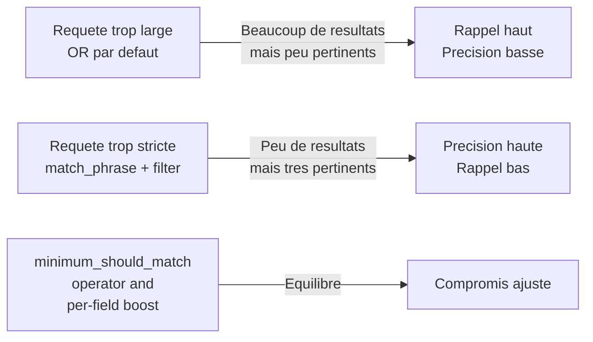

<a id="top"></a>

<!-- Copyright (c) Haythem Rehouma - InSkillFlow‌​‍​​‍​​​‌​‍​‍​​‍​‌​‍​​‍​​‍‌​‍​​​‍‍​‌​‍​​​‍‍‍‌ - Gneurone. Tous droits reserves. Code tague. Reproduction interdite sans autorisation ecrite. -->
# 15 — Requêtes Elasticsearch — niveau intermédiaire

> **Type** : Pratique · **Pré-requis** : [12](./12-commandes-base-elasticsearch.md), [13](./13-crud-pedagogique-kibana.md), [14](./14-import-bulk-dataset.md)

## Table des matières

- [1. Le contexte : l'index `news`](#1-le-contexte--lindex-news)
  - [1.1 Compter exactement les résultats (`track_total_hits`)](#11-compter-exactement-les-résultats-track_total_hits)
- [2. Recherche full-text](#2-recherche-full-text)
  - [Concept fondamental — Précision vs Rappel](#concept-fondamental--précision-vs-rappel)
  - [Affiner `match` : OR (défaut) vs AND vs `minimum_should_match`](#affiner-match--or-défaut-vs-and-vs-minimum_should_match)
- [3. Recherches exactes (term, terms, prefix)](#3-recherches-exactes-term-terms-prefix)
- [4. Filtres combinés (`bool`)](#4-filtres-combinés-bool)
- [5. Plages (`range`) sur dates et nombres](#5-plages-range-sur-dates-et-nombres)
- [6. Tri & pagination](#6-tri--pagination)
- [7. Highlight (surlignage)](#7-highlight-surlignage)
- [8. Agrégations (KPIs, facettes)](#8-agrégations-kpis-facettes)
- [9. Mises à jour & réindexation](#9-mises-à-jour--réindexation)
- [10. Cheatsheet rapide](#10-cheatsheet-rapide)

---

## 1. Le contexte : l'index `news`

Tous les exemples ci-dessous supposent un index `news` indexé selon le mapping suivant :

| Champ                 | Type                                  |
| --------------------- | ------------------------------------- |
| `date`                | `date` (format `yyyy-MM-dd`)          |
| `category`            | `text` + `category.keyword`           |
| `headline`            | `text` + `headline.keyword`           |
| `short_description`   | `text` + `short_description.keyword`  |
| `authors`             | `text` + `authors.keyword`            |
| `link`                | `keyword`                             |

> Toutes les requêtes sont à coller dans **Kibana → Dev Tools → Console**, ou à exécuter en `curl` avec `-X GET 'http://localhost:9200/news/_search'`.

### 1.1 Compter **exactement** les résultats (`track_total_hits`)

Par défaut, Elasticsearch **plafonne** la valeur de `hits.total.value` à **10 000** (`"relation": "gte"`) pour des raisons de performance. Sur le dataset `news` (~200 853 articles), vous verrez donc :

```json
"hits": { "total": { "value": 10000, "relation": "gte" }, ... }
```

Pour obtenir le **vrai total** (200 853 sur ce dataset), ajoutez `track_total_hits: true` :

```json
GET news/_search
{
  "track_total_hits": true
}
```

Réponse attendue :

```json
"hits": { "total": { "value": 200853, "relation": "eq" }, ... }
```

| Valeur de `track_total_hits` | Comportement                                            | Quand l'utiliser ?                              |
| ---------------------------- | ------------------------------------------------------- | ----------------------------------------------- |
| `false` (défaut moderne)     | Aucun comptage → `total` absent                         | Recherche en temps réel, on s'en fiche du total |
| `10000` (défaut historique)  | Comptage jusqu'à 10 000, puis arrêt                     | Pagination classique                            |
| `true`                       | Comptage **exact** (plus lent sur gros index)           | Rapports, KPIs, dashboards                      |
| `25000` (entier)             | Comptage exact jusqu'au seuil donné                     | Compromis perf / précision                      |

> **Rappel pédagogique** : pour gagner en performance, gardez la limite par défaut. Activez `true` uniquement quand le total exact est nécessaire (ex. afficher « 200 853 résultats » dans une UI).

---

## 2. Recherche full-text

### Concept fondamental — Précision vs Rappel

Avant d'écrire des requêtes, il faut comprendre le **compromis universel** de la recherche d'information :

| Métrique      | Définition (en clair)                                              | Comment l'augmenter                                |
| ------------- | ------------------------------------------------------------------ | -------------------------------------------------- |
| **Rappel**    | « Ai-je récupéré **tous** les documents pertinents ? » (couverture) | Élargir la requête : `OR`, `fuzzy`, `multi_match`  |
| **Précision** | « Parmi mes résultats, combien sont **vraiment** pertinents ? »    | Restreindre la requête : `AND`, `match_phrase`, `filter` |

> **La règle d'or** : augmenter le rappel **diminue** la précision, et vice versa. Tout l'art consiste à trouver le bon équilibre selon l'usage.



| Cas d'usage                                  | Préférer…                                       |
| -------------------------------------------- | ----------------------------------------------- |
| Suggestion / autocomplétion                  | **Rappel** (ne rien rater)                      |
| Réponse unique « la bonne »                  | **Précision** (pas de bruit)                    |
| Moteur de recherche grand public             | Équilibre via `boost` + `minimum_should_match`  |
| Audit légal / conformité                     | **Rappel maximal** (puis tri humain)            |

### `match` (analyse linguistique)

```json
GET news/_search
{
  "query": { "match": { "headline": "Trump summit North Korea" } },
  "_source": ["headline","date","category"]
}
```

### Affiner `match` : OR (défaut) vs AND vs `minimum_should_match`

Le `match` standard utilise un **OR implicite** entre les termes. Pour ajuster finement le compromis précision/rappel, trois variantes :

```json
GET news/_search
{ "query": { "match": { "headline": { "query": "obama trump clinton" } } } }
```

vs.

```json
GET news/_search
{ "query": { "match": { "headline": { "query": "obama trump clinton", "operator": "and" } } } }
```

vs.

```json
GET news/_search
{ "query": { "match": { "headline": { "query": "obama trump clinton", "minimum_should_match": 2 } } } }
```

| Variante                            | Logique                                       | Effet sur rappel | Effet sur précision | Quand l'utiliser                                |
| ----------------------------------- | --------------------------------------------- | :--------------: | :-----------------: | ----------------------------------------------- |
| `match` (défaut)                    | **OR** : au moins **1** terme suffit          | ▲▲▲              | ▼                   | Recherche large, suggestions                    |
| `"operator": "and"`                 | **AND** : **tous** les termes obligatoires    | ▼▼               | ▲▲▲                 | Réponse précise, peu de bruit                   |
| `"minimum_should_match": N`         | Au moins **N** termes obligatoires            | ▲ (modulable)    | ▲ (modulable)       | Compromis fin (souvent N=2 ou `"75%"`)          |

> **Astuce** : `minimum_should_match` accepte aussi un **pourcentage** : `"75%"` ⇒ 3 termes sur 4 obligatoires. Très utile quand le nombre de termes varie.

### `match_phrase` (expression exacte, dans l'ordre)

```json
GET news/_search
{
  "query": { "match_phrase": { "headline": "President Obama" } }
}
```

### `multi_match` avec pondération

```json
GET news/_search
{
  "query": {
    "multi_match": {
      "query":  "President Obama",
      "fields": ["headline^3", "short_description", "authors"]
    }
  }
}
```

| Notation | Effet                                                            |
| -------- | ---------------------------------------------------------------- |
| `^N`     | Multiplie le score du champ par N                                |
| `type`   | `best_fields` (défaut), `phrase`, `cross_fields`, `most_fields`  |

### Tolérance aux fautes (`fuzzy`)

```json
GET news/_search
{
  "query": {
    "match": {
      "headline": { "query": "presdent obmaa", "fuzziness": "AUTO" }
    }
  }
}
```

### `query_string` (syntaxe Lucene : AND/OR/NOT, guillemets, wildcards)

```json
GET news/_search
{
  "query": {
    "query_string": {
      "query":  "\"North Korea\" AND Trump",
      "fields": ["headline","short_description"]
    }
  }
}
```

---

## 3. Recherches exactes (term, terms, prefix)

> **Toujours** utiliser le sous-champ `.keyword` pour les recherches exactes.

```json
GET news/_search
{ "query": { "term": { "category.keyword": "POLITICS" } } }

GET news/_search
{ "query": { "terms": { "category.keyword": ["POLITICS","WORLD NEWS"] } } }

GET news/_search
{ "query": { "prefix": { "authors.keyword": "Mary" } } }
```

> `wildcard` et `regexp` existent mais sont **lents** sur de gros index : à éviter en prod.

---

## 4. Filtres combinés (`bool`)

```json
GET news/_search
{
  "_source": ["date","category","headline"],
  "query": {
    "bool": {
      "must":     [ { "match": { "headline": "Trump" } } ],
      "filter":   [
        { "terms": { "category.keyword": ["POLITICS","WORLD NEWS"] } },
        { "range": { "date": { "gte": "2018-05-24", "lte": "2018-05-26" } } }
      ],
      "must_not": [ { "match_phrase": { "short_description": "joke" } } ],
      "should":   [ { "match": { "short_description": "summit" } } ]
    }
  }
}
```

| Clause       | Effet                                                            |
| ------------ | ---------------------------------------------------------------- |
| `must`       | DOIT matcher (compte dans le score)                              |
| `filter`     | DOIT matcher (**ne compte pas** dans le score → plus rapide)     |
| `must_not`   | NE DOIT PAS matcher                                              |
| `should`     | OPTIONNEL ; augmente le score si match                           |

---

## 5. Plages (`range`) sur dates et nombres

```json
GET news/_search
{
  "query": {
    "range": {
      "date": { "gte": "2018-05-01", "lt": "2018-06-01" }
    }
  }
}
```

| Opérateur | Signification         |
| --------- | --------------------- |
| `gte`     | ≥                     |
| `gt`      | >                     |
| `lte`     | ≤                     |
| `lt`      | <                     |

Format date relative : `now-1d/d`, `now/M`, etc.

---

## 6. Tri & pagination

### Pagination classique `from / size`

```json
GET news/_search
{
  "from": 10, "size": 10,
  "sort": [ { "date": "desc" } ]
}
```

> `from + size > 10 000` est **bloqué** par défaut. Pour les grandes pages, utiliser `search_after`.

### Pagination scalable `search_after` (recommandée)

Page 1 :

```json
GET news/_search
{
  "size": 5,
  "sort": [ { "date": "desc" }, { "_id": "desc" } ],
  "_source": ["date","headline"]
}
```

Page suivante (avec les valeurs de `sort` du dernier hit) :

```json
GET news/_search
{
  "size": 5,
  "search_after": ["2018-05-24", "<ID_DERNIER_HIT>"],
  "sort": [ { "date": "desc" }, { "_id": "desc" } ]
}
```

---

## 7. Highlight (surlignage)

```json
GET news/_search
{
  "_source": ["headline","short_description","date"],
  "query":   { "match": { "short_description": "North Korea summit" } },
  "highlight": {
    "fields": { "headline": {}, "short_description": {} },
    "pre_tags":  ["<mark>"],
    "post_tags": ["</mark>"]
  }
}
```

---

## 8. Agrégations (KPIs, facettes)

### Comptage par catégorie

```json
GET news/_search
{
  "size": 0,
  "aggs": {
    "by_category": {
      "terms": { "field": "category.keyword", "size": 20 }
    }
  }
}
```

### Histogramme par jour + sous-agrégation

```json
GET news/_search
{
  "size": 0,
  "aggs": {
    "per_day": {
      "date_histogram": { "field": "date", "calendar_interval": "day" },
      "aggs": {
        "by_cat": { "terms": { "field": "category.keyword", "size": 5 } }
      }
    }
  }
}
```

### Top hits par catégorie (le dernier titre de chaque cat)

```json
GET news/_search
{
  "size": 0,
  "aggs": {
    "by_category": {
      "terms": { "field": "category.keyword", "size": 10 },
      "aggs": {
        "latest": {
          "top_hits": {
            "size": 1,
            "sort": [ { "date": "desc" } ],
            "_source": ["date","headline","authors"]
          }
        }
      }
    }
  }
}
```

### Cardinalité (nombre d'auteurs distincts)

```json
GET news/_search
{
  "size": 0,
  "aggs": {
    "authors_count": { "cardinality": { "field": "authors.keyword" } }
  }
}
```

### Termes significatifs (mots saillants pour POLITICS)

```json
GET news/_search
{
  "size": 0,
  "query": { "term": { "category.keyword": "POLITICS" } },
  "aggs":  { "hot_terms": { "significant_text": { "field": "headline" } } }
}
```

---

## 9. Mises à jour & réindexation

### `_update_by_query` (modifier en masse)

```json
POST news/_update_by_query
{
  "script": {
    "source": "ctx._source.category = ctx._source.category.toUpperCase();",
    "lang":   "painless"
  },
  "query": { "match_all": {} }
}
```

### `_reindex` (copier vers un nouvel index avec mapping différent)

```json
POST _reindex
{
  "source": { "index": "news"    },
  "dest":   { "index": "news_v2" }
}
```

### Refresh manuel

```bash
curl -X POST 'http://localhost:9200/news/_refresh'
```

---

## 10. Cheatsheet rapide

| Besoin                            | Requête                                            |
| --------------------------------- | -------------------------------------------------- |
| Compter exactement les hits       | `"track_total_hits": true`                         |
| Maximiser le **rappel**           | `match` (OR par défaut), `fuzzy`, `multi_match`    |
| Maximiser la **précision**        | `"operator": "and"`, `match_phrase`, `filter`      |
| Compromis fin précision/rappel    | `"minimum_should_match": 2` (ou `"75%"`)           |
| Recherche full-text simple        | `match`                                            |
| Expression exacte                 | `match_phrase`                                     |
| Recherche multi-champs pondérée   | `multi_match` + `^N`                               |
| Tolérance aux fautes              | `match` + `fuzziness: "AUTO"`                      |
| Filtre exact                      | `term` (sur `.keyword`)                            |
| Liste de valeurs                  | `terms`                                            |
| Plage                             | `range` (`gte`, `lt`…)                             |
| Combinaison logique               | `bool` (must / filter / should / must_not)         |
| Top N par facette                 | `aggs` + `terms`                                   |
| Courbe temporelle                 | `aggs` + `date_histogram`                          |
| 1er résultat par groupe           | `terms` + `top_hits`                               |
| Surlignage                        | `highlight`                                        |
| Pagination > 10k                  | `search_after`                                     |
| Modifier en masse                 | `_update_by_query` + Painless                      |
| Changer de mapping                | `_reindex`                                         |

<p align="right"><a href="#top">↑ Retour en haut</a></p>


---

*Copyright © Haythem R - Tous droits reserves.*
<!-- Copyright (c) Haythem Rehouma - InSkillFlow‌​‍​​‍​​​‌​‍​‍​​‍​‌​‍​​‍​​‍‌​‍​​​‍‍​‌​‍​​​‍‍‍‌ - Gneurone. Tous droits reserves. Code tague. Reproduction interdite sans autorisation ecrite. [tag-id: HRIFG] -->
