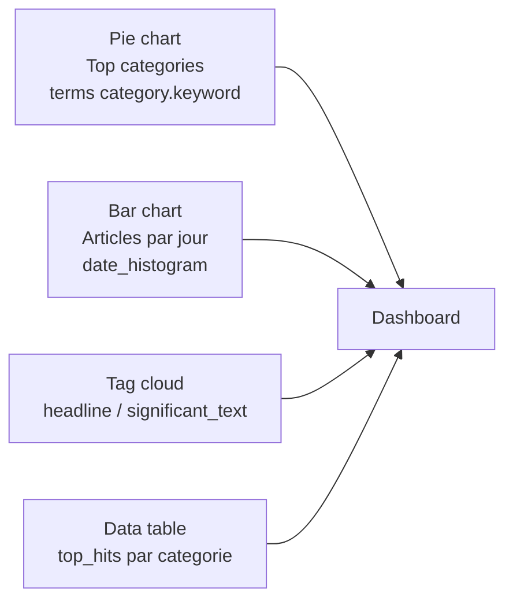

<a id="top"></a>

<!-- Copyright (c) Haythem Rehouma - InSkillFlow‌​‍​​‍​​​‌​‍​‍​​‍​‌​‍​​‍​​‍‌​‍​​​‍‍​‌​‍​​​‍‍‍‌ - Gneurone. Tous droits reserves. Code tague. Reproduction interdite sans autorisation ecrite. -->
# 17 — Laboratoire 2 : recherche d'actualités avec ELK

> **Type** : Laboratoire · **Pré-requis** : [11 — Labo 1](./11-labo1-mise-en-place-elk.md) · [14 — Bulk import](./14-import-bulk-dataset.md) · [15 — Requêtes intermédiaires](./15-requetes-elasticsearch-intermediaire.md) · [16 — DSL/KQL/ES\|QL](./16-requetes-avancees-kql-esql-dsl.md)

## Table des matières

- [Objectif et livrables](#objectif-et-livrables)
- [1. Préparation des données](#1-préparation-des-données)
- [2. Création de l'index avec mapping maîtrisé](#2-création-de-lindex-avec-mapping-maîtrisé)
- [3. Ingestion en _bulk](#3-ingestion-en-_bulk)
- [4. Requêtes (Query DSL imposé)](#4-requêtes-query-dsl-imposé)
  - [4.1 Lecture / pagination](#41-lecture--pagination)
  - [4.2 Plein texte](#42-plein-texte)
  - [4.3 Filtres exacts et combinaisons](#43-filtres-exacts-et-combinaisons)
  - [4.4 Highlight](#44-highlight)
  - [4.5 Agrégations (KPIs)](#45-agrégations-kpis)
  - [4.6 Diversification et autocomplétion](#46-diversification-et-autocomplétion)
  - [4.7 Mises à jour et reindex](#47-mises-à-jour-et-reindex)
- [5. Visualisations Kibana](#5-visualisations-kibana)
- [6. Dépannage](#6-dépannage)
- [7. Critères d'évaluation](#7-critères-dévaluation)

---

## Objectif et livrables

Bâtir une mini-plateforme de recherche d'actualités avec **Elasticsearch + Kibana** à partir d'un dataset JSON (`category`, `headline`, `authors`, `link`, `short_description`, `date`).

À la fin du labo, vous saurez :

- Modéliser un index `news` avec mapping propre (`text`/`keyword`, `date`, normalizer)
- Ingérer des documents en **NDJSON** via `_bulk`
- Interroger en **Query DSL** (match, multi_match, bool, range, fuzzy, agrégations, highlight)
- Construire un **dashboard Kibana** simple

> **Contrainte du labo** : on n'utilise **que le Query DSL** (pas de KQL, pas d'ES|QL). C'est l'occasion d'en maîtriser la syntaxe.

| Livrable                                   | Format            |
| ------------------------------------------ | ----------------- |
| Mapping `news`                             | JSON / capture    |
| 10 requêtes commentées (cf. § 4)           | Markdown / PDF    |
| Dashboard Kibana                           | Capture(s) écran  |
| Petit rapport (≤ 4 pages)                  | Markdown / PDF    |

> **Matériel source du prof** (énoncés officiels) :
> - [`assets-cours2/Kibana - Pratique 1.docx`](./assets-cours2/)
> - [`assets-cours2/Kibana - Pratique 2.docx`](./assets-cours2/)
> - Dataset : [`assets-cours2/News_Category_Dataset_v2.json`](./assets-cours2/) (~84 Mo)

---

## 1. Préparation des données

### 1.1 Format `raw.jsonl`

Un article = une ligne JSON valide UTF-8.

```json
{"category":"POLITICS","headline":"Trump's Scottish Golf Resort Pays Women Less","authors":"Mary Papenfuss","link":"https://...","short_description":"And there are four times as many male executives.","date":"2018-05-26"}
{"category":"POLITICS","headline":"Ryan Zinke Looks To Reel Back Some Critics","authors":"Chris D'Angelo","link":"https://...","short_description":"The interior secretary attempts damage control.","date":"2018-05-26"}
```

### 1.2 Vérifications systématiques

```bash
sed -i 's/\r$//' raw.jsonl                               # nettoyer les CRLF Windows
file -bi raw.jsonl                                       # doit contenir charset=utf-8
wc -l raw.jsonl                                          # = nombre de docs
nl -ba raw.jsonl | while IFS= read -r l; do
  num="${l%%	*}"; j="${l#*	}"
  echo "$j" | jq -e . >/dev/null 2>&1 || echo "Ligne $num INVALIDE"
done
```

### 1.3 Conversion en NDJSON pour `_bulk`

```bash
awk '{print "{\"index\":{\"_index\":\"news\"}}"; print}' raw.jsonl > news.bulk.ndjson
wc -l raw.jsonl news.bulk.ndjson    # le second doit avoir 2× plus de lignes
```

---

## 2. Création de l'index avec mapping maîtrisé

```bash
curl -s -X PUT 'http://localhost:9200/news' \
  -H 'Content-Type: application/json' -d '{
  "settings": {
    "number_of_shards": 1,
    "number_of_replicas": 0,
    "refresh_interval": "-1",
    "analysis": {
      "normalizer": {
        "lowercase_normalizer": { "type": "custom", "filter": ["lowercase"] }
      }
    }
  },
  "mappings": {
    "properties": {
      "date":     { "type": "date", "format": "yyyy-MM-dd" },
      "category": {
        "type": "text",
        "fields": {
          "keyword":       { "type": "keyword" },
          "keyword_lower": { "type": "keyword", "normalizer": "lowercase_normalizer" }
        }
      },
      "headline":          { "type": "text", "fields": { "keyword": { "type": "keyword", "ignore_above": 256 } } },
      "authors":           { "type": "text", "fields": { "keyword": { "type": "keyword" } } },
      "short_description": { "type": "text", "fields": { "keyword": { "type": "keyword", "ignore_above": 256 } } },
      "link":              { "type": "keyword" }
    }
  }
}'
```

> On désactive `refresh` et `replicas` pendant l'import (cf. [§ 3](#3-ingestion-en-_bulk)) ; on les rétablit après.

---

## 3. Ingestion en _bulk

### 3.1 Test sur 4 lignes

```bash
head -n 4 news.bulk.ndjson > test.bulk.ndjson
curl -s -H 'Content-Type: application/x-ndjson' \
     -X POST 'http://localhost:9200/_bulk?pretty' \
     --data-binary @test.bulk.ndjson | jq '.errors'   # doit afficher false
```

### 3.2 Charger l'ensemble (ou par chunks)

```bash
# Tout d'un coup (petit dataset)
curl -s -H 'Content-Type: application/x-ndjson' \
     -X POST 'http://localhost:9200/_bulk?pretty' \
     --data-binary @news.bulk.ndjson | jq '.errors'

# Sinon : chunks
mkdir -p chunks
split -l 5000 --numeric-suffixes=1 --additional-suffix=.ndjson news.bulk.ndjson chunks/part_
for f in chunks/part_*; do
  curl -s -H 'Content-Type: application/x-ndjson' \
       -X POST 'http://localhost:9200/_bulk' \
       --data-binary @"$f" | jq '.errors'
done
```

### 3.3 Réactiver replicas & refresh

```bash
curl -s -X PUT 'http://localhost:9200/news/_settings' \
  -H 'Content-Type: application/json' -d '{
  "index": { "number_of_replicas": 1, "refresh_interval": "1s" }
}'
curl -s -X POST 'http://localhost:9200/news/_refresh'
curl -s 'http://localhost:9200/news/_count?pretty'
```

---

## 4. Requêtes (Query DSL imposé)

> Toutes les requêtes ci-dessous se collent dans **Kibana → Dev Tools → Console**.

### 4.1 Lecture / pagination

<details>
<summary><strong>R1 — Tri par date descendante (5 derniers articles)</strong></summary>

```json
GET news/_search
{
  "size": 5,
  "sort": [ { "date": "desc" } ],
  "_source": ["date","category","headline"]
}
```

</details>

<details>
<summary><strong>R2 — Pagination scalable <code>search_after</code></strong></summary>

```json
GET news/_search
{
  "size": 5,
  "sort": [ { "date": "desc" }, { "_id": "desc" } ],
  "_source": ["date","headline"]
}
```

Récupérez la valeur `sort` du dernier hit, puis :

```json
GET news/_search
{
  "size": 5,
  "search_after": ["2018-05-24","<ID_DERNIER_HIT>"],
  "sort": [ { "date": "desc" }, { "_id": "desc" } ],
  "_source": ["date","headline"]
}
```

</details>

### 4.2 Plein texte

<details>
<summary><strong>R3 — <code>multi_match</code> avec boost titre</strong></summary>

```json
GET news/_search
{
  "query": {
    "multi_match": {
      "query": "President Obama",
      "fields": ["headline^3","short_description","authors"]
    }
  },
  "_source": ["headline","authors","date","category"]
}
```

</details>

<details>
<summary><strong>R4 — Phrase exacte</strong></summary>

```json
GET news/_search
{ "query": { "match_phrase": { "headline": "North Korea" } } }
```

</details>

<details>
<summary><strong>R5 — Tolérance aux fautes (fuzzy)</strong></summary>

```json
GET news/_search
{
  "query": {
    "match": {
      "headline": { "query": "presdent obmaa", "fuzziness": "AUTO" }
    }
  }
}
```

</details>

### 4.3 Filtres exacts et combinaisons

<details>
<summary><strong>R6 — Bool : Trump en POLITICS ou WORLD NEWS, dates 2018-05</strong></summary>

```json
GET news/_search
{
  "_source": ["date","category","headline"],
  "query": {
    "bool": {
      "must":   [ { "match": { "headline": "Trump" } } ],
      "filter": [
        { "terms": { "category.keyword": ["POLITICS","WORLD NEWS"] } },
        { "range": { "date": { "gte": "2018-05-01", "lte": "2018-05-31" } } }
      ],
      "must_not": [ { "match_phrase": { "short_description": "joke" } } ]
    }
  }
}
```

</details>

<details>
<summary><strong>R7 — <code>function_score</code> avec boost catégorie POLITICS</strong></summary>

```json
GET news/_search
{
  "query": {
    "function_score": {
      "query": { "match": { "headline": "Trump" } },
      "boost_mode": "multiply",
      "score_mode": "sum",
      "functions": [
        { "filter": { "term": { "category.keyword": "POLITICS" } }, "weight": 2.0 }
      ]
    }
  },
  "_source": ["headline","category","_score"]
}
```

</details>

### 4.4 Highlight

<details>
<summary><strong>R8 — Surligner les mots trouvés dans titre + description</strong></summary>

```json
GET news/_search
{
  "_source": ["headline","short_description","date"],
  "query": { "match": { "short_description": "North Korea summit" } },
  "highlight": {
    "fields":    { "headline": {}, "short_description": {} },
    "pre_tags":  ["<mark>"],
    "post_tags": ["</mark>"]
  }
}
```

</details>

### 4.5 Agrégations (KPIs)

<details>
<summary><strong>R9 — Top catégories + dernier titre par catégorie</strong></summary>

```json
GET news/_search
{
  "size": 0,
  "aggs": {
    "by_category": {
      "terms": { "field": "category.keyword", "size": 10 },
      "aggs": {
        "latest": {
          "top_hits": {
            "size": 1,
            "sort": [ { "date": "desc" } ],
            "_source": ["date","headline","authors"]
          }
        }
      }
    }
  }
}
```

</details>

<details>
<summary><strong>R10 — Histogramme par jour, sous-aggrégation par catégorie</strong></summary>

```json
GET news/_search
{
  "size": 0,
  "aggs": {
    "per_day": {
      "date_histogram": { "field": "date", "calendar_interval": "day" },
      "aggs": {
        "by_cat": { "terms": { "field": "category.keyword", "size": 5 } }
      }
    }
  }
}
```

</details>

<details>
<summary><strong>Bonus — Cardinalité (auteurs distincts) et termes significatifs</strong></summary>

```json
GET news/_search
{
  "size": 0,
  "aggs": {
    "authors_count": { "cardinality": { "field": "authors.keyword" } }
  }
}
```

```json
GET news/_search
{
  "size": 0,
  "query": { "term": { "category.keyword": "POLITICS" } },
  "aggs": {
    "hot_terms": { "significant_text": { "field": "headline", "size": 10 } }
  }
}
```

</details>

### 4.6 Diversification et autocomplétion

<details>
<summary><strong><code>field_collapse</code> — éviter les doublons par auteur</strong></summary>

```json
GET news/_search
{
  "query": { "match": { "headline": "Trump" } },
  "collapse": {
    "field": "authors.keyword",
    "inner_hits": { "name": "by_author_latest", "size": 1, "sort": [ { "date": "desc" } ] }
  },
  "sort": [ { "date": "desc" } ],
  "_source": ["authors","headline","date"]
}
```

</details>

<details>
<summary><strong>Autocomplete simple par <code>prefix</code></strong></summary>

```json
GET news/_search
{
  "size": 10,
  "query": { "prefix": { "headline.keyword": "Harvey" } },
  "_source": ["headline"]
}
```

</details>

### 4.7 Mises à jour et reindex

<details>
<summary><strong><code>_update_by_query</code> — uppercaser les catégories</strong></summary>

```json
POST news/_update_by_query
{
  "script": {
    "source": "ctx._source.category = ctx._source.category.toUpperCase();",
    "lang":   "painless"
  },
  "query": { "match_all": {} }
}
```

</details>

<details>
<summary><strong><code>_reindex</code> vers <code>news_v2</code></strong></summary>

```json
POST _reindex
{
  "source": { "index": "news"    },
  "dest":   { "index": "news_v2" }
}
```

</details>

---

## 5. Visualisations Kibana

1. **Stack Management → Data Views → Create** : nom `news`, pattern `news`, time field `date`.
2. **Discover** : explorer les documents (filtre catégorie, timeline).
3. **Visualize Library → Create visualization** :



4. **Dashboard → Create new** : assembler les 4 visualisations.

| Visualisation       | Type        | Buckets / champs                                      |
| ------------------- | ----------- | ----------------------------------------------------- |
| Top catégories      | Pie         | `terms` sur `category.keyword`, size 10               |
| Articles par jour   | Bar         | `date_histogram` sur `date`, split `category.keyword` |
| Mots saillants      | Tag cloud   | `headline` (Lens : significant_text si dispo)         |
| Top titres récents  | Data table  | `terms` cat. + sous-`top_hits` size 3                 |

---

## 6. Dépannage

| Problème                        | Cause probable                          | Correctif                                                                 |
| ------------------------------- | --------------------------------------- | ------------------------------------------------------------------------- |
| `"errors": true` dans `_bulk`   | NDJSON mal formé / date invalide        | Inspecter `items[].index.error`, corriger la ligne fautive                |
| `413 Request Entity Too Large`  | Payload bulk > 100 Mo                   | `split -l 5000` puis envoyer chunk par chunk                              |
| `429 Too Many Requests`         | Trop de jobs parallèles                 | Réduire `-j`, agrandir l'intervalle entre lots                            |
| Date refusée                    | Format incorrect (`2018/05/26`)         | Conformer à `yyyy-MM-dd`, ou ajouter `||strict_date_optional_time`        |
| Aucune donnée dans Discover     | Time picker trop restreint              | Mettre **Last 15 years**                                                  |
| Mauvais résultats agrégations   | `terms` sur `text` au lieu de `keyword` | Toujours utiliser le sous-champ `.keyword`                                |
| Doublons après réindex          | Pas d'`_id` déterministe                | Générer un `_id` (hash SHA1 du titre) dans la ligne action                |

---

## 7. Critères d'évaluation

| Critère                                                           | Poids |
| ----------------------------------------------------------------- | :---: |
| Mapping correct (text + keyword + date + normalizer)              |  20%  |
| Ingestion `_bulk` réussie + count attendu                         |  15%  |
| Les 10 requêtes DSL fonctionnent et sont commentées               |  35%  |
| Dashboard Kibana propre (≥ 4 visualisations cohérentes)           |  20%  |
| Rapport synthétique avec captures et choix justifiés              |  10%  |

> Pour aller plus loin : analyzers FR/EN, suggester `completion`, snapshot/restore, alias d'index. Voir [chapitre 18 — Annexe architectures avancées](./18-annexe-architectures-avancees.md).

<p align="right"><a href="#top">↑ Retour en haut</a></p>


---

*Copyright © Haythem R - Tous droits reserves.*
<!-- Copyright (c) Haythem Rehouma - InSkillFlow‌​‍​​‍​​​‌​‍​‍​​‍​‌​‍​​‍​​‍‌​‍​​​‍‍​‌​‍​​​‍‍‍‌ - Gneurone. Tous droits reserves. Code tague. Reproduction interdite sans autorisation ecrite. [tag-id: HRIFG] -->
