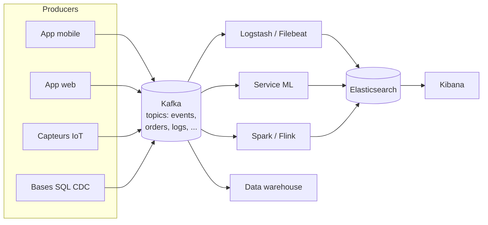
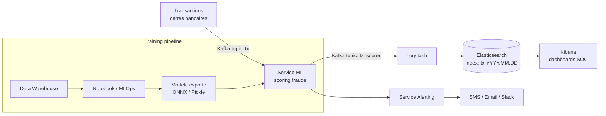
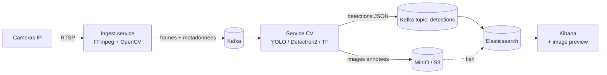
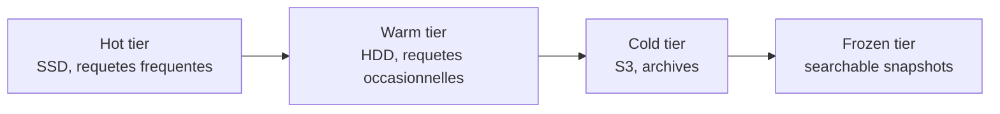

<a id="top"></a>

<!-- Copyright (c) Haythem Rehouma - InSkillFlow‌​‍​​‍​​​‌​‍​‍​​‍​‌​‍​​‍​​‍‌​‍​​​‍‍​‌​‍​​​‍‍‍‌ - Gneurone. Tous droits reserves. Code tague. Reproduction interdite sans autorisation ecrite. -->
# 18 — Annexe : architectures avancées (Kafka, ML, Computer Vision)

> **Type** : Annexe (théorie) · Pour aller plus loin que le contenu du cours.

## Table des matières

- [Pourquoi cette annexe](#pourquoi-cette-annexe)
- [1. Architecture événementielle avec Kafka](#1-architecture-événementielle-avec-kafka)
- [2. Pipeline ML temps réel pour la fraude bancaire](#2-pipeline-ml-temps-réel-pour-la-fraude-bancaire)
- [3. Pipeline Computer Vision (vidéo + détection)](#3-pipeline-computer-vision-vidéo--détection)
- [4. Patterns transverses](#4-patterns-transverses)
- [5. Conseils de mise en production](#5-conseils-de-mise-en-production)
- [6. Liens utiles](#6-liens-utiles)

---

## Pourquoi cette annexe

Les chapitres [04](./04-architecture-pipeline-elk-neo4j.md) et [05](./05-architecture-pipeline-elk-ml.md) ont introduit les pipelines ELK + Neo4j et ELK + ML. Cette annexe pousse plus loin avec **trois architectures industrielles types** que l'on rencontre couramment :

1. **Kafka** comme bus d'événements central pour découpler les producteurs et consommateurs.
2. **ML temps réel** pour la détection de fraude bancaire.
3. **Computer Vision** sur flux vidéo (CCTV, caméras embarquées).

> Ces architectures ne sont **pas exigées par le cours**, mais constituent une excellente lecture pour comprendre où s'insère ELK dans un système de production.

---

## 1. Architecture événementielle avec Kafka

### 1.1 Le problème

Sans bus d'événements, chaque producteur (mobile, web, capteurs IoT) doit connaître tous les consommateurs (Elasticsearch, ML, data warehouse, analytics). Couplage fort, fragile, peu évolutif.

### 1.2 La solution : Kafka comme « colonne vertébrale »



### 1.3 Vocabulaire express

| Terme              | Sens                                                                        |
| ------------------ | --------------------------------------------------------------------------- |
| **Topic**          | « File » nommée (ex : `orders`, `clicks`)                                  |
| **Partition**      | Sous-file ordonnée d'un topic (parallélisme)                               |
| **Producer**       | Celui qui publie                                                            |
| **Consumer**       | Celui qui lit                                                               |
| **Consumer group** | Plusieurs consommateurs se partagent les partitions                         |
| **Offset**         | Position de lecture par consommateur (replay possible)                      |
| **Broker**         | Nœud Kafka                                                                  |
| **ZooKeeper / KRaft** | Coordination du cluster (KRaft = nouvelle voie sans ZooKeeper)           |

### 1.4 Pourquoi cette architecture est puissante

- **Découplage** : un nouveau consommateur s'abonne sans toucher aux producteurs.
- **Replay** : on peut rejouer l'historique pour réindexer Elasticsearch.
- **Backpressure** : Kafka encaisse les pics, le consommateur lent ne fait pas crasher le producteur.
- **Multi-langage** : clients en Java, Python, Go, Node, etc.

---

## 2. Pipeline ML temps réel pour la fraude bancaire

### 2.1 Schéma complet



### 2.2 Étapes clés

1. Chaque transaction carte bancaire est publiée sur le topic `tx` (~ 10k msg/s).
2. Le **service ML** consomme `tx`, applique le modèle (XGBoost, réseau de neurones), et publie un score de fraude sur `tx_scored`.
3. **Logstash** (ou un connecteur Kafka-Elasticsearch) écrit dans des index quotidiens `tx-YYYY.MM.DD`.
4. **Kibana** sert de console SOC (Security Operations Center) avec :
   - top des transactions à haut score
   - histogramme par minute/heure
   - carte géographique des fraudes
5. Au-delà d'un seuil, le **service Alerting** déclenche notification + blocage carte.

### 2.3 Atouts spécifiques d'Elasticsearch ici

- Index quotidiens → **rétention** automatique (ILM Index Lifecycle Management).
- **Aggregations** rapides pour les dashboards temps réel.
- **Watcher / alerting natif** pour seuils simples.
- Recherche plein texte sur les commentaires/notes humaines de l'enquêteur.

### 2.4 Réentraînement du modèle

| Étape                     | Outil typique                       |
| ------------------------- | ----------------------------------- |
| Extraction historique     | SQL / Spark sur le DWH              |
| Feature engineering       | pandas / Spark                      |
| Entraînement              | scikit-learn, XGBoost, PyTorch      |
| Tracking                  | MLflow, Weights & Biases            |
| Packaging                 | ONNX, MLflow Model, Docker image    |
| Déploiement               | K8s + canary, ou simple `model.pkl` |

---

## 3. Pipeline Computer Vision (vidéo + détection)

### 3.1 Cas d'usage

- Vidéosurveillance d'un site industriel
- Comptage de personnes dans un magasin
- Détection d'objets sur tapis logistique
- Analyse d'images médicales

### 3.2 Schéma



### 3.3 Données stockées dans Elasticsearch

```json
{
  "camera_id": "cam-04",
  "timestamp": "2026-04-19T14:33:12.000Z",
  "frame_uri": "s3://video-frames/2026/04/19/cam-04/00012345.jpg",
  "objects": [
    { "label": "person",  "score": 0.97, "bbox": [120, 80, 240, 360] },
    { "label": "forklift","score": 0.81, "bbox": [400, 220, 580, 410] }
  ],
  "alert": false
}
```

### 3.4 Pourquoi ne pas stocker les images dans Elasticsearch

| Stockage          | Bon pour                       | Mauvais pour                                |
| ----------------- | ------------------------------ | ------------------------------------------- |
| Elasticsearch     | Métadonnées, recherche, agrég  | **Blobs binaires** (images, vidéos)         |
| MinIO / S3        | Blobs, téraoctets pas chers    | Recherche structurée                         |
| Combinaison       | Métadonnées dans ES + URI vers le blob, image affichée à la demande dans Kibana via custom plugin |

---

## 4. Patterns transverses

### 4.1 Index par jour + alias

```bash
# Création quotidienne automatique via index template + ILM
PUT _ilm/policy/logs-policy
{
  "policy": {
    "phases": {
      "hot":    { "actions": { "rollover": { "max_age": "1d", "max_size": "50gb" } } },
      "delete": { "min_age": "30d", "actions": { "delete": {} } }
    }
  }
}
```

Avantages : pas de gros index unique, rotation automatique, suppression facile.

### 4.2 Hot / Warm / Cold tiers



### 4.3 Cross-cluster search

Un Kibana central peut chercher dans plusieurs clusters Elasticsearch (un par région, par exemple) sans réplication.

### 4.4 Anonymisation à l'ingestion

Un **ingest pipeline** Elasticsearch peut hacher/anonymiser les champs sensibles (numéro de carte → SHA-256) **avant** que le document n'arrive dans l'index.

```json
PUT _ingest/pipeline/anonymize
{
  "processors": [
    { "fingerprint": { "fields": ["card_number"], "target_field": "card_hash", "method": "SHA-256" } },
    { "remove":      { "field": "card_number" } }
  ]
}
```

---

## 5. Conseils de mise en production

| Sujet                | Recommandation                                                                 |
| -------------------- | ------------------------------------------------------------------------------ |
| **Sécurité**         | Activer X-Pack Security, TLS partout, rôles RBAC, jamais d'accès anonyme       |
| **Monitoring**       | Stack Monitoring + Metricbeat sur tous les nœuds                                |
| **Sauvegarde**       | Snapshots vers S3/MinIO planifiés (SLM Snapshot Lifecycle Management)          |
| **Capacity**         | Heap JVM ≤ 32 Go par nœud ; viser 50% RAM pour ES, 50% pour le file cache OS  |
| **Shards**           | Quelques Go à 50 Go par shard ; éviter les milliers de petits shards          |
| **Mappings**         | Toujours définir explicitement (pas de dynamic mapping en prod)                |
| **Ingestion**        | Buffer Kafka entre source et ES pour absorber les pics                         |
| **Mise à jour**      | Rolling restart, jamais d'arrêt brutal                                         |

---

## 6. Liens utiles

- [Documentation officielle Elasticsearch](https://www.elastic.co/guide/en/elasticsearch/reference/current/index.html)
- [Documentation Kibana](https://www.elastic.co/guide/en/kibana/current/index.html)
- [Documentation Kafka](https://kafka.apache.org/documentation/)
- [Index Lifecycle Management](https://www.elastic.co/guide/en/elasticsearch/reference/current/index-lifecycle-management.html)
- [Cross-cluster search](https://www.elastic.co/guide/en/elasticsearch/reference/current/modules-cross-cluster-search.html)
- [Painless scripting](https://www.elastic.co/guide/en/elasticsearch/painless/current/index.html)

---

> **Fin du cours.** Vous avez maintenant une vue complète : théorie ELK ([01-03](./01-introduction-elasticsearch-elk-stack.md)), architectures ([04-05](./04-architecture-pipeline-elk-neo4j.md)), bases Neo4j ([06-09](./06-installation-neo4j.md)), installation et exploration d'Elasticsearch ([10-16](./10-installation-elasticsearch-kibana.md)), et deux laboratoires ([11](./11-labo1-mise-en-place-elk.md), [17](./17-labo2-rapport-dsl-news.md)).

<p align="right"><a href="#top">↑ Retour en haut</a></p>


---

*Copyright © Haythem R - Tous droits reserves.*
<!-- Copyright (c) Haythem Rehouma - InSkillFlow‌​‍​​‍​​​‌​‍​‍​​‍​‌​‍​​‍​​‍‌​‍​​​‍‍​‌​‍​​​‍‍‍‌ - Gneurone. Tous droits reserves. Code tague. Reproduction interdite sans autorisation ecrite. [tag-id: HRIFG] -->
