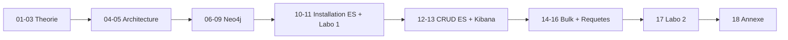

<a id="top"></a>

<!-- Copyright (c) Haythem Rehouma - InSkillFlow‌​‍​​‍​​​‌​‍​‍​​‍​‌​‍​​‍​​‍‌​‍​​​‍‍​‌​‍​​​‍‍‍‌ - Gneurone. Tous droits reserves. Code tague. Reproduction interdite sans autorisation ecrite. -->
# Cours — Elasticsearch, Neo4j & la stack ELK

Ce dossier rassemble l'intégralité du cours, réorganisé en **18 chapitres chronologiques** qui vont de la théorie pure jusqu'aux laboratoires pratiques.

> **Étudiants — les pratiques sont numérotées dans l'ordre d'exécution** (Pratique 1 → Pratique 10, plus deux laboratoires Labo 1 et Labo 2).
>
> Les **deux pratiques avec guide étudiant pas-à-pas** (= énoncés `.docx` du prof) :
> - **Pratique 7** (chap. 13, CRUD Kibana, énoncé `Kibana - Pratique 1.docx`) → [`GUIDE-PRATIQUE-1.md`](./assets-cours2/GUIDE-PRATIQUE-1.md)
> - **Labo 2** (chap. 17, Search/DSL, énoncé `Kibana - Pratique 2.docx`) → [`GUIDE-PRATIQUE-2.md`](./assets-cours2/GUIDE-PRATIQUE-2.md)
>
> **Matériel source** (datasets, énoncés .docx du prof) : voir le sous-dossier [`assets-cours2/`](./assets-cours2/).
> **Solutions runnables des exercices** (chapitres 8 à 17) + **setup A à Z** : voir [`assets-cours2/solutions/`](./assets-cours2/solutions/).
> **Projets autonomes par chapitre** (compose + scripts + queries) : voir les dossiers [`assets-cours2/solutions/chXX-*/`](./assets-cours2/solutions/).

## Table des matières

> Les chapitres marqués **Pratique N** sont à faire **dans l'ordre numérique** (1 → 10). Les chapitres **Labo 1** et **Labo 2** sont les deux livrables principaux.

| #   | Titre                                                                                       | Type         | Pratique         |
| --- | ------------------------------------------------------------------------------------------- | ------------ | ---------------- |
| 01  | [Introduction à Elasticsearch & ELK Stack](./01-introduction-elasticsearch-elk-stack.md)    | Théorie      | —                |
| 02  | [SQL vs Documents (Elasticsearch)](./02-theorie-sql-vs-documents.md)                        | Théorie      | —                |
| 03  | [Concepts clés : cluster, shards, mapping, types](./03-concepts-cles-elasticsearch.md)      | Théorie      | —                |
| 04  | [Architecture pipeline ELK + Neo4j](./04-architecture-pipeline-elk-neo4j.md)                | Architecture | —                |
| 05  | [Architecture pipeline ELK + Machine Learning](./05-architecture-pipeline-elk-ml.md)        | Architecture | —                |
| 06  | [Installation de Neo4j (Linux + Docker)](./06-installation-neo4j.md)                        | Pratique     | **Pratique 1**   |
| 07  | [Premiers pas en Cypher](./07-premiers-pas-cypher.md)                                       | Pratique     | **Pratique 2**   |
| 08  | [Cas pratique Cypher : cours, professeurs, programme IA](./08-cas-pratique-cypher-ia.md)    | Pratique     | **Pratique 3**   |
| 09  | [Nettoyage et reset d'une base Neo4j](./09-nettoyage-neo4j.md)                              | Pratique     | **Pratique 4**   |
| 10  | [Installation d'Elasticsearch + Kibana](./10-installation-elasticsearch-kibana.md)          | Pratique     | **Pratique 5**   |
| 11  | [**Labo 1** — Mise en place complète ELK avec persistance](./11-labo1-mise-en-place-elk.md) | Laboratoire  | **Labo 1**       |
| 12  | [Commandes de base d'Elasticsearch (curl)](./12-commandes-base-elasticsearch.md)            | Pratique     | **Pratique 6**   |
| 13  | [CRUD pédagogique avec Kibana Dev Tools (`forum`, `liste_cours`)](./13-crud-pedagogique-kibana.md) | Pratique | **Pratique 7** — [guide étudiant](./assets-cours2/GUIDE-PRATIQUE-1.md) |
| 14  | [Import d'un dataset volumineux (Bulk API)](./14-import-bulk-dataset.md)                    | Pratique     | **Pratique 8**   |
| 15  | [Requêtes Elasticsearch — niveau intermédiaire](./15-requetes-elasticsearch-intermediaire.md) | Pratique   | **Pratique 9**   |
| 16  | [Requêtes avancées : KQL, ES\|QL, Query DSL](./16-requetes-avancees-kql-esql-dsl.md)        | Pratique     | **Pratique 10**  |
| 17  | [**Labo 2** — Rapport DSL sur l'index `news`](./17-labo2-rapport-dsl-news.md)               | Laboratoire  | **Labo 2** — [guide étudiant](./assets-cours2/GUIDE-PRATIQUE-2.md) |
| 18  | [Annexe — Architectures avancées (Kafka, ML, Computer Vision)](./18-annexe-architectures-avancees.md) | Annexe | —                |

### Liste de suivi (checklist étudiant)

> **Mode d'emploi** : remplacez `[ ]` par `[x]` dans la colonne **Done** au fur et à mesure que vous terminez chaque chapitre / pratique / labo. Sur GitHub, vous pouvez aussi utiliser le bouton **Edit** (icône crayon) pour cocher directement en ligne.
>
> **Objectif global** : 18/18 cases cochées = cours terminé.

| Done  | #  | Catégorie     | Titre                                                                                       | Effort estimé | Livrable               |
| :---: | -: | ------------- | ------------------------------------------------------------------------------------------- | :-----------: | ---------------------- |
| `[ ]` | 01 | Théorie       | [Introduction à Elasticsearch & ELK Stack](./01-introduction-elasticsearch-elk-stack.md)    | 1 h           | Lecture                |
| `[ ]` | 02 | Théorie       | [SQL vs Documents (Elasticsearch)](./02-theorie-sql-vs-documents.md)                        | 45 min        | Lecture                |
| `[ ]` | 03 | Théorie       | [Concepts clés : cluster, shards, mapping, types](./03-concepts-cles-elasticsearch.md)      | 1 h           | Lecture                |
| `[ ]` | 04 | Architecture  | [Pipeline ELK + Neo4j](./04-architecture-pipeline-elk-neo4j.md)                             | 30 min        | Lecture                |
| `[ ]` | 05 | Architecture  | [Pipeline ELK + Machine Learning](./05-architecture-pipeline-elk-ml.md)                     | 30 min        | Lecture                |
| `[ ]` | 06 | **Pratique 1** | [Installation de Neo4j + APOC dans Docker](./06-installation-neo4j.md)                     | 20 min        | `docker compose up`    |
| `[ ]` | 07 | **Pratique 2** | [Premiers pas en Cypher (8 requêtes types)](./07-premiers-pas-cypher.md)                   | 30 min        | Run de `run-all.sh`    |
| `[ ]` | 08 | **Pratique 3** | [Cas pratique Cypher : cours, profs, programme IA](./08-cas-pratique-cypher-ia.md)         | 45 min        | Graphe + 5 requêtes    |
| `[ ]` | 09 | **Pratique 4** | [Nettoyage et reset d'une base Neo4j (5 méthodes)](./09-nettoyage-neo4j.md)                 | 20 min        | 5 méthodes testées     |
| `[ ]` | 10 | **Pratique 5** | [Installation Elasticsearch + Kibana](./10-installation-elasticsearch-kibana.md)            | 25 min        | `docker compose up`    |
| `[ ]` | 11 | **Labo 1**    | [Mise en place complète ELK avec persistance](./11-labo1-mise-en-place-elk.md)              | 2 h           | **Rapport noté**       |
| `[ ]` | 12 | **Pratique 6** | [Commandes ES via `curl`](./12-commandes-base-elasticsearch.md)                            | 45 min        | Console + tests        |
| `[ ]` | 13 | **Pratique 7** | [CRUD Kibana Dev Tools — `forum` + `liste_cours`](./13-crud-pedagogique-kibana.md)         | 1 h 30        | Guide étudiant complété ([P1](./assets-cours2/GUIDE-PRATIQUE-1.md)) |
| `[ ]` | 14 | **Pratique 8** | [Import d'un dataset volumineux (Bulk API, 200 853 docs)](./14-import-bulk-dataset.md)     | 1 h           | `count = 200 853`      |
| `[ ]` | 15 | **Pratique 9** | [Requêtes Elasticsearch — niveau intermédiaire](./15-requetes-elasticsearch-intermediaire.md) | 1 h         | 16 requêtes DSL        |
| `[ ]` | 16 | **Pratique 10**| [Requêtes avancées : KQL, ES\|QL, Query DSL](./16-requetes-avancees-kql-esql-dsl.md)        | 45 min        | 3 langages comparés    |
| `[ ]` | 17 | **Labo 2**    | [Rapport DSL sur l'index `news`](./17-labo2-rapport-dsl-news.md)                            | 3-4 h         | **Rapport noté** ([P2](./assets-cours2/GUIDE-PRATIQUE-2.md)) |
| `[ ]` | 18 | Annexe        | [Architectures avancées (Kafka, ML, Computer Vision)](./18-annexe-architectures-avancees.md) | 30 min       | Lecture (optionnel)    |

#### Compteur de progression

| Catégorie       | Nombre | Mes cases cochées          |
| --------------- | :----: | -------------------------- |
| Théorie         |   3    | `__ / 3`                   |
| Architecture    |   2    | `__ / 2`                   |
| Pratiques       |   10   | `__ / 10`                  |
| Laboratoires    |   2    | `__ / 2` (notés)           |
| Annexe          |   1    | `__ / 1` (optionnel)       |
| **Total**       | **18** | **`__ / 18`**              |

> **Astuce** : forkez ce dépôt sur votre compte GitHub, et cochez les cases au fil du semestre. Cela vous fera un journal de progression visible aussi par vos camarades pour les sessions de groupe.

#### Liste à cocher cliquable (alternative GitHub)

> Cette version utilise la syntaxe **GitHub task list** : les cases sont cliquables dans une **issue, un commentaire ou une PR** (mais pas dans un fichier `.md` standard). Copiez-les si vous voulez les utiliser dans une issue de suivi personnel.

<details>
<summary>Voir la version « task list » à copier dans une issue GitHub</summary>

```markdown
## Suivi du cours Elasticsearch / ELK / Neo4j

### Théorie et architecture
- [ ] Chap. 01 — Introduction à Elasticsearch & ELK Stack
- [ ] Chap. 02 — SQL vs Documents
- [ ] Chap. 03 — Concepts clés : cluster, shards, mapping
- [ ] Chap. 04 — Architecture pipeline ELK + Neo4j
- [ ] Chap. 05 — Architecture pipeline ELK + Machine Learning

### Pratiques Neo4j / Cypher
- [ ] Pratique 1 (chap. 06) — Installation Neo4j + APOC
- [ ] Pratique 2 (chap. 07) — Premiers pas Cypher
- [ ] Pratique 3 (chap. 08) — Cypher cas IA
- [ ] Pratique 4 (chap. 09) — Nettoyage / reset
- [ ] Pratique 5 (chap. 10) — Installation ES + Kibana

### Laboratoire 1 (noté)
- [ ] Labo 1 (chap. 11) — ELK avec persistance

### Pratiques Elasticsearch / Kibana
- [ ] Pratique 6 (chap. 12) — Commandes ES (curl)
- [ ] Pratique 7 (chap. 13) — CRUD Kibana — Guide P1
- [ ] Pratique 8 (chap. 14) — Bulk import 200 853 docs
- [ ] Pratique 9 (chap. 15) — Requêtes DSL intermédiaires
- [ ] Pratique 10 (chap. 16) — KQL vs ES|QL vs DSL

### Laboratoire 2 (noté)
- [ ] Labo 2 (chap. 17) — Rapport DSL News — Guide P2

### Annexe
- [ ] Chap. 18 — Architectures avancées
```

</details>

---

### Récapitulatif des pratiques et laboratoires

| Ordre           | Chapitre | Sujet                                         | Énoncé officiel du prof          | Guide / projet runnable                                              |
| --------------- | :------: | --------------------------------------------- | -------------------------------- | -------------------------------------------------------------------- |
| **Pratique 1**  | 06       | Installation de Neo4j (Linux + Docker)        | (interne au cours)                | [`pratique-01-ch06-installation-neo4j/`](./assets-cours2/solutions/pratique-01-ch06-installation-neo4j/) |
| **Pratique 2**  | 07       | Premiers pas en Cypher                        | (interne au cours)                | [`pratique-02-ch07-premiers-pas-cypher/`](./assets-cours2/solutions/pratique-02-ch07-premiers-pas-cypher/) |
| **Pratique 3**  | 08       | Cas pratique Cypher (cours, profs, IA)        | (interne au cours)                | [`pratique-03-ch08-cypher-ia/`](./assets-cours2/solutions/pratique-03-ch08-cypher-ia/)       |
| **Pratique 4**  | 09       | Nettoyage / reset Neo4j                       | (interne au cours)                | [`pratique-04-ch09-nettoyage-neo4j/`](./assets-cours2/solutions/pratique-04-ch09-nettoyage-neo4j/) |
| **Pratique 5**  | 10       | Installation d'Elasticsearch + Kibana         | (interne au cours)                | [`pratique-05-ch10-installation-es-kibana/`](./assets-cours2/solutions/pratique-05-ch10-installation-es-kibana/) |
| **Labo 1**      | 11       | Mise en place complète ELK avec persistance   | (interne au cours)                | [`labo-1-ch11-elk/`](./assets-cours2/solutions/labo-1-ch11-elk/)       |
| **Pratique 6**  | 12       | Commandes de base ES (`curl`)                 | (interne au cours)                | [`pratique-06-ch12-commandes-base/`](./assets-cours2/solutions/pratique-06-ch12-commandes-base/) |
| **Pratique 7**  | 13       | CRUD pédagogique Kibana                       | `Kibana - Pratique 1.docx`        | [`GUIDE-PRATIQUE-1.md`](./assets-cours2/GUIDE-PRATIQUE-1.md) + [`pratique-07-ch13-crud-kibana/`](./assets-cours2/solutions/pratique-07-ch13-crud-kibana/) |
| **Pratique 8**  | 14       | Bulk import (200 853 docs)                    | (interne au cours)                | [`pratique-08-ch14-bulk-import/`](./assets-cours2/solutions/pratique-08-ch14-bulk-import/)   |
| **Pratique 9**  | 15       | Requêtes DSL intermédiaires                   | (interne au cours)                | [`pratique-09-ch15-requetes/`](./assets-cours2/solutions/pratique-09-ch15-requetes/)         |
| **Pratique 10** | 16       | KQL vs ES\|QL vs DSL                          | (interne au cours)                | [`pratique-10-ch16-kql-esql-dsl/`](./assets-cours2/solutions/pratique-10-ch16-kql-esql-dsl/) |
| **Labo 2**      | 17       | Rapport DSL complet sur l'index `news`        | `Kibana - Pratique 2.docx`        | [`GUIDE-PRATIQUE-2.md`](./assets-cours2/GUIDE-PRATIQUE-2.md) + [`labo-2-ch17-labo2/`](./assets-cours2/solutions/labo-2-ch17-labo2/) |

> **Attention à la nomenclature.** Les fichiers `.docx` du prof s'appellent `Kibana - Pratique 1.docx` et `Kibana - Pratique 2.docx`. Dans **notre numérotation interne**, ils correspondent respectivement à **Pratique 7** (chap. 13) et **Labo 2** (chap. 17).

---

## Plan de lecture conseillé



| Étape           | Chapitres | Objectif                                                                                                     |
| --------------- | --------- | ------------------------------------------------------------------------------------------------------------ |
| **Théorie**     | 01 → 03   | Comprendre ce qu'est Elasticsearch, en quoi il diffère du SQL, et son vocabulaire (cluster, shards, mapping). |
| **Architecture**| 04 → 05   | Voir comment Elasticsearch s'intègre dans une stack avec Neo4j et un pipeline ML.                            |
| **Neo4j**       | 06 → 09   | Installer Neo4j, écrire ses premières requêtes Cypher, faire un cas pratique, savoir nettoyer.               |
| **Setup ES**    | 10 → 11   | Installer Elasticsearch + Kibana via Docker Compose, puis bâtir un environnement complet (Labo 1).           |
| **CRUD ES**     | 12 → 13   | Apprendre les commandes de base avec `curl`, puis le CRUD pédagogique dans Kibana (PUT vs POST vs `_create`). |
| **Bulk + Requêtes** | 14 → 16 | Charger un gros dataset, puis maîtriser les trois langages de requête (KQL, ES\|QL, DSL).                  |
| **Labo final**  | 17        | Rendre un rapport DSL complet sur le dataset `news`.                                                         |
| **Annexe**      | 18        | Découvrir des architectures avancées (Kafka, ML, Computer Vision).                                           |

---

## Datasets utilisés

| Dataset                                | Emplacement                                                       | Utilisé dans          |
| -------------------------------------- | ----------------------------------------------------------------- | --------------------- |
| Données Cypher de démo (4 personnes, 3 villes) | [`pratique-02-ch07-premiers-pas-cypher/cypher/`](./assets-cours2/solutions/pratique-02-ch07-premiers-pas-cypher/cypher/) | Pratique 2 (chap. 07) |
| Mini-graphe IA (cours, profs, programme) | [`pratique-03-ch08-cypher-ia/`](./assets-cours2/solutions/pratique-03-ch08-cypher-ia/) | Pratique 3 (chap. 08) |
| News Category Dataset v2 (JSON, 80 Mo, 200 853 articles) | [`assets-cours2/News_Category_Dataset_v2.json`](./assets-cours2/News_Category_Dataset_v2.json) | Pratiques 8 → 10, Labo 2 |
| Datasets compressés (CSV/JSON)         | [`assets-cours2/archiveCSV.zip`](./assets-cours2/archiveCSV.zip), [`archiveJSON.zip`](./assets-cours2/archiveJSON.zip) | Variantes du dataset news |
| Énoncés officiels du prof (.docx)      | [`Kibana - Pratique 1.docx`](./assets-cours2/Kibana%20-%20Pratique%201.docx), [`Kibana - Pratique 2.docx`](./assets-cours2/Kibana%20-%20Pratique%202.docx) | Référence Pratique 7 et Labo 2 |

> **Note** : ce dépôt est la version « cours seul » du projet. Les **datasets Spotify** (CSV `artists/albums/tracks`) du projet recommandation Neo4j sont **volontairement absents** ici — ils sont disponibles dans le dépôt parallèle `elasticsearch-1`.

---

## Solutions des exercices (clés en main)

Implémentations **complètes et runnables** de tous les exercices et laboratoires, organisées par chapitre. Chaque solution est **auto-suffisante** : on peut partir d'une machine vierge.

| Documentation détaillée                                                                  | Projet runnable (compose + scripts)                                                | Couvre              |
| --------------------------------------------------------------------------------------- | ---------------------------------------------------------------------------------- | ------------------- |
| [00 — **Setup complet de A à Z**](./assets-cours2/solutions/00-setup-complet-a-z.md)    | (utilise le `docker-compose.yml` racine du projet)                                  | Setup global         |
| [Pratique 1 — Installation Neo4j](./assets-cours2/solutions/pratique-01-solutions-installation-neo4j.md) | [`pratique-01-ch06-installation-neo4j/`](./assets-cours2/solutions/pratique-01-ch06-installation-neo4j/) | Chapitre 06 |
| [Pratique 2 — Premiers pas Cypher](./assets-cours2/solutions/pratique-02-solutions-premiers-pas-cypher.md) | [`pratique-02-ch07-premiers-pas-cypher/`](./assets-cours2/solutions/pratique-02-ch07-premiers-pas-cypher/) | Chapitre 07 |
| [Pratique 3 — Cypher cas IA](./assets-cours2/solutions/pratique-03-solutions-cypher-cas-ia.md) | [`pratique-03-ch08-cypher-ia/`](./assets-cours2/solutions/pratique-03-ch08-cypher-ia/) | Chapitre 08 |
| [Pratique 4 — Nettoyage Neo4j](./assets-cours2/solutions/pratique-04-solutions-nettoyage-neo4j.md) | [`pratique-04-ch09-nettoyage-neo4j/`](./assets-cours2/solutions/pratique-04-ch09-nettoyage-neo4j/) | Chapitre 09 |
| [Pratique 5 — Installation ES + Kibana](./assets-cours2/solutions/pratique-05-solutions-installation-es-kibana.md) | [`pratique-05-ch10-installation-es-kibana/`](./assets-cours2/solutions/pratique-05-ch10-installation-es-kibana/) | Chapitre 10 |
| [Labo 1 — Mise en place ELK](./assets-cours2/solutions/labo-1-solutions-elk.md) | [`labo-1-ch11-elk/`](./assets-cours2/solutions/labo-1-ch11-elk/) | Chapitre 11 (livrable) |
| [Pratique 6 — Commandes ES](./assets-cours2/solutions/pratique-06-solutions-commandes-base.md) | [`pratique-06-ch12-commandes-base/`](./assets-cours2/solutions/pratique-06-ch12-commandes-base/) | Chapitre 12 |
| [Pratique 7 — CRUD Kibana](./assets-cours2/solutions/pratique-07-solutions-crud-pedagogique.md) | [`pratique-07-ch13-crud-kibana/`](./assets-cours2/solutions/pratique-07-ch13-crud-kibana/) | Chapitre 13 |
| [Pratique 8 — Bulk import 200 853 docs](./assets-cours2/solutions/pratique-08-solutions-bulk-import.md) | [`pratique-08-ch14-bulk-import/`](./assets-cours2/solutions/pratique-08-ch14-bulk-import/) | Chapitre 14 |
| [Pratique 9 — Requêtes DSL intermédiaires](./assets-cours2/solutions/pratique-09-solutions-requetes-intermediaires.md) | [`pratique-09-ch15-requetes/`](./assets-cours2/solutions/pratique-09-ch15-requetes/) | Chapitre 15 |
| [Pratique 10 — KQL vs ES\|QL vs DSL](./assets-cours2/solutions/pratique-10-solutions-kql-esql-dsl.md) | [`pratique-10-ch16-kql-esql-dsl/`](./assets-cours2/solutions/pratique-10-ch16-kql-esql-dsl/) | Chapitre 16 |
| [Labo 2 — Rapport DSL News](./assets-cours2/solutions/labo-2-solutions-rapport-dsl-news.md) | [`labo-2-ch17-labo2/`](./assets-cours2/solutions/labo-2-ch17-labo2/) | Chapitre 17 (livrable) |
| [Index complet des solutions](./assets-cours2/solutions/README.md)                      | (index général)                                                                     | Tous                 |

> **Vous démarrez ?** Lisez d'abord le [Setup A à Z](./assets-cours2/solutions/00-setup-complet-a-z.md) puis attaquez les chapitres dans l'ordre.

---

## Conventions de ce cours

| Symbole / Style | Signification                                                                   |
| --------------- | ------------------------------------------------------------------------------- |
| Théorie         | Chapitre conceptuel, pas de manipulation                                        |
| Pratique        | Commandes shell ou Cypher à exécuter                                            |
| Laboratoire     | Travail à rendre, exercices structurés                                          |
| Annexe          | Compléments / approfondissements optionnels                                     |

Tous les blocs `bash` sont prévus pour une **VM Ubuntu** ou un **WSL2 Windows**.
Tous les blocs `cypher` sont compatibles **Neo4j 5.x** (sauf mention contraire).
Les requêtes Elasticsearch ciblent **Elasticsearch 8.x**.

<p align="right"><a href="#top">Retour en haut</a></p>


---

*Copyright © Haythem R - Tous droits reserves.*
<!-- Copyright (c) Haythem Rehouma - InSkillFlow‌​‍​​‍​​​‌​‍​‍​​‍​‌​‍​​‍​​‍‌​‍​​​‍‍​‌​‍​​​‍‍‍‌ - Gneurone. Tous droits reserves. Code tague. Reproduction interdite sans autorisation ecrite. [tag-id: HRIFG] -->
