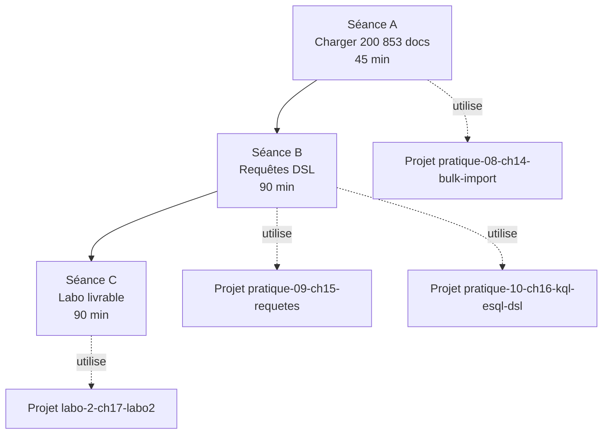

<a id="top"></a>

# Guide étudiant — Pratique 2 : Search API et Query DSL sur 200 853 articles

> **Énoncé officiel du prof :** [`Kibana - Pratique 2.docx`](./Kibana%20-%20Pratique%202.docx) (dans ce dossier)
>
> Cette pratique est **plus longue** que la Pratique 1 : on travaille sur un vrai dataset (200 853 articles de presse) et on construit une mini-plateforme de recherche complète. Comptez **3 à 4 heures** réparties sur 2 séances.

## Table des matières

- [Objectif pédagogique](#objectif-pédagogique)
- [Ce que vous saurez faire à la fin](#ce-que-vous-saurez-faire-à-la-fin)
- [Pré-requis](#pré-requis)
- [Plan global (3 séances)](#plan-global-3-séances)
- [Séance A — Charger 200 853 articles (45 min)](#séance-a--charger-200-853-articles-45-min)
- [Séance B — Maîtriser les requêtes DSL (90 min)](#séance-b--maîtriser-les-requêtes-dsl-90-min)
- [Séance C — Labo final livrable (90 min)](#séance-c--labo-final-livrable-90-min)
- [Livrable et critères d'évaluation](#livrable-et-critères-dévaluation)
- [Aide rapide / FAQ étudiants](#aide-rapide--faq-étudiants)

---

## Objectif pédagogique

Apprendre à **chercher de l'information dans un grand volume de documents** avec Elasticsearch, en utilisant le langage de requête le plus riche : la **Query DSL**.

Vous aborderez aussi rapidement **KQL** (langage simple pour Discover) et **ES|QL** (langage SQL-like d'Elastic) pour comprendre **quand utiliser quoi**.

| Mini-objectif                          | Outil maîtrisé                  |
| -------------------------------------- | ------------------------------- |
| Charger 200 853 documents efficacement | Bulk API + scripts             |
| Compter au-delà de 10 000 résultats    | `track_total_hits`             |
| Faire de la recherche full-text        | `match`, `match_phrase`, `multi_match` |
| Tolérer les fautes de frappe           | `fuzziness`                    |
| Combiner filtres et exclusions         | `bool` (must / filter / must_not / should) |
| Trier et paginer à grande échelle      | `sort`, `search_after`         |
| Calculer des KPI                       | Agrégations (`terms`, `date_histogram`, `top_hits`) |
| Surligner les correspondances          | `highlight`                    |
| Construire un dashboard Kibana         | Visualizations + Dashboard     |

## Ce que vous saurez faire à la fin

- Importer un dataset JSONL en `_bulk` avec mapping optimisé
- Écrire une requête DSL complète (filtres + tri + pagination + highlight)
- Faire des **agrégations imbriquées** (catégorie → top auteurs)
- Choisir entre **KQL / ES|QL / DSL** selon le besoin
- Livrer un **rapport pro** avec captures Kibana, mapping, requêtes documentées

## Pré-requis

| # | Pré-requis                                  | Vérification rapide                                |
| - | ------------------------------------------- | -------------------------------------------------- |
| 1 | Avoir terminé la **Pratique 1**             | [Guide Pratique 1](./GUIDE-PRATIQUE-1.md)          |
| 2 | Docker Desktop (4 Go RAM minimum)           | `docker info` doit afficher >= 4 GB Memory         |
| 3 | Le fichier dataset                           | [`News_Category_Dataset_v2.json`](./News_Category_Dataset_v2.json) — ~80 Mo |
| 4 | (Optionnel) Lecture des chapitres 14, 15, 16, 17 | environ 1h de lecture théorique                |

---

## Plan global (3 séances)



> Les **4 projets runnables** correspondants sont auto-suffisants : un `docker compose up -d` par projet, pas de configuration partagée à gérer.

---

## Séance A — Charger 200 853 articles (45 min)

### Objectif

Avoir un index `news` peuplé de **200 853 documents**, prêt à requêter.

### Projet runnable

[`solutions/pratique-08-ch14-bulk-import/`](./solutions/pratique-08-ch14-bulk-import/) — voir son [README](./solutions/pratique-08-ch14-bulk-import/README.md).

### Marche à suivre (1 commande)

```bash
cd docs2-cours1/assets-cours2/solutions/pratique-08-ch14-bulk-import

# Linux / macOS / WSL
bash scripts/run-all.sh

# OU Windows PowerShell
.\scripts\run-all.ps1

# OU multiplateforme via Python
pip install -r requirements.txt
python scripts/bulk_import.py
```

### Vérification que tout est OK

Dans Kibana → Dev Tools :

```
GET news/_count
```

Vous devez voir : `"count": 200853`. Si non → voir [Cas d'erreurs](./solutions/pratique-08-ch14-bulk-import/README.md#) ou la FAQ ci-dessous.

### Concepts vus

- **Mapping** explicite (date, keyword, text) avec sous-champs `.keyword`
- Optimisation **avant import** : `replicas: 0`, `refresh_interval: -1`
- Restauration **après import** : `replicas: 1`, `refresh_interval: "1s"`, `_refresh`
- Pourquoi découper en **chunks de 5000 lignes** pour `_bulk`

> **Documentation détaillée :** [chapitre 14](../14-import-bulk-dataset.md) et [`pratique-08-solutions-bulk-import.md`](./solutions/pratique-08-solutions-bulk-import.md).

---

## Séance B — Maîtriser les requêtes DSL (90 min)

### Objectif

Savoir écrire **les 16 patterns de requêtes** qui couvrent 95 % des besoins réels.

### Projets runnables

| Projet                                          | Couvre                                       |
| ----------------------------------------------- | -------------------------------------------- |
| [`pratique-09-ch15-requetes/`](./solutions/pratique-09-ch15-requetes/)  | Toutes les requêtes DSL intermédiaires       |
| [`pratique-10-ch16-kql-esql-dsl/`](./solutions/pratique-10-ch16-kql-esql-dsl/) | KQL vs ES\|QL vs DSL côte-à-côte         |

### Marche à suivre

1. Garder la stack ch14 démarrée (l'index `news` y est déjà chargé).
2. Ouvrir Kibana → Dev Tools → Console.
3. Coller le snippet [`pratique-09-ch15-requetes/console/all-queries.txt`](./solutions/pratique-09-ch15-requetes/console/all-queries.txt) — **16 requêtes commentées** prêtes à exécuter.
4. Exécuter **une requête à la fois** (`Ctrl + Entrée`), lire la réponse, comprendre.

### Les 16 patterns à tester (résumé)

| #  | Pattern              | Démontre                                  |
| -: | -------------------- | ----------------------------------------- |
|  1 | `track_total_hits`   | Compter au-delà de 10 000 résultats       |
|  2 | `operator: and`      | Précision vs rappel                       |
|  3 | `match_phrase`       | Phrase exacte                             |
|  4 | `multi_match` + boost| Plusieurs champs avec poids différents    |
|  5 | `fuzziness: AUTO`    | Tolérance aux fautes                      |
|  6 | `term` / `terms`     | Filtre exact (sur `.keyword`)             |
|  7 | `bool`               | must / filter / must_not / should         |
|  8 | `range` sur date     | Période temporelle                        |
|  9 | `sort` + `search_after` | Pagination scalable                    |
| 10 | `highlight`          | Surligner les mots trouvés                |
| 11 | `terms` agg + `top_hits` | Top catégories + dernier article      |
| 12 | `date_histogram`     | Série temporelle journalière              |
| 13 | `significant_text`   | Termes saillants                          |
| 14 | `cardinality`        | Compter des valeurs distinctes            |
| 15 | `_update_by_query`   | Modifier en masse                         |
| 16 | `_reindex`           | Copier vers un nouvel index               |

### Comparer KQL / ES|QL / DSL

Coller successivement les 3 fichiers du projet `ch16` :

| Fichier                                                                    | Outil Kibana             |
| -------------------------------------------------------------------------- | ------------------------ |
| [`console/01-kql-discover.txt`](./solutions/pratique-10-ch16-kql-esql-dsl/console/01-kql-discover.txt) | Barre de recherche **Discover** |
| [`console/02-esql-devtools.txt`](./solutions/pratique-10-ch16-kql-esql-dsl/console/02-esql-devtools.txt) | **Dev Tools** → `POST _query` |
| [`console/03-dsl-devtools.txt`](./solutions/pratique-10-ch16-kql-esql-dsl/console/03-dsl-devtools.txt)   | **Dev Tools** → `GET news/_search` |

> Mêmes 7 questions, **3 langages différents** → vous comprenez immédiatement quand utiliser quoi.

| Critère                                  | Recommandation               |
| ---------------------------------------- | ---------------------------- |
| Filtre interactif dans Discover          | **KQL**                      |
| Rapport tabulaire SQL-like               | **ES\|QL**                   |
| Application backend ou besoin avancé     | **Query DSL**                |
| Boost, highlight, function_score, search_after | **DSL** uniquement     |

### Documentation détaillée

- [Chapitre 15 — Requêtes intermédiaires](../15-requetes-elasticsearch-intermediaire.md) + [`solutions-15`](./solutions/pratique-09-solutions-requetes-intermediaires.md)
- [Chapitre 16 — KQL/ES\|QL/DSL](../16-requetes-avancees-kql-esql-dsl.md) + [`solutions-16`](./solutions/pratique-10-solutions-kql-esql-dsl.md)

---

## Séance C — Labo final livrable (90 min)

### Objectif

Construire la **mini-plateforme de recherche complète** demandée dans `Kibana - Pratique 2.docx` :

- 1 mapping optimisé pour la recherche
- 10 requêtes DSL versionnées et exécutables
- 4 visualisations Kibana sur un dashboard
- Un rapport PDF documentant tout

### Projet runnable

[`solutions/labo-2-ch17-labo2/`](./solutions/labo-2-ch17-labo2/) — voir son [README](./solutions/labo-2-ch17-labo2/README.md).

### Marche à suivre (2 commandes)

```bash
cd docs2-cours1/assets-cours2/solutions/labo-2-ch17-labo2

bash scripts/01-up-and-import.sh        # ~5 min : stack + import
bash scripts/02-run-all-queries.sh      # joue R01..R10, écrit results/*.json
```

→ 10 fichiers JSON dans `results/`, un par requête.

### Les 10 requêtes du labo

| #  | Fichier                                  | Démontre                          |
| -: | ---------------------------------------- | --------------------------------- |
|  1 | `R01-tri-date.json`                       | `sort` + `_source`                |
|  2 | `R02-search-after.json`                   | Pagination scalable               |
|  3 | `R03-multi-match-boost.json`              | `headline^3` + boosting           |
|  4 | `R04-match-phrase.json`                   | Phrase exacte                     |
|  5 | `R05-fuzzy.json`                          | Tolérance fautes                  |
|  6 | `R06-bool-trump.json`                     | bool complexe                     |
|  7 | `R07-function-score.json`                 | Boost catégoriel                  |
|  8 | `R08-highlight.json`                      | Surlignement `<mark>`             |
|  9 | `R09-aggs-top-hits.json`                  | terms agg + top_hits              |
| 10 | `R10-date-histogram.json`                 | Série temporelle                  |

### Construire le dashboard Kibana

Ouvrir Kibana → **Dashboard → Create dashboard**, puis ajouter 4 visualisations :

| # | Type            | Source                                                |
| - | --------------- | ----------------------------------------------------- |
| 1 | Pie chart       | Top 10 catégories (`terms` sur `category.keyword`)    |
| 2 | Vertical bar    | Articles par jour (`date_histogram`) splittés par catégorie |
| 3 | Tag cloud       | Mots saillants des `headline`                         |
| 4 | Data table      | Top auteurs par catégorie (sub-`top_hits`)            |

Sauvegarder le dashboard, faire **une capture d'écran** pour le rapport.

### Rédiger le rapport

Un **template prérempli** est fourni : [`solutions/labo-2-ch17-labo2/docs/rapport-template.md`](./solutions/labo-2-ch17-labo2/docs/rapport-template.md).

Sections imposées :
1. Objectif et contexte
2. Architecture déployée (compose, versions)
3. Modélisation (justifier les choix de mapping)
4. Pipeline d'ingestion
5. Les 10 requêtes (synthèse)
6. Dashboard Kibana (capture)
7. Difficultés rencontrées
8. Conclusion

> Convertir le `.md` en PDF (Pandoc, VS Code Markdown PDF, ou impression navigateur).

---

## Livrable et critères d'évaluation

### Quoi remettre

| Élément                                              | Format          | Pondération |
| ---------------------------------------------------- | --------------- | :---------: |
| Le `docker-compose.yml` du labo                       | fichier         |     5 %     |
| Le mapping `news.mapping.json`                       | fichier         |     5 %     |
| Les 10 requêtes `R01..R10.json`                      | dossier         |    20 %     |
| Les 10 sorties `results/R*.json`                     | dossier         |    10 %     |
| Capture du dashboard Kibana (4 visus)                | image PDF       |    20 %     |
| Rapport (8 sections du template)                     | PDF             |    40 %     |

### Grille rapide

| Critère                                          | Points |
| ------------------------------------------------ | :----: |
| Index `news` à 200 853 documents (vérifié)        |   2    |
| Mapping justifié (text/keyword, dates, etc.)     |   3    |
| 10 requêtes correctes et exécutables             |   5    |
| Dashboard avec 4 visus                           |   3    |
| Rapport structuré et clair                        |   4    |
| Section « difficultés rencontrées » sincère      |   2    |
| Soin général (orthographe, captures lisibles)    |   1    |
| **Total**                                        | **20** |

---

## Aide rapide / FAQ étudiants

<details>
<summary><strong>L'import s'arrête à 50 000 / 100 000 docs</strong></summary>

ES manque de RAM. Augmenter dans Docker Desktop : **Settings → Resources → Memory ≥ 4 GB**, puis :

```bash
docker compose down
docker compose up -d
bash scripts/run-all.sh
```

Le script est **idempotent** : il recommence proprement.

</details>

<details>
<summary><strong>`_count` retourne 10 000 et pas 200 853</strong></summary>

Ce n'est pas `_count` (lui est exact) mais `_search` qui plafonne par défaut à 10 000. Utiliser :

```
GET news/_search
{ "track_total_hits": true, "size": 0 }
```

</details>

<details>
<summary><strong>Mes agrégations sur `category` sont vides</strong></summary>

`category` est un champ `text`, pas agrégeable directement. Cibler le sous-champ keyword :

```
"terms": { "field": "category.keyword" }
```

</details>

<details>
<summary><strong>`search_after` me retourne les mêmes résultats en boucle</strong></summary>

Le tri doit avoir une **clé unique** en fin (ex. `_id`). Sinon les ties produisent des doublons :

```json
"sort": [ { "date": "desc" }, { "_id": "desc" } ]
```

</details>

<details>
<summary><strong>Mon dashboard n'affiche aucune donnée</strong></summary>

Vérifier le **time picker** en haut à droite : par défaut Kibana filtre sur les 15 dernières minutes. Le dataset va de **2012 à 2018** → choisir **« Last 10 years »** ou plage personnalisée.

</details>

<details>
<summary><strong>Erreur « illegal_argument_exception » sur un mapping existant</strong></summary>

Vous tentez de modifier un mapping après création (interdit). Solution : créer un **nouvel index** + `_reindex` depuis l'ancien. Voir requête #16 dans `pratique-09-ch15-requetes/console/all-queries.txt`.

</details>

---

## Pour aller plus loin

| Ressource                                                                                | Quand l'utiliser                            |
| ---------------------------------------------------------------------------------------- | ------------------------------------------- |
| [Cours chapitre 14 — Bulk import](../14-import-bulk-dataset.md)                          | Comprendre l'optimisation pré/post-import   |
| [Cours chapitre 15 — Requêtes DSL](../15-requetes-elasticsearch-intermediaire.md)        | Théorie complète des requêtes DSL           |
| [Cours chapitre 16 — KQL / ES\|QL / DSL](../16-requetes-avancees-kql-esql-dsl.md)        | Comparaison des trois langages              |
| [Cours chapitre 17 — Labo 2](../17-labo2-rapport-dsl-news.md)                            | Énoncé pédagogique du labo                  |
| [Énoncé officiel du prof (.docx)](./Kibana%20-%20Pratique%202.docx)                       | Référence d'autorité pour la notation       |
| [Index complet des solutions](./solutions/README.md)                                      | Vue d'ensemble de toutes les implémentations |

> **Vous n'avez pas encore fait la Pratique 1 ?** Commencer par : [`GUIDE-PRATIQUE-1.md`](./GUIDE-PRATIQUE-1.md).

<p align="right"><a href="#top">Retour en haut</a></p>
