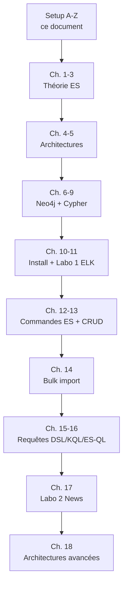

<a id="top"></a>

# 00 — Setup complet de A à Z (Docker → ELK + Neo4j + Jupyter prêts à l'emploi)

> **Objectif** : partir d'une **machine vierge** et arriver à une stack **fonctionnelle** où vous pouvez ouvrir Kibana, Neo4j Browser et Jupyter et exécuter les exercices des chapitres 8 à 17.
>
> **Durée** : ~30 min (selon connexion internet — les images Docker font ~3 Go).
>
> **Pré-requis** : Windows 10/11 (64 bits) ou macOS / Linux + 8 Go de RAM minimum (16 Go recommandé) + 15 Go d'espace disque libre.

## Table des matières

- [1. Installer Docker Desktop](#1-installer-docker-desktop)
- [2. Vérifier l'installation](#2-vérifier-linstallation)
- [3. Créer l'arborescence du projet](#3-créer-larborescence-du-projet)
- [4. Créer le fichier `.env`](#4-créer-le-fichier-env)
- [5. Créer le `docker-compose.yml` complet](#5-créer-le-docker-composeyml-complet)
- [6. Créer `requirements.txt` (Jupyter)](#6-créer-requirementstxt-jupyter)
- [7. Démarrer la stack](#7-démarrer-la-stack)
- [8. Vérifier que tout fonctionne](#8-vérifier-que-tout-fonctionne)
- [9. Ouvrir les interfaces](#9-ouvrir-les-interfaces)
- [10. Première commande dans Kibana](#10-première-commande-dans-kibana)
- [11. Charger le dataset Spotify dans Neo4j (optionnel pour cours 1)](#11-charger-le-dataset-spotify-dans-neo4j-optionnel-pour-cours-1)
- [12. Arrêter / Redémarrer / Reset complet](#12-arrêter--redémarrer--reset-complet)
- [13. Dépannage A à Z](#13-dépannage-a-à-z)
- [14. Aller plus loin](#14-aller-plus-loin)

---

## 1. Installer Docker Desktop

### Windows (recommandé pour ce cours)

1. Téléchargez **Docker Desktop** : https://www.docker.com/products/docker-desktop/
2. Lancez l'installeur `.exe`. Cochez **Use WSL 2 instead of Hyper-V** (par défaut).
3. Redémarrez Windows si demandé.
4. Lancez Docker Desktop. Acceptez les conditions. Attendez l'icône de la **baleine** dans la barre des tâches : **Docker Desktop is running**.
5. Settings → **Resources** :
   - **Memory** : ≥ **6 Go** (8 Go recommandé)
   - **CPUs** : ≥ 4
   - **Disk image size** : ≥ 64 Go
6. Settings → **General** : cochez **Start Docker Desktop when you sign in to your computer**.

### macOS

1. Téléchargez Docker Desktop pour Mac (Apple Silicon ou Intel selon votre machine).
2. Glissez l'app dans **Applications**, lancez-la, attendez l'icône baleine.

### Linux (Ubuntu/Debian)

```bash
sudo apt-get update && sudo apt-get install -y ca-certificates curl gnupg
sudo install -m 0755 -d /etc/apt/keyrings
curl -fsSL https://download.docker.com/linux/ubuntu/gpg | sudo gpg --dearmor -o /etc/apt/keyrings/docker.gpg
sudo chmod a+r /etc/apt/keyrings/docker.gpg
echo "deb [arch=$(dpkg --print-architecture) signed-by=/etc/apt/keyrings/docker.gpg] \
  https://download.docker.com/linux/ubuntu $(lsb_release -cs) stable" | \
  sudo tee /etc/apt/sources.list.d/docker.list > /dev/null
sudo apt-get update
sudo apt-get install -y docker-ce docker-ce-cli containerd.io docker-buildx-plugin docker-compose-plugin
sudo usermod -aG docker $USER
newgrp docker
```

---

## 2. Vérifier l'installation

Ouvrez **PowerShell** (Windows) ou un **Terminal** (mac/Linux) :

```bash
docker --version
docker compose version
docker run --rm hello-world
```

Sortie attendue (extrait) :

```
Docker version 27.x.x
Docker Compose version v2.x.x
Hello from Docker!
This message shows that your installation appears to be working correctly.
```

Si `docker run hello-world` échoue → Docker Desktop n'est pas démarré, lancez-le d'abord.

---

## 3. Créer l'arborescence du projet

### Windows (PowerShell)

```powershell
cd C:\
mkdir 00-dream
cd 00-dream
mkdir elasticsearch-1
cd elasticsearch-1
mkdir cypher, fichiers, neo4j\plugins, notebooks, scripts
```

### macOS / Linux

```bash
mkdir -p ~/elasticsearch-1/{cypher,fichiers,neo4j/plugins,notebooks,scripts}
cd ~/elasticsearch-1
```

Arborescence cible **après ce setup** :

```
elasticsearch-1/
├── .env                       <- variables d'environnement
├── docker-compose.yml         <- la stack complète
├── requirements.txt           <- libs Python pour Jupyter
├── cypher/                    <- scripts Cypher (ch. 7-9)
├── fichiers/                  <- CSV Spotify (cours 1)
├── neo4j/plugins/             <- APOC + GDS (auto-téléchargés)
├── notebooks/                 <- Notebooks Jupyter
└── scripts/                   <- helpers (load_all.ps1, etc.)
```

---

## 4. Créer le fichier `.env`

À la racine de `elasticsearch-1/`, créez un fichier nommé exactement **`.env`** (avec le point devant) :

```ini
# --- Neo4j ---
NEO4J_USER=neo4j
NEO4J_PASSWORD=spotify123
NEO4J_HEAP=2G
NEO4J_PAGECACHE=1G

# --- Elasticsearch ---
ELASTIC_PASSWORD=spotify123
ES_JAVA_OPTS=-Xms1g -Xmx1g

# --- Jupyter ---
JUPYTER_TOKEN=spotify
```

> **Sécurité** : `spotify123` est un mot de passe **de laboratoire**. En production, utilisez un secret fort (≥ 16 caractères, généré aléatoirement) et ne committez **jamais** le `.env` (ajoutez `.env` à `.gitignore`).

| Variable             | Rôle                                                       |
| -------------------- | ---------------------------------------------------------- |
| `NEO4J_USER`         | Login Neo4j (le user `neo4j` est obligatoire à la création) |
| `NEO4J_PASSWORD`     | Mot de passe Neo4j (≥ 8 caractères)                        |
| `NEO4J_HEAP`         | RAM Java pour Neo4j                                        |
| `NEO4J_PAGECACHE`    | Cache pages Neo4j                                          |
| `ELASTIC_PASSWORD`   | Mot de passe utilisateur `elastic` (utile si vous activez la sécurité plus tard) |
| `ES_JAVA_OPTS`       | RAM Java pour Elasticsearch                                |
| `JUPYTER_TOKEN`      | Token d'accès à JupyterLab                                 |

---

## 5. Créer le `docker-compose.yml` complet

À la racine de `elasticsearch-1/`, créez **`docker-compose.yml`** avec ce contenu **exact** :

```yaml
services:
  neo4j:
    image: neo4j:5.20-community
    container_name: spotify-neo4j
    ports:
      - "7474:7474"
      - "7687:7687"
    environment:
      NEO4J_AUTH: ${NEO4J_USER}/${NEO4J_PASSWORD}
      NEO4J_PLUGINS: '["apoc","graph-data-science"]'
      NEO4J_dbms_security_procedures_unrestricted: "apoc.*,gds.*"
      NEO4J_dbms_security_procedures_allowlist: "apoc.*,gds.*"
      NEO4J_apoc_import_file_enabled: "true"
      NEO4J_apoc_import_file_use__neo4j__config: "false"
      NEO4J_server_memory_heap_initial__size: ${NEO4J_HEAP}
      NEO4J_server_memory_heap_max__size: ${NEO4J_HEAP}
      NEO4J_server_memory_pagecache_size: ${NEO4J_PAGECACHE}
      NEO4J_gds_enterprise_license__file: ""
    volumes:
      - neo4j_data:/data
      - neo4j_logs:/logs
      - ./fichiers:/var/lib/neo4j/import
      - ./neo4j/plugins:/plugins
    healthcheck:
      test: ["CMD-SHELL", "wget -qO- http://localhost:7474 || exit 1"]
      interval: 15s
      timeout: 10s
      retries: 20
    networks:
      - spotify-net

  elasticsearch:
    image: docker.elastic.co/elasticsearch/elasticsearch:8.13.4
    container_name: spotify-elasticsearch
    environment:
      discovery.type: single-node
      xpack.security.enabled: "false"
      ES_JAVA_OPTS: ${ES_JAVA_OPTS}
    ports:
      - "9200:9200"
    volumes:
      - es_data:/usr/share/elasticsearch/data
    healthcheck:
      test: ["CMD-SHELL", "curl -fs http://localhost:9200/_cluster/health || exit 1"]
      interval: 15s
      timeout: 10s
      retries: 20
    networks:
      - spotify-net

  kibana:
    image: docker.elastic.co/kibana/kibana:8.13.4
    container_name: spotify-kibana
    ports:
      - "5601:5601"
    environment:
      ELASTICSEARCH_HOSTS: http://elasticsearch:9200
    depends_on:
      elasticsearch:
        condition: service_healthy
    networks:
      - spotify-net

  jupyter:
    image: jupyter/scipy-notebook:python-3.11
    container_name: spotify-jupyter
    ports:
      - "8888:8888"
    environment:
      JUPYTER_TOKEN: ${JUPYTER_TOKEN}
      NEO4J_URI: bolt://neo4j:7687
      NEO4J_USER: ${NEO4J_USER}
      NEO4J_PASSWORD: ${NEO4J_PASSWORD}
      ES_HOST: http://elasticsearch:9200
      ES_USER: elastic
      ES_PASSWORD: ${ELASTIC_PASSWORD}
    volumes:
      - ./notebooks:/home/jovyan/work/notebooks
      - ./scripts:/home/jovyan/work/scripts
      - ./fichiers:/home/jovyan/work/fichiers:ro
      - ./requirements.txt:/home/jovyan/requirements.txt:ro
    command: >
      bash -c "pip install --quiet -r /home/jovyan/requirements.txt &&
               start-notebook.sh --NotebookApp.token=${JUPYTER_TOKEN} --NotebookApp.password=''"
    depends_on:
      neo4j:
        condition: service_healthy
    networks:
      - spotify-net

networks:
  spotify-net:
    driver: bridge

volumes:
  neo4j_data:
  neo4j_logs:
  es_data:
```

### Décryptage rapide

| Service         | Image                                            | Port hôte   | Rôle                                       |
| --------------- | ------------------------------------------------ | ----------- | ------------------------------------------ |
| `neo4j`         | `neo4j:5.20-community` + APOC + GDS              | 7474, 7687  | Graphe (cours 1 — Spotify)                 |
| `elasticsearch` | `elasticsearch:8.13.4`                           | 9200        | Moteur de recherche (cours 2 — News)       |
| `kibana`        | `kibana:8.13.4`                                  | 5601        | UI + Dev Tools pour Elasticsearch          |
| `jupyter`       | `jupyter/scipy-notebook:python-3.11`             | 8888        | Notebooks Python (analyses, recommandations) |

| Élément                              | Pourquoi                                                                  |
| ------------------------------------ | ------------------------------------------------------------------------- |
| `xpack.security.enabled: "false"`    | Désactive l'auth ES en local (pas en prod !)                              |
| `discovery.type: single-node`        | Cluster ES à un seul nœud (suffit pour le lab)                            |
| `NEO4J_PLUGINS: '["apoc","graph-data-science"]'` | Téléchargement automatique d'APOC + GDS au premier démarrage |
| `healthcheck` + `depends_on: service_healthy` | Garantit l'ordre de démarrage (Kibana attend ES, Jupyter attend Neo4j) |
| `volumes: neo4j_data, es_data`       | Persistance : les données survivent à `docker compose down`               |
| `./fichiers` monté dans Neo4j        | Permet `LOAD CSV` depuis des fichiers locaux                              |
| `networks: spotify-net`              | Réseau interne ; les services se voient par leur nom (`elasticsearch`, `neo4j`) |

---

## 6. Créer `requirements.txt` (Jupyter)

À la racine de `elasticsearch-1/`, créez **`requirements.txt`** :

```
neo4j==5.20.0
elasticsearch==8.13.0
pandas==2.2.2
matplotlib==3.8.4
seaborn==0.13.2
networkx==3.3
scikit-learn==1.4.2
python-dotenv==1.0.1
tqdm==4.66.4
```

> Ces libs sont installées **automatiquement** au démarrage du container `jupyter` (cf. la directive `command:` dans le compose).

---

## 7. Démarrer la stack

Toujours depuis le dossier `elasticsearch-1/` :

```bash
docker compose up -d
```

Sortie attendue (extrait) :

```
[+] Running 5/5
 ✓ Network elasticsearch-1_spotify-net          Created
 ✓ Container spotify-elasticsearch              Started
 ✓ Container spotify-neo4j                      Started
 ✓ Container spotify-kibana                     Started
 ✓ Container spotify-jupyter                    Started
```

> **Premier démarrage** : Docker doit télécharger ~3 Go d'images. Comptez 5 à 15 min selon votre connexion. Les démarrages suivants prennent < 30 secondes.

### Suivre les logs en direct

```bash
docker compose logs -f
```

Tapez `Ctrl + C` pour quitter le suivi (les conteneurs continuent de tourner).

---

## 8. Vérifier que tout fonctionne

### 8.1 État des conteneurs

```bash
docker compose ps
```

Sortie attendue : **4 lignes**, toutes en **`Up`** ou **`Up (healthy)`**.

```
NAME                       STATUS                   PORTS
spotify-elasticsearch      Up 2 minutes (healthy)   0.0.0.0:9200->9200/tcp
spotify-kibana             Up 1 minute              0.0.0.0:5601->5601/tcp
spotify-neo4j              Up 2 minutes (healthy)   0.0.0.0:7474->7474/tcp
spotify-jupyter            Up 1 minute              0.0.0.0:8888->8888/tcp
```

> Si un conteneur est en `Exited (1)` → voir [§ 13. Dépannage](#13-dépannage-a-à-z).

### 8.2 Elasticsearch répond

```bash
curl http://localhost:9200
```

Sortie attendue (extrait) :

```json
{
  "name" : "...",
  "cluster_name" : "docker-cluster",
  "version" : { "number" : "8.13.4", ... },
  "tagline" : "You Know, for Search"
}
```

```bash
curl http://localhost:9200/_cluster/health?pretty
```

Doit retourner `"status" : "green"` ou `"yellow"` (jamais `"red"`).

### 8.3 Kibana répond

```bash
curl -I http://localhost:5601
```

Doit retourner **`HTTP/1.1 302 Found`** (Kibana redirige vers `/app/home`).

### 8.4 Neo4j répond

```bash
curl http://localhost:7474
```

Doit retourner du HTML/JSON avec une mention de Neo4j.

### 8.5 Jupyter répond

```bash
curl -I http://localhost:8888
```

Doit retourner **`HTTP/1.1 302 Found`**.

---

## 9. Ouvrir les interfaces

| Service          | URL                                  | Login                                                    |
| ---------------- | ------------------------------------ | -------------------------------------------------------- |
| **Kibana**       | http://localhost:5601                | aucun (sécurité désactivée)                              |
| **Neo4j Browser**| http://localhost:7474                | user `neo4j` / password `spotify123` (du `.env`)         |
| **Jupyter Lab**  | http://localhost:8888/?token=spotify | token = `JUPYTER_TOKEN` du `.env`                        |
| **Elasticsearch**| http://localhost:9200                | API REST directe (pour `curl` / Postman)                 |

### Premier login Neo4j

1. Ouvrez http://localhost:7474
2. **Connect URL** : `bolt://localhost:7687` (rempli par défaut)
3. **Username** : `neo4j`
4. **Password** : `spotify123`
5. Cliquez **Connect**.

Si Neo4j vous demande de **changer le mot de passe** au premier login, mettez le **même** que dans `.env` (sinon vos scripts ne pourront plus se connecter).

---

## 10. Première commande dans Kibana

C'est le test final qui valide toute la chaîne ELK.

1. Ouvrez Kibana : http://localhost:5601
2. Menu (≡ en haut à gauche) → **Management → Dev Tools** (ou `/app/dev_tools#/console`)
3. Dans la **Console**, collez :

```
GET _cluster/health
```

4. Cliquez la flèche ▶ à droite (ou `Ctrl + Entrée`).

Réponse attendue à droite :

```json
{
  "cluster_name" : "docker-cluster",
  "status" : "green",
  "number_of_nodes" : 1,
  "active_shards" : 0,
  ...
}
```

Essayons une commande CRUD :

```
PUT mon_premier_index

POST mon_premier_index/_doc/1
{
  "message": "Hello Elasticsearch !",
  "date":    "2026-04-19"
}

GET mon_premier_index/_doc/1

DELETE mon_premier_index
```

→ Si ces 4 commandes fonctionnent, **votre setup est complet**.

---

## 11. Charger le dataset Spotify dans Neo4j (optionnel pour cours 1)

Si vous suivez les chapitres **2 à 9** (cours 1, Spotify) :

1. Téléchargez les CSV Spotify (artistes, albums, tracks) et placez-les dans `fichiers/`.
2. Vérifiez la présence :
   ```bash
   ls fichiers/
   # spotify_artists.csv  spotify_albums.csv  spotify_tracks.csv
   ```
3. Lancez le script de chargement :

   **Windows (PowerShell)** :
   ```powershell
   .\scripts\load_all.ps1
   ```

   **macOS/Linux** :
   ```bash
   bash scripts/load_all.sh
   ```

4. Vérifiez dans Neo4j Browser :
   ```cypher
   MATCH (a:Artist) RETURN count(a);
   MATCH (al:Album) RETURN count(al);
   MATCH (t:Track) RETURN count(t);
   ```

---

## 12. Arrêter / Redémarrer / Reset complet

| Action                              | Commande                              | Données conservées ?           |
| ----------------------------------- | ------------------------------------- | ------------------------------ |
| Arrêter (sans supprimer)            | `docker compose stop`                 | Oui                            |
| Redémarrer                          | `docker compose start`                | Oui                            |
| Arrêter + supprimer les conteneurs  | `docker compose down`                 | Oui (volumes nommés conservés) |
| **Reset complet** (wipe volumes)    | `docker compose down -v`              | **NON** — tout est effacé      |
| Voir les volumes                    | `docker volume ls`                    | —                              |
| Inspecter un volume                 | `docker volume inspect <nom>`         | —                              |
| Logs d'un seul service              | `docker compose logs -f elasticsearch`| —                              |

> **Conseil** : utilisez `docker compose down -v` uniquement quand vous voulez **repartir de zéro** (par ex. pour rejouer le labo 1 proprement).

---

## 13. Dépannage A à Z

### 13.1 « Docker Desktop is starting… » qui dure indéfiniment

- Redémarrez le PC.
- Sur Windows : Activer **Hyper-V** + **Windows Subsystem for Linux** dans « Activer ou désactiver des fonctionnalités Windows ».
- Settings → Resources → cochez **Use the WSL 2 based engine**.

### 13.2 Port déjà utilisé (`bind: address already in use`)

```bash
# Trouver le process qui utilise le port
# Windows :
netstat -ano | findstr :9200
# macOS / Linux :
lsof -i :9200
```

Solutions :
- Tuer le process : `taskkill /PID <pid> /F` (Windows) ou `kill -9 <pid>` (Unix)
- Ou changer le mapping dans `docker-compose.yml` : `"19200:9200"` → accès via `http://localhost:19200`.

### 13.3 Conteneur Neo4j en `Exited (1)`

Cause classique : volume `./fichiers` monté en read-only.
**Vérifiez** que la ligne dans `docker-compose.yml` est bien :

```yaml
- ./fichiers:/var/lib/neo4j/import
```

et **PAS** :

```yaml
- ./fichiers:/var/lib/neo4j/import:ro   # MAUVAIS
```

Puis :

```bash
docker compose down
docker compose up -d
docker compose logs neo4j
```

### 13.4 Elasticsearch « max virtual memory areas » sur Linux

```bash
sudo sysctl -w vm.max_map_count=262144
echo 'vm.max_map_count=262144' | sudo tee /etc/sysctl.d/99-elasticsearch.conf
```

### 13.5 Kibana affiche « Kibana server is not ready yet »

Patientez 60 secondes. Si ça persiste :

```bash
docker compose logs -f kibana
```

→ Souvent : ES n'est pas encore healthy. Attendez `"status":"green"` sur ES.

### 13.6 Mot de passe Neo4j refusé

Si vous avez changé le mot de passe via l'UI sans le synchroniser dans `.env` :

```bash
docker compose down -v        # !! efface les données Neo4j
docker compose up -d
```

### 13.7 Manque de RAM

Symptômes : `OOMKilled`, conteneurs qui redémarrent en boucle.
Réduisez la mémoire dans `.env` :

```ini
NEO4J_HEAP=1G
NEO4J_PAGECACHE=512M
ES_JAVA_OPTS=-Xms512m -Xmx512m
```

Puis :

```bash
docker compose down
docker compose up -d
```

### 13.8 Pull image trop lent / qui échoue

```bash
# Réessayer en pull explicite
docker compose pull
docker compose up -d
```

Si vous êtes derrière un proxy d'entreprise : Settings → **Proxies** dans Docker Desktop.

---

## 14. Aller plus loin

Une fois la stack opérationnelle, suivez les chapitres dans cet ordre **pédagogique** :



| Pour faire…                                       | Allez à                                                    |
| ------------------------------------------------- | ---------------------------------------------------------- |
| Vos premiers pas Cypher                           | Solutions [chapitre 8](./solutions-08-cypher-cas-ia.md)    |
| Le labo 1 ELK (livrable)                          | Solutions [chapitre 11](./solutions-11-labo1-elk.md)       |
| Maîtriser les `curl` ES                           | Solutions [chapitre 12](./solutions-12-commandes-base.md)  |
| Le CRUD pédagogique sur `liste_cours`             | Solutions [chapitre 13](./solutions-13-crud-pedagogique.md)|
| Charger les 200 853 articles News                 | Solutions [chapitre 14](./solutions-14-bulk-import.md)     |
| Toutes les requêtes intermédiaires                | Solutions [chapitre 15](./solutions-15-requetes-intermediaires.md) |
| KQL vs ES\|QL vs DSL côte-à-côte                  | Solutions [chapitre 16](./solutions-16-kql-esql-dsl.md)    |
| Le labo 2 News (livrable)                         | Solutions [chapitre 17](./solutions-17-labo2.md)           |

<p align="right"><a href="#top">Retour en haut</a></p>
