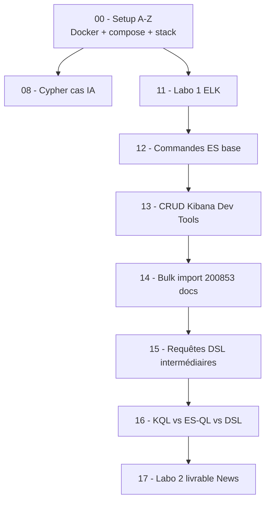

<a id="top"></a>

# Solutions des exercices — Index

> Implémentations **complètes et runnables** des exercices et laboratoires des chapitres 8 à 17 du cours.
>
> **Tous les fichiers sont auto-suffisants** : si vous partez d'une machine vierge, commencez par le [Setup A à Z](./00-setup-complet-a-z.md).

## Table des matières

- [Parcours recommandé](#parcours-recommandé)
- [Projets runnables par chapitre (NEW)](#projets-runnables-par-chapitre)
- [Index des solutions par chapitre](#index-des-solutions-par-chapitre)
- [Conventions d'écriture](#conventions-décriture)
- [Comment lancer une solution](#comment-lancer-une-solution)

---

## Parcours recommandé



> **Compter ~6 à 10 heures** pour parcourir l'ensemble la première fois.

---

## Projets runnables par chapitre

Chaque chapitre dispose d'un **dossier projet autonome** avec son propre `docker-compose.yml`, ses scripts et ses requêtes prêtes à l'emploi. Ils sont **isolés les uns des autres** (volumes nommés préfixés `chXX_*`) mais **partagent les mêmes ports** (9200, 5601, 7474) → on lance **un projet à la fois**.

| Projet                                                | Compose | Stack démarrée   | Démarrage rapide                                  |
| ----------------------------------------------------- | :-----: | ---------------- | ------------------------------------------------- |
| [`ch08-cypher-ia/`](./ch08-cypher-ia/)                | OUI     | Neo4j seul       | `bash ch08-cypher-ia/run.sh`                      |
| [`ch11-labo1-elk/`](./ch11-labo1-elk/)                | OUI     | ES + Kibana      | `bash ch11-labo1-elk/scripts/01-up.sh`            |
| [`ch12-commandes-base/`](./ch12-commandes-base/)      | OUI     | ES + Kibana      | `docker compose up -d` puis `scripts/demo.sh`     |
| [`ch13-crud-kibana/`](./ch13-crud-kibana/)            | OUI     | ES + Kibana      | `docker compose up -d`, puis Kibana Dev Tools     |
| [`ch14-bulk-import/`](./ch14-bulk-import/)            | OUI     | ES (1G) + Kibana | `bash ch14-bulk-import/scripts/run-all.sh`        |
| [`ch15-requetes/`](./ch15-requetes/)                  | OUI     | ES + Kibana      | utilise l'index `news` chargé par ch14            |
| [`ch16-kql-esql-dsl/`](./ch16-kql-esql-dsl/)          | OUI     | ES + Kibana      | utilise l'index `news` chargé par ch14            |
| [`ch17-labo2/`](./ch17-labo2/)                        | OUI     | ES (1G) + Kibana | `bash ch17-labo2/scripts/01-up-and-import.sh`     |

### Ce que contient chaque projet

| Dossier              | Contenu type                                                          |
| -------------------- | --------------------------------------------------------------------- |
| `docker-compose.yml` | Stack minimale (volumes nommés préfixés `chXX_*`)                     |
| `.env.example`       | Variables (mots de passe, ports) à copier en `.env`                   |
| `scripts/`           | Scripts `.sh` (Linux/macOS/WSL) **et** `.ps1` (Windows PowerShell)    |
| `cypher/` ou `queries/` ou `console/` | Requêtes prêtes à exécuter                           |
| `mappings/`          | Mappings ES (initial + post-import) en JSON                           |
| `data/`              | Datasets locaux (créé au premier lancement)                           |
| `docs/`              | Templates de rapport pour les labos                                   |
| `README.md`          | Mode d'emploi en 30 secondes pour ce chapitre                         |

### Démolir un projet (sans toucher aux autres)

```bash
cd ch08-cypher-ia        # ou tout autre chXX-*
docker compose down -v    # supprime conteneurs + volumes de ce projet UNIQUEMENT
```

Les autres projets gardent leurs volumes (`ch14_esdata`, `ch17_esdata`, etc.).

---

## Index des solutions par chapitre

| Solution (doc)                                                    | Projet runnable                              | Chapitre source                                                                 | Durée  |
| ----------------------------------------------------------------- | -------------------------------------------- | ------------------------------------------------------------------------------- | :----: |
| [00 — Setup complet A à Z](./00-setup-complet-a-z.md)             | (utilise le `docker-compose.yml` racine)     | (transverse)                                                                    | ~30 min|
| [08 — Cas pratique Cypher IA](./solutions-08-cypher-cas-ia.md)    | [`ch08-cypher-ia/`](./ch08-cypher-ia/)        | [`08-cas-pratique-cypher-ia.md`](../../08-cas-pratique-cypher-ia.md)             | ~30 min|
| [11 — Labo 1 ELK](./solutions-11-labo1-elk.md)                    | [`ch11-labo1-elk/`](./ch11-labo1-elk/)        | [`11-labo1-mise-en-place-elk.md`](../../11-labo1-mise-en-place-elk.md)           | ~2 h   |
| [12 — Commandes de base ES](./solutions-12-commandes-base.md)     | [`ch12-commandes-base/`](./ch12-commandes-base/)| [`12-commandes-base-elasticsearch.md`](../../12-commandes-base-elasticsearch.md) | ~45 min|
| [13 — CRUD pédagogique Kibana](./solutions-13-crud-pedagogique.md)| [`ch13-crud-kibana/`](./ch13-crud-kibana/)    | [`13-crud-pedagogique-kibana.md`](../../13-crud-pedagogique-kibana.md)           | ~45 min|
| [14 — Bulk import 200 853 articles](./solutions-14-bulk-import.md)| [`ch14-bulk-import/`](./ch14-bulk-import/)    | [`14-import-bulk-dataset.md`](../../14-import-bulk-dataset.md)                    | ~1 h   |
| [15 — Requêtes DSL intermédiaires](./solutions-15-requetes-intermediaires.md) | [`ch15-requetes/`](./ch15-requetes/) | [`15-requetes-elasticsearch-intermediaire.md`](../../15-requetes-elasticsearch-intermediaire.md) | ~1 h   |
| [16 — KQL vs ES\|QL vs DSL](./solutions-16-kql-esql-dsl.md)       | [`ch16-kql-esql-dsl/`](./ch16-kql-esql-dsl/)  | [`16-requetes-avancees-kql-esql-dsl.md`](../../16-requetes-avancees-kql-esql-dsl.md) | ~45 min|
| [17 — Labo 2 News (livrable)](./solutions-17-labo2.md)            | [`ch17-labo2/`](./ch17-labo2/)                | [`17-labo2-rapport-dsl-news.md`](../../17-labo2-rapport-dsl-news.md)              | ~3-4 h |

---

## Conventions d'écriture

| Notation                            | Signification                                                          |
| ----------------------------------- | ---------------------------------------------------------------------- |
| Bloc ` ```bash ` (shell)            | Commandes à exécuter dans **un terminal** (PowerShell ou bash)         |
| Bloc ` ``` ` sans langage           | Commandes à coller dans **Kibana → Dev Tools → Console**               |
| Bloc ` ```cypher `                  | Requêtes pour **Neo4j Browser** (http://localhost:7474)                |
| Bloc ` ```python `                  | Code à exécuter dans **JupyterLab** (http://localhost:8888)            |
| `# Sortie attendue : ...`           | Ce que vous devriez observer en réponse                                |
| Symbole `→`                         | Note pédagogique / explication                                         |

---

## Comment lancer une solution

### Étape 1 : vérifier que la stack tourne

```bash
docker compose ps
```

Vous devez voir 4 services en `Up (healthy)` ou `Up` :

```
spotify-elasticsearch   Up (healthy)   0.0.0.0:9200->9200/tcp
spotify-kibana          Up             0.0.0.0:5601->5601/tcp
spotify-neo4j           Up (healthy)   0.0.0.0:7474->7474/tcp
spotify-jupyter         Up             0.0.0.0:8888->8888/tcp
```

Si non → [Setup A à Z § 7](./00-setup-complet-a-z.md#7-démarrer-la-stack).

### Étape 2 : ouvrir l'interface concernée

| Solution             | Interface                                       |
| -------------------- | ----------------------------------------------- |
| 08 (Cypher)          | http://localhost:7474 (Neo4j Browser)           |
| 11 (Labo 1 ELK)      | terminal + http://localhost:5601                |
| 12, 13, 15, 16, 17   | http://localhost:5601/app/dev_tools             |
| 14 (Bulk)            | terminal (et Kibana pour vérifier)              |

### Étape 3 : suivre les sections de la solution **dans l'ordre**

Chaque solution commence par un **§ 0 Vérifications** (pré-flight). N'avancez que si ce § passe.

---

## Aide rapide

| Problème                              | Aller à                                                                |
| ------------------------------------- | ---------------------------------------------------------------------- |
| Docker ne démarre pas                 | [Setup A-Z § 1](./00-setup-complet-a-z.md#1-installer-docker-desktop)  |
| Port 9200 ou 5601 occupé              | [Setup A-Z § 13.2](./00-setup-complet-a-z.md#132-port-déjà-utilisé-bind-address-already-in-use) |
| ES en `Exited (1)` ou `unhealthy`     | [Setup A-Z § 13.3-4](./00-setup-complet-a-z.md#133-conteneur-neo4j-en-exited-1) |
| Mot de passe Neo4j refusé             | [Setup A-Z § 13.6](./00-setup-complet-a-z.md#136-mot-de-passe-neo4j-refusé) |
| Memory error / OOMKilled              | [Setup A-Z § 13.7](./00-setup-complet-a-z.md#137-manque-de-ram)         |
| `_bulk` retourne `"errors": true`     | [Solutions chap. 14 § 12](./solutions-14-bulk-import.md#12-cas-derreurs-résolus) |
| Aggrégation vide sur `category`       | Cibler `category.keyword` — voir [Solutions chap. 15 § 7](./solutions-15-requetes-intermediaires.md#7-recherches-exactes-term-terms-prefix) |

<p align="right"><a href="#top">Retour en haut</a></p>
