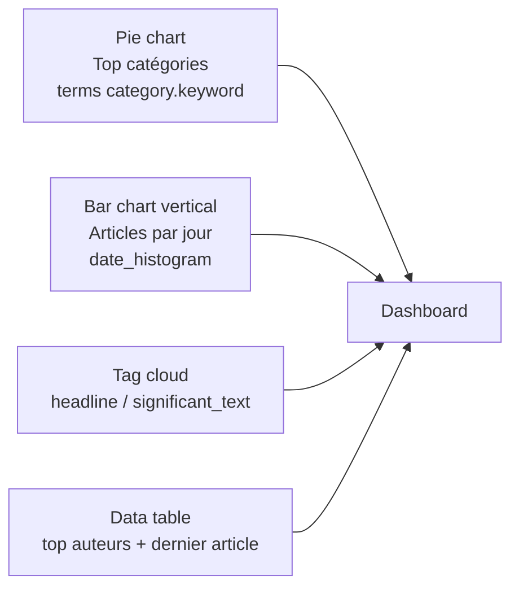

<a id="top"></a>

# Solutions — Chapitre 17 : Labo 2 (livrable complet, plateforme News en DSL)

> **Lien chapitre source** : [`17-labo2-rapport-dsl-news.md`](../../17-labo2-rapport-dsl-news.md)
> **Pré-requis** : [Setup A à Z](./00-setup-complet-a-z.md) — ES + Kibana healthy, dataset News disponible.
> **Contrainte** : on n'utilise **que** le **Query DSL** (pas de KQL, pas d'ES|QL). C'est exigé par l'énoncé du labo.

## Table des matières

- [0. Pré-flight (5 min)](#0-pré-flight-5-min)
- [1. Préparation du dataset (de A à Z)](#1-préparation-du-dataset-de-a-à-z)
- [2. Création de l'index `news` avec mapping maîtrisé](#2-création-de-lindex-news-avec-mapping-maîtrisé)
- [3. Ingestion `_bulk`](#3-ingestion-_bulk)
- [4. Réactivation post-import](#4-réactivation-post-import)
- [5. Les 10 requêtes DSL imposées (corrigées)](#5-les-10-requêtes-dsl-imposées-corrigées)
- [6. Visualisations Kibana — étape par étape](#6-visualisations-kibana--étape-par-étape)
- [7. Captures à fournir](#7-captures-à-fournir)
- [8. Modèle de rapport (≤ 4 pages)](#8-modèle-de-rapport-≤-4-pages)
- [9. Auto-évaluation finale](#9-auto-évaluation-finale)

---

## 0. Pré-flight (5 min)

```bash
docker compose ps spotify-elasticsearch spotify-kibana
curl -s 'http://localhost:9200/_cluster/health?pretty' | jq .status
# → "green"

curl -I http://localhost:5601
# → HTTP/1.1 302 Found
```

Si la stack n'est pas démarrée → suivez le [Setup A à Z § 7-8](./00-setup-complet-a-z.md#7-démarrer-la-stack).

---

## 1. Préparation du dataset (de A à Z)

```bash
# Aller dans le dossier de travail
mkdir -p ~/labo2 && cd ~/labo2

# Copier le dataset depuis assets-cours2/
cp /chemin/vers/elasticsearch-1/docs2-cours1/assets-cours2/News_Category_Dataset_v2.json raw.jsonl

# Vérifs minimales
file -bi raw.jsonl                  # → application/json; charset=utf-8
wc -l raw.jsonl                     # → 200853 lignes
sed -i 's/\r$//' raw.jsonl          # nettoyer CRLF si Windows
head -n 1 raw.jsonl | jq            # 1ʳᵉ ligne valide ?

# Test : transformer 4 lignes en NDJSON pour _bulk
head -n 4 raw.jsonl | awk '{print "{\"index\":{\"_index\":\"news\"}}"; print}' > test.bulk.ndjson
cat test.bulk.ndjson
```

> Détails complets : voir [Solutions chap. 14](./pratique-08-solutions-bulk-import.md).

---

## 2. Création de l'index `news` avec mapping maîtrisé

À copier dans **Kibana → Dev Tools → Console** (préférable au curl pour la lisibilité) :

```
DELETE news

PUT news
{
  "settings": {
    "number_of_shards":   1,
    "number_of_replicas": 0,
    "refresh_interval":   "-1",
    "analysis": {
      "normalizer": {
        "lowercase_normalizer": { "type": "custom", "filter": ["lowercase"] }
      }
    }
  },
  "mappings": {
    "properties": {
      "date": { "type": "date", "format": "yyyy-MM-dd" },
      "category": {
        "type": "text",
        "fields": {
          "keyword":       { "type": "keyword" },
          "keyword_lower": { "type": "keyword", "normalizer": "lowercase_normalizer" }
        }
      },
      "headline": {
        "type": "text",
        "fields": { "keyword": { "type": "keyword", "ignore_above": 256 } }
      },
      "authors": {
        "type": "text",
        "fields": { "keyword": { "type": "keyword" } }
      },
      "short_description": {
        "type": "text",
        "fields": { "keyword": { "type": "keyword", "ignore_above": 256 } }
      },
      "link": { "type": "keyword" }
    }
  }
}

GET news/_mapping
```

| Décision de mapping              | Justification                                                  |
| -------------------------------- | -------------------------------------------------------------- |
| `number_of_shards: 1`            | Single-node : pas besoin de plus                              |
| `number_of_replicas: 0` à l'import | Pas de double écriture pendant le chargement                |
| `refresh_interval: -1` à l'import | Évite le refresh toutes les secondes                         |
| `category.keyword_lower` (normalizer) | Permet `term` insensible à la casse sur la catégorie     |
| `headline` text + `.keyword`     | Recherche full-text + tri/agrégations                          |
| `link` en `keyword`              | URL = identifiant exact, pas de full-text dessus               |

---

## 3. Ingestion `_bulk`

### 3.1 Test sur 4 lignes (sécurité)

```bash
curl -s -H 'Content-Type: application/x-ndjson' \
     -X POST 'http://localhost:9200/_bulk?pretty' \
     --data-binary @test.bulk.ndjson | jq '.errors'
# Attendu : false
```

### 3.2 Convertir l'ensemble + split en chunks

```bash
awk '{print "{\"index\":{\"_index\":\"news\"}}"; print}' raw.jsonl > news.bulk.ndjson
wc -l news.bulk.ndjson                # 401706 (= 2 × 200853)

mkdir -p chunks
split -l 5000 --numeric-suffixes=1 --additional-suffix=.ndjson \
      news.bulk.ndjson chunks/part_

ls chunks | wc -l                     # ~81 chunks
```

### 3.3 Boucle d'import avec progression

```bash
total=$(ls chunks/part_*.ndjson | wc -l)
i=0
for f in chunks/part_*.ndjson; do
  i=$((i+1))
  err=$(curl -s -H 'Content-Type: application/x-ndjson' \
        -X POST 'http://localhost:9200/_bulk' \
        --data-binary @"$f" | jq -r '.errors')
  echo "[$i/$total] $f → errors: $err"
done
```

→ Comptez **3 à 8 minutes** au total (selon la RAM allouée à ES).

---

## 4. Réactivation post-import

```bash
curl -s -X PUT 'http://localhost:9200/news/_settings' \
  -H 'Content-Type: application/json' -d '{
  "index": { "number_of_replicas": 1, "refresh_interval": "1s" }
}'

curl -s -X POST 'http://localhost:9200/news/_refresh'

curl -s 'http://localhost:9200/news/_count?pretty'
# Attendu : "count": 200853
```

---

## 5. Les 10 requêtes DSL imposées (corrigées)

Toutes ces requêtes se collent dans **Kibana → Dev Tools → Console**.

### R1 — Tri par date desc (5 derniers articles)

```
GET news/_search
{
  "size": 5,
  "sort":    [ { "date": "desc" } ],
  "_source": ["date","category","headline"]
}
```

**Sortie attendue** : 5 hits triés par `date` décroissante (les plus récents : mai 2018).

### R2 — Pagination scalable `search_after`

```
GET news/_search
{
  "size": 5,
  "sort": [ { "date": "desc" }, { "_id": "desc" } ],
  "_source": ["date","headline"]
}
```

Récupérez la valeur `sort` du dernier hit (par ex. `["2018-05-26","_xyz123"]`), puis :

```
GET news/_search
{
  "size": 5,
  "search_after": ["2018-05-26", "<ID_DERNIER_HIT>"],
  "sort":         [ { "date": "desc" }, { "_id": "desc" } ],
  "_source":      ["date","headline"]
}
```

### R3 — `multi_match` avec boost titre

```
GET news/_search
{
  "query": {
    "multi_match": {
      "query":  "President Obama",
      "fields": ["headline^3","short_description","authors"]
    }
  },
  "_source": ["headline","authors","date","category"]
}
```

→ Les hits où « President Obama » est dans le titre remontent en tête.

### R4 — Phrase exacte

```
GET news/_search
{
  "query": { "match_phrase": { "headline": "North Korea" } }
}
```

### R5 — Tolérance aux fautes (fuzzy)

```
GET news/_search
{
  "query": {
    "match": {
      "headline": { "query": "presdent obmaa", "fuzziness": "AUTO" }
    }
  }
}
```

→ Retourne quand même des résultats sur "President Obama" (tolère 1-2 lettres d'erreur).

### R6 — Bool : Trump en POLITICS ou WORLD NEWS, dates 2018-05, sans "joke"

```
GET news/_search
{
  "_source": ["date","category","headline"],
  "query": {
    "bool": {
      "must":   [ { "match": { "headline": "Trump" } } ],
      "filter": [
        { "terms": { "category.keyword": ["POLITICS","WORLD NEWS"] } },
        { "range": { "date": { "gte": "2018-05-01", "lte": "2018-05-31" } } }
      ],
      "must_not": [ { "match_phrase": { "short_description": "joke" } } ]
    }
  }
}
```

### R7 — `function_score` avec boost catégorie POLITICS

```
GET news/_search
{
  "query": {
    "function_score": {
      "query":      { "match": { "headline": "Trump" } },
      "boost_mode": "multiply",
      "score_mode": "sum",
      "functions": [
        { "filter": { "term": { "category.keyword": "POLITICS" } }, "weight": 2.0 }
      ]
    }
  },
  "_source": ["headline","category","_score"]
}
```

→ Un titre "Trump" en POLITICS aura un score 2× supérieur à un titre "Trump" hors politique.

### R8 — Highlight (surligner les mots trouvés)

```
GET news/_search
{
  "_source": ["headline","short_description","date"],
  "query":   { "match": { "short_description": "North Korea summit" } },
  "highlight": {
    "fields":    { "headline": {}, "short_description": {} },
    "pre_tags":  ["<mark>"],
    "post_tags": ["</mark>"]
  }
}
```

### R9 — Top catégories + dernier titre par catégorie

```
GET news/_search
{
  "size": 0,
  "aggs": {
    "by_category": {
      "terms": { "field": "category.keyword", "size": 10 },
      "aggs": {
        "latest": {
          "top_hits": {
            "size": 1,
            "sort":   [ { "date": "desc" } ],
            "_source":["date","headline","authors"]
          }
        }
      }
    }
  }
}
```

### R10 — Histogramme par jour, sous-aggrégation par catégorie

```
GET news/_search
{
  "size": 0,
  "aggs": {
    "per_day": {
      "date_histogram": { "field": "date", "calendar_interval": "day" },
      "aggs": {
        "by_cat": { "terms": { "field": "category.keyword", "size": 5 } }
      }
    }
  }
}
```

### Bonus — Cardinalité auteurs + termes significatifs

```
GET news/_search
{
  "size": 0,
  "aggs": {
    "authors_count": { "cardinality": { "field": "authors.keyword" } }
  }
}

GET news/_search
{
  "size": 0,
  "query": { "term": { "category.keyword": "POLITICS" } },
  "aggs":  { "hot_terms": { "significant_text": { "field": "headline", "size": 10 } } }
}
```

### Bonus — Diversification (`field_collapse`)

```
GET news/_search
{
  "query": { "match": { "headline": "Trump" } },
  "collapse": {
    "field":      "authors.keyword",
    "inner_hits": { "name": "by_author_latest", "size": 1, "sort": [ { "date": "desc" } ] }
  },
  "sort":    [ { "date": "desc" } ],
  "_source": ["authors","headline","date"]
}
```

→ Évite que les mêmes auteurs saturent les premiers résultats.

### Bonus — Mises à jour et reindex

```
POST news/_update_by_query
{
  "script": {
    "source": "ctx._source.category = ctx._source.category.toUpperCase();",
    "lang":   "painless"
  },
  "query": { "match_all": {} }
}

POST _reindex
{
  "source": { "index": "news"    },
  "dest":   { "index": "news_v2" }
}
```

---

## 6. Visualisations Kibana — étape par étape

### 6.1 Créer la Data View

1. Menu → **Stack Management → Data Views → Create data view**
2. **Name** : `news`
3. **Index pattern** : `news`
4. **Timestamp field** : `date`
5. **Save data view to Kibana**

### 6.2 Régler le time picker

En haut à droite de Discover : **Last 15 years** (le dataset va de 2012 à 2018).

### 6.3 Discover

→ http://localhost:5601/app/discover. Vous voyez la timeline + 200 853 documents.

Filtres rapides à tester :
- Sélecteur de champ : cliquez sur `category` → cliquez le ⊕ à côté de `POLITICS`.
- Dans la barre du haut : tapez `headline : "Trump"` (mode KQL) pour filtrer.

### 6.4 Visualisations à créer

Menu → **Visualize Library → Create visualization → Lens**.



| # | Visualisation              | Type        | Buckets / champs                                                |
| - | -------------------------- | ----------- | --------------------------------------------------------------- |
| 1 | Top catégories             | Pie         | `terms` sur `category.keyword`, size 10                         |
| 2 | Articles par jour          | Bar (Vert.) | `date_histogram` sur `date`, split rows par `category.keyword`  |
| 3 | Mots saillants             | Tag cloud   | `terms` sur `headline.keyword` (ou `significant_text` via Lens) |
| 4 | Top titres récents         | Data table  | `terms` sur `category.keyword` + sub-`top_hits` size 3          |

### 6.5 Assembler le Dashboard

1. Menu → **Dashboard → Create new**
2. **Add from library** → ajoutez les 4 visualisations.
3. Réorganisez par drag-drop.
4. **Save** sous le nom `Labo2 — News Dashboard`.

---

## 7. Captures à fournir

| # | Capture                                                          | Comment l'obtenir                                          |
| - | ---------------------------------------------------------------- | ---------------------------------------------------------- |
| 1 | `docker compose ps` services healthy                             | terminal                                                   |
| 2 | `GET news/_count` → 200 853                                      | Dev Tools                                                  |
| 3 | Mapping de `news` (sortie de `GET news/_mapping`)                | Dev Tools                                                  |
| 4 | Discover affichant l'histogramme + 200 853 hits                  | http://localhost:5601/app/discover                         |
| 5 | Une exécution de chacune des 10 requêtes (R1-R10) avec sa sortie | Dev Tools (1 capture par requête, ou un fichier .md exporté) |
| 6 | Le Dashboard final                                               | http://localhost:5601/app/dashboards                       |

---

## 8. Modèle de rapport (≤ 4 pages)

```markdown
# Rapport Labo 2 — Plateforme de recherche d'actualités

## 1. Objectif et contexte
On bâtit une mini-plateforme de recherche sur ~200 853 articles de presse
(News Category Dataset v2, 2012-2018) avec Elasticsearch + Kibana.
Contrainte : utilisation **exclusive** du Query DSL.

## 2. Architecture

[Diagramme Mermaid ou capture]

| Composant   | Version       | Rôle                                  |
| ----------- | ------------- | ------------------------------------- |
| Elasticsearch | 8.13.4      | Stockage + moteur de recherche        |
| Kibana      | 8.13.4        | UI + Dev Tools + Dashboards           |
| Docker      | 27.x          | Orchestration locale                  |

## 3. Modélisation (mapping)

Décisions clés :
- `date` typé `date` → active `range`, `date_histogram`, time picker.
- Tous les champs textuels en `text` + sous-champ `.keyword` → recherche full-text + agrégations exactes.
- `category.keyword_lower` avec normalizer → recherche insensible à la casse.
- `link` en `keyword` pur → URL exacte, pas de full-text inutile.

## 4. Ingestion

| Étape                   | Détail                                                  |
| ----------------------- | ------------------------------------------------------- |
| Format source           | JSONL (1 article par ligne)                             |
| Conversion → NDJSON     | `awk` qui prépend `{"index":{"_index":"news"}}`         |
| Découpage               | `split -l 5000` → ~81 chunks                            |
| Settings d'import       | `replicas: 0`, `refresh_interval: -1`                   |
| Boucle                  | Bash `for` sur les chunks, `--data-binary`              |
| Settings post-import    | `replicas: 1`, `refresh_interval: 1s`, `_refresh`       |
| Compte final            | 200 853 documents, `_cluster/health: green`             |

## 5. Les 10 requêtes (synthèse)

| #   | Objectif                  | Outil DSL utilisé                          |
| --- | ------------------------- | ------------------------------------------ |
| R1  | Derniers articles         | `sort` + `_source`                         |
| R2  | Pagination scalable       | `search_after` + sort à 2 clés             |
| R3  | Plein texte multi-champ   | `multi_match` + boost `headline^3`         |
| R4  | Phrase exacte             | `match_phrase`                             |
| R5  | Tolérance aux fautes      | `match` + `fuzziness: AUTO`                |
| R6  | Filtres complexes         | `bool` (must / filter / must_not)          |
| R7  | Boost catégoriel          | `function_score` + weight                  |
| R8  | Highlight                 | `highlight` + `pre_tags`/`post_tags`       |
| R9  | KPI catégories            | `terms` agg + sub-`top_hits`               |
| R10 | Série temporelle          | `date_histogram` + sub-`terms`             |

## 6. Dashboard

[Capture du dashboard final]

4 visualisations cohérentes : Pie (cat.) / Bar (jour) / Tag cloud / Data table.

## 7. Difficultés rencontrées

| Difficulté                                  | Solution                              |
| ------------------------------------------- | ------------------------------------- |
| Limite 10k hits dans `_search`              | `track_total_hits: true` ou `_count`  |
| Aggrégation vide sur `category`             | Cibler `category.keyword`             |
| Payload `_bulk` > 100 Mo                    | Split en chunks de 5000 lignes        |
| (autres…)                                   |                                       |

## 8. Conclusion

[Bilan en quelques lignes : ce qui marche, limites, pistes d'amélioration]
```

---

## 9. Auto-évaluation finale

| Critère                                                              | Poids | OK ? |
| -------------------------------------------------------------------- | :---: | :--: |
| Mapping correct (text + keyword + date + normalizer)                 |  20%  |   ☐  |
| Ingestion `_bulk` réussie + count = 200 853                          |  15%  |   ☐  |
| Les 10 requêtes DSL fonctionnent et sont commentées                  |  35%  |   ☐  |
| Dashboard Kibana ≥ 4 visualisations cohérentes                       |  20%  |   ☐  |
| Rapport synthétique avec captures et choix justifiés                 |  10%  |   ☐  |

> **Pour aller plus loin** : analyzers FR/EN, suggester `completion`, snapshot/restore, alias d'index — voir [chap. 18](../../18-annexe-architectures-avancees.md).

<p align="right"><a href="#top">Retour en haut</a></p>
