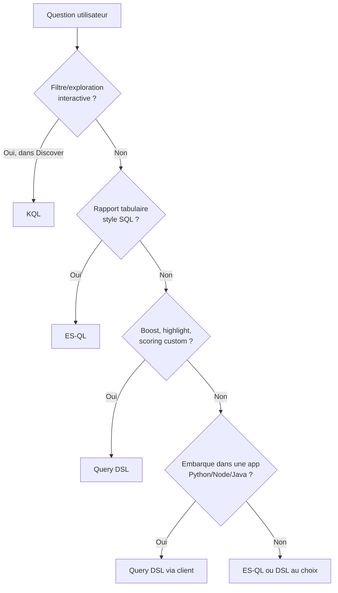

<a id="top"></a>

# Solutions — Chapitre 16 : KQL vs ES|QL vs Query DSL

> **Lien chapitre source** : [`16-requetes-avancees-kql-esql-dsl.md`](../../16-requetes-avancees-kql-esql-dsl.md)
> **Pré-requis** : [Setup A à Z](./00-setup-complet-a-z.md) + [Solutions chap. 14](./pratique-08-solutions-bulk-import.md) (index `news` chargé).
> **Approche** : pour chaque besoin, on donne **les 3 requêtes côte à côte** + où les exécuter dans Kibana.

## Table des matières

- [0. Où exécuter quelle requête](#0-où-exécuter-quelle-requête)
- [1. Filtrer par catégorie](#1-filtrer-par-catégorie)
- [2. Filtrer par période](#2-filtrer-par-période)
- [3. Plein texte simple](#3-plein-texte-simple)
- [4. Combinaison filtres + plein texte](#4-combinaison-filtres--plein-texte)
- [5. Top 10 catégories](#5-top-10-catégories)
- [6. Histogramme par jour](#6-histogramme-par-jour)
- [7. Top auteurs sur une période](#7-top-auteurs-sur-une-période)
- [8. Cas où KQL/ES|QL ne suffisent pas](#8-cas-où-kqlesql-ne-suffisent-pas)
- [9. Cas pratique : 5 questions, 5 réponses](#9-cas-pratique--5-questions-5-réponses)
- [10. Quand utiliser quoi ?](#10-quand-utiliser-quoi-)

---

## 0. Où exécuter quelle requête

| Langage      | Lieu d'exécution dans Kibana                                                              |
| ------------ | ----------------------------------------------------------------------------------------- |
| **KQL**      | **Discover** (champ de recherche en haut) ou filtres de Dashboard                         |
| **ES\|QL**   | **Discover** (sélecteur en haut : "Try ES\|QL") ou **Dev Tools → Console** (avec `POST _query`)|
| **Query DSL**| **Dev Tools → Console**, ou via `curl`, ou clients officiels (Python, Node, Java)         |

> Pour ES|QL en Dev Tools, le format est :
> ```
> POST _query
> { "query": "FROM news | LIMIT 5" }
> ```

Avant de commencer : ouvrez **Discover** dans Kibana, et créez la **Data View** :
1. Stack Management → **Data Views** → **Create data view**
2. Name : `news`
3. Index pattern : `news`
4. Time field : `date`
5. **Save data view to Kibana**

Réglez le time picker en haut à droite sur **Last 15 years** pour voir tout le dataset (qui va de 2012 à 2018).

---

## 1. Filtrer par catégorie

### KQL (dans Discover)

```text
category : "POLITICS"
```

### ES|QL

```sql
FROM news
| WHERE category == "POLITICS"
| LIMIT 20
```

Ou en Dev Tools :

```
POST _query
{
  "query": "FROM news | WHERE category == \"POLITICS\" | LIMIT 20"
}
```

### Query DSL

```
GET news/_search
{
  "size": 20,
  "query": { "term": { "category.keyword": "POLITICS" } }
}
```

→ Les **3 retournent les mêmes documents**. KQL est le plus court ; DSL est le plus précis (term sur `.keyword`).

---

## 2. Filtrer par période

### KQL

```text
date >= "2018-05-20" and date < "2018-06-01"
```

### ES|QL

```sql
FROM news
| WHERE date BETWEEN "2018-05-20" AND "2018-05-31"
| LIMIT 20
```

### Query DSL

```
GET news/_search
{
  "size": 20,
  "query": {
    "range": { "date": { "gte": "2018-05-20", "lt": "2018-06-01" } }
  }
}
```

---

## 3. Plein texte simple

### KQL

```text
headline : "Trump" or short_description : "Trump"
```

### ES|QL

```sql
FROM news
| WHERE MATCH(headline, "Trump") OR MATCH(short_description, "Trump")
| LIMIT 20
```

### Query DSL

```
GET news/_search
{
  "size": 20,
  "query": {
    "multi_match": { "query": "Trump", "fields": ["headline","short_description"] }
  }
}
```

> Sur un cas simple comme ça, KQL est imbattable côté concision. DSL devient nécessaire dès qu'on veut **booster** un champ (`headline^3`).

---

## 4. Combinaison filtres + plein texte

**Question** : articles WORLD NEWS ou POLITICS, écrits par "Ron Dicker", à partir du 25 mai 2018.

### KQL

```text
category : ("WORLD NEWS" or "POLITICS")
  and authors : "Ron Dicker"
  and date >= "2018-05-25"
```

### ES|QL

```sql
FROM news
| WHERE (category == "WORLD NEWS" OR category == "POLITICS")
  AND MATCH(authors, "Ron Dicker")
  AND date >= "2018-05-25"
| LIMIT 50
```

### Query DSL

```
GET news/_search
{
  "size": 50,
  "_source": ["date","category","authors","headline"],
  "query": {
    "bool": {
      "filter": [
        { "terms": { "category.keyword": ["WORLD NEWS","POLITICS"] } },
        { "range": { "date": { "gte": "2018-05-25" } } }
      ],
      "must": [
        { "match": { "authors": "Ron Dicker" } }
      ]
    }
  }
}
```

> Le DSL permet ici d'utiliser `filter` (cacheable, sans score) au lieu de `must` pour les conditions exactes — gain de performance.

---

## 5. Top 10 catégories

### KQL

→ **Impossible directement** : KQL filtre, n'agrège pas. Utilisez Discover + Visualize.

### ES|QL

```sql
FROM news
| STATS count = COUNT(*) BY category
| SORT count DESC
| LIMIT 10
```

| category       | count   |
| -------------- | ------: |
| POLITICS       | 32 739  |
| WELLNESS       | 17 827  |
| ENTERTAINMENT  | 16 058  |
| TRAVEL         |  9 887  |
| STYLE & BEAUTY |  9 649  |
| ...            |  ...    |

### Query DSL

```
GET news/_search
{
  "size": 0,
  "aggs": {
    "by_category": {
      "terms": { "field": "category.keyword", "size": 10 }
    }
  }
}
```

→ Pour les rapports tabulaires simples, **ES|QL est le plus naturel** (syntaxe SQL-like).

---

## 6. Histogramme par jour

### KQL

→ **Impossible** : Discover affiche déjà l'histogramme automatiquement, pas besoin de KQL.

### ES|QL

```sql
FROM news
| WHERE category == "POLITICS"
| EVAL day = DATE_TRUNC(1 days, date)
| STATS articles = COUNT(*) BY day
| SORT day
```

### Query DSL

```
GET news/_search
{
  "size": 0,
  "query": { "term": { "category.keyword": "POLITICS" } },
  "aggs": {
    "per_day": {
      "date_histogram": { "field": "date", "calendar_interval": "day" }
    }
  }
}
```

→ Le DSL `date_histogram` propose **`calendar_interval`** (jour, semaine, mois calendaires) et **`fixed_interval`** (24h, 7d) — plus fin qu'ES|QL.

---

## 7. Top auteurs sur une période

### ES|QL

```sql
FROM news
| WHERE date BETWEEN "2018-05-20" AND "2018-05-31"
| STATS articles = COUNT(*) BY authors
| SORT articles DESC
| LIMIT 10
```

### Query DSL

```
GET news/_search
{
  "size": 0,
  "query": {
    "range": { "date": { "gte": "2018-05-20", "lte": "2018-05-31" } }
  },
  "aggs": {
    "top_authors": {
      "terms": { "field": "authors.keyword", "size": 10 }
    }
  }
}
```

---

## 8. Cas où KQL/ES|QL ne suffisent pas

### Boost / scoring custom (DSL uniquement)

```
GET news/_search
{
  "query": {
    "function_score": {
      "query":      { "match": { "headline": "Trump" } },
      "boost_mode": "multiply",
      "score_mode": "sum",
      "functions": [
        { "filter": { "term": { "category.keyword": "POLITICS" } }, "weight": 2.0 }
      ]
    }
  }
}
```

→ « Trump » dans POLITICS aura un score 2× supérieur à « Trump » ailleurs.

### Highlight (DSL uniquement)

```
GET news/_search
{
  "query": {
    "multi_match": { "query": "North Korea", "fields": ["headline","short_description"] }
  },
  "highlight": {
    "fields": { "headline": {}, "short_description": {} }
  }
}
```

### Pagination scalable `search_after` (DSL uniquement)

```
GET news/_search
{
  "size": 5,
  "sort": [ { "date": "desc" }, { "_id": "desc" } ],
  "search_after": ["2018-05-26", "<derniere_id>"]
}
```

### Sub-aggregations imbriquées (DSL principalement)

```
GET news/_search
{
  "size": 0,
  "aggs": {
    "by_cat": {
      "terms": { "field": "category.keyword", "size": 5 },
      "aggs": {
        "top_authors": {
          "terms": { "field": "authors.keyword", "size": 3 }
        }
      }
    }
  }
}
```

---

## 9. Cas pratique : 5 questions, 5 réponses

| # | Question                                                                  | Outil idéal | Requête (résumé)                                                |
| - | ------------------------------------------------------------------------- | :---------: | --------------------------------------------------------------- |
| 1 | Voir les articles WORLD NEWS du dernier mois                              |  KQL        | `category : "WORLD NEWS" and date >= "2018-04-01"`              |
| 2 | Top 10 catégories les plus actives                                        |  ES\|QL     | `FROM news \| STATS COUNT(*) BY category \| SORT count DESC \| LIMIT 10` |
| 3 | Articles dont le **titre** OU la **description** parle de Trump, classés par pertinence | DSL | `multi_match` avec `headline^3`                       |
| 4 | Top auteurs avec leur dernier article                                     |  DSL        | `aggs.terms` + sous-`top_hits`                                  |
| 5 | Surligner « North Korea » dans les titres et descriptions                 |  DSL        | `highlight` avec `pre_tags`/`post_tags`                         |

### Implémentations complètes

#### Q1 — Discover, barre KQL :

```text
category : "WORLD NEWS" and date >= "2018-04-01"
```

#### Q2 — Discover ES|QL ou Dev Tools :

```sql
FROM news
| STATS count = COUNT(*) BY category
| SORT count DESC
| LIMIT 10
```

#### Q3 — Dev Tools :

```
GET news/_search
{
  "size": 10,
  "_source": ["headline","short_description","_score"],
  "query": {
    "multi_match": {
      "query":  "Trump",
      "fields": ["headline^3", "short_description"]
    }
  }
}
```

#### Q4 — Dev Tools :

```
GET news/_search
{
  "size": 0,
  "aggs": {
    "top_authors": {
      "terms": { "field": "authors.keyword", "size": 5 },
      "aggs": {
        "latest": {
          "top_hits": {
            "size": 1,
            "sort":   [ { "date": "desc" } ],
            "_source":["date","headline","category"]
          }
        }
      }
    }
  }
}
```

#### Q5 — Dev Tools :

```
GET news/_search
{
  "size": 5,
  "_source": ["headline","short_description","date"],
  "query":   { "multi_match": { "query": "North Korea", "fields": ["headline","short_description"] } },
  "highlight": {
    "fields":    { "headline": {}, "short_description": {} },
    "pre_tags":  ["<mark>"],
    "post_tags": ["</mark>"]
  }
}
```

---

## 10. Quand utiliser quoi ?



| Critère                                | Recommandation               |
| -------------------------------------- | ---------------------------- |
| L'utilisateur tape dans Discover       | **KQL**                      |
| Rapport tabulaire, agrégations simples | **ES\|QL**                   |
| Application backend (Python, Node)     | **DSL via client officiel**  |
| Highlight, function_score, search_after| **DSL** uniquement           |
| Migration de mapping                   | **DSL** (`_reindex`)         |
| Filtres de dashboard Kibana            | **KQL**                      |

> **Recommandation pour le Labo 2** ([chapitre 17](./labo-2-solutions-rapport-dsl-news.md)) : on utilise **uniquement le DSL** pour bien le maîtriser.

<p align="right"><a href="#top">Retour en haut</a></p>


---

*Copyright © Haythem R - Tous droits reserves.*
